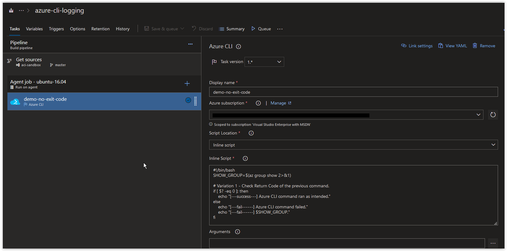
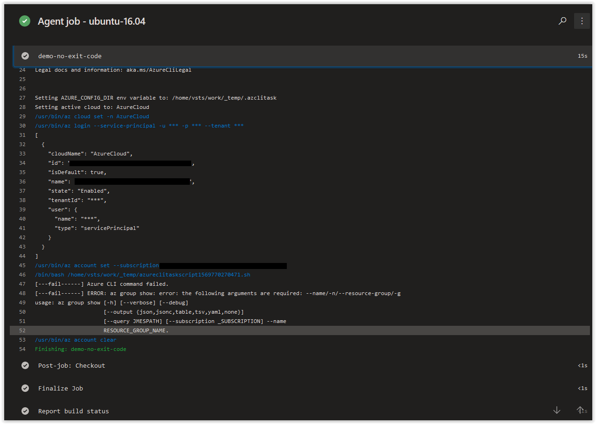

# Day 18 - Azure CLI Logging in an Azure Build Pipeline (Linux Edition)

## Logging without returning Error Codes

If you do not exit out of your script with a number in your Build Pipeline, then your script will appear to run without any issues.

Take the example script below.

```bash
#!/bin/bash
SHOW_GROUP=$(az group show 2>&1)

# Variation 1 - Check Return Code of the previous command.
if [ $? -eq 0 ]; then
    echo "[---success---] Azure CLI command ran as intended."
else
    echo "[---fail------] Azure CLI command failed."
    echo "[---fail------] $SHOW_GROUP."
fi
```

When you add it as an inline script into a Build Pipeline in Azure DevOps, it should look similar to what is shown below.



This script is storing the results from the *az group show* command into a variable called **SHOW_GROUP**. This command is also redirecting all STDERR to STDOUT (that's the *2>&1* after the command) to ensure that we can verify the results of the command by looking at the contents of the **SHOW_GROUP** variable. Whether the command is successful or fails, we'll know because the results will be in the **SHOW_GROUP** variable.

After the command is executed, we are checking to see if the *SHOW_GROUP=$(az group show 2>&1)* returned either a **0** or something else. If anything else other than **0** is returned. The *else* section with the *Azure CLI command failed* will be echo'd out along with the contents of the **SHOW_GROUP** variable which will contain the error message.

If you run this script above in an Azure Build Pipeline, you should get back the following below.



You'll notice that the Build Pipeline executed without any issues and that the error from the script was returned properly. You may be asking, why didn't the pipeline fail? Since we redirected all STDERR to STDOUT in our command, the build Pipeline was never made aware of the error because we encapsulated the results in the **SHOW_GROUP** variable.

This is very important and very useful when running scripts in an Azure Build Pipeline where you may expect some errornous behaviour in your script, but you don't want your entire build to fail. By redirecting STDERR to STDOUT and encapsulating all of your results from your commands into variables, you can completely control your error handling.

Now, what if we do want the script to fail every single time that an actual error occurs but maintain complete control of the results in the build? We only need to force an exit code after the results of the **SHOW_GROUP** are displayed.

```bash
#!/bin/bash
SHOW_GROUP=$(az group show 2>&1)

# Variation 1 - Check Return Code of the previous command.
if [ $? -eq 0 ]; then
    echo "[---success---] Azure CLI command ran as intended."
else
    echo "[---fail------] Azure CLI command failed."
    echo "[---fail------] $SHOW_GROUP."
    exit 2
fi
```

If you run this script in the Azure Pipeline, you should get back the following results.


However, if we were to take the same script, and add an exit code larger than **0**, we will get back something completely different when the Build Pipeline is finished running.


In this example, we are going going to run *az group show* without providing any of the required parameters to show how you can handle errors from Azure CLI in an Azure DevOps release pipeline.

```bash
#!/bin/bash

SHOW_GROUP=$(az group show 2>&1)

# Variation 1 - Check Return Code of the previous command.
if [ $? -eq 0 ]; then
    echo "[---success---] Azure CLI command ran as intended."
else
    echo "[---fail------] Azure CLI command failed."
    echo "[---fail------] $SHOW_GROUP."
fi

# Variation 2 - Check the contents of the Variable.
if [[ $SHOW_GROUP =~ "ERROR" ]]; then
    echo "[---fail------] There was problem running the command."
    echo "[---fail------] echo "$SHOW_GROUP"
fi
```
