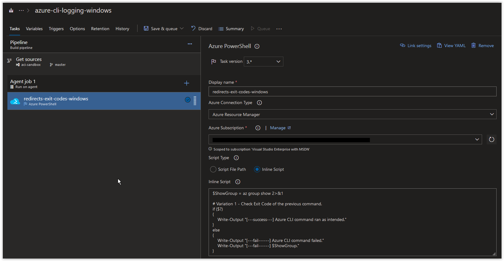
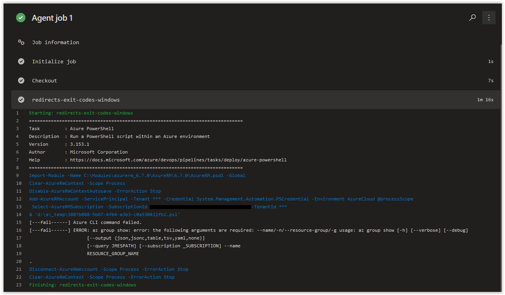
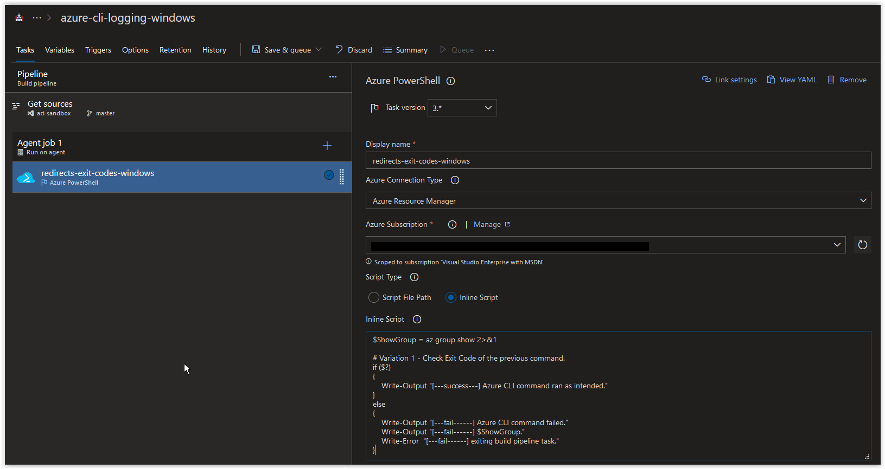
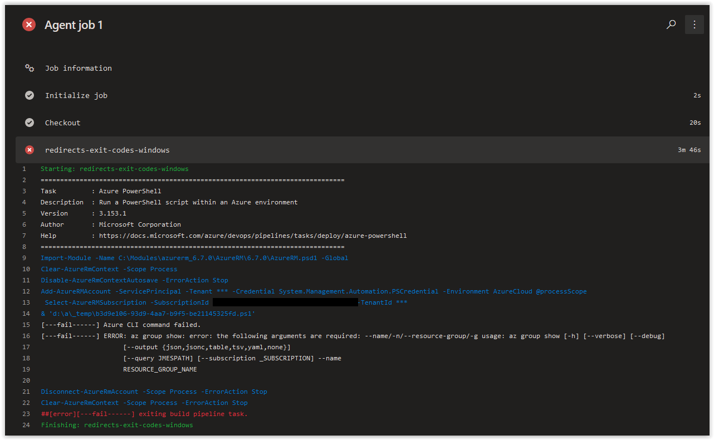

# Day 20 - Azure CLI Logging in Azure Build Pipelines, Redirections and Exit Codes (Windows Edition)

Today we are covering how redirecting STDERR to STDOUT and using exit codes can affect the behavior of your Azure Build Pipelines tasks when using PowerShell scripts.

> **NOTE:** This article covers essentially the same material as **[Day 18](../articles/day.18.azure.cli.logging.build.pipelines.redirects.exit.codes.md)**; however, the example used here is a PowerShell Script calling an Azure CLI command in an Azure PowerShell task. It may sound a bit wacky, but we wanted to make sure that you, dear reader, have a plethora of options at your disposal in Azure DevOps.

***
SPONSOR: Need to stop and start your development VMs on a schedule? The Azure Resource Scheduler let's you schedule up to 10 Azure VMs for FREE! Learn more [HERE](https://azuremarketplace.microsoft.com/en-us/marketplace/apps/lumagatena.resourcescheduler?tab=Overview)
***

The script below is going to be the focus of today's topic and is designed to fail on purpose.

```powershell
$ShowGroup = az group show 2>&1

# Variation 1 - Check Exit Code of the previous command.
if ($?)
{
    Write-Output "[---success---] Azure CLI command ran as intended."
}
else
{
    Write-Output "[---fail------] Azure CLI command failed."
    Write-Output "[---fail------] $ShowGroup."
}
```

<br />

When you add it as an inline script into a Build Pipeline in Azure DevOps, it should look similar to what is shown below.



This script is storing the results from the *az group show* command into a variable called **ShowGroup**. This command is also redirecting all STDERR to STDOUT using **2>&1** so we can verify the results of the command by looking at the contents of the **ShowGroup** variable. Whether the command is successful or fails,we'll know because the results will be in the **ShowGroup** variable.

After the command is executed, the **$LastExitCode** value (either *true* or *false*) returned from the command **ShowGroup = az group show 2>&1** is evaluated. If **false** is returned, the *else* section of the script will be returned out along with the contents of the **ShowGroup** variable which will contain the error message.

If you run this script above in an Azure Build Pipeline, you should get back the following result.



<br />

You'll notice that the Build Pipeline executed without any issues and didn't mention any failure. Since we redirected all STDERR to STDOUT in the command, the build Pipeline could not detect an actual error as everything pertaining to the command was encapsulated in the **ShowGroup** variable.

This is something you need to be aware of when running PowerShell scripts in an Azure Build Pipeline. By redirecting STDERR to STDOUT and encapsulating all of your results from your commands into variables, you can completely control your error handling.

Now, if we want the same action to fail every time an actual error occurs in the script, but still maintain complete control of the results in the build, we need to pass something to the Azure PowerShell Task to force it to exit. In our case, we are going to add a new line in the **else** statement.

```powershell
Write-Error  "[---fail------] exiting build pipeline task."
```

By using the **Write-Error** cmdlet we are forcing text into the error stream of the Azure PowerShell Task causing it to blow up and die. Additionally, the **Write-Error** text is added after the contents of the **ShowGroup** variable are displayed so that the cause of the error is displayed. If the **Write-Error** cmdlet was positioned before the contents of the **ShowGroup** variable, you would only see the *[---fail------] exiting build pipeline task.* text.

<br />

The script below is identical to our original script with the new line added.

```powershell
$ShowGroup = az group show 2>&1

# Variation 1 - Check Exit Code of the previous command.
if ($?)
{
    Write-Output "[---success---] Azure CLI command ran as intended."
}
else
{
    Write-Output "[---fail------] Azure CLI command failed."
    Write-Output "[---fail------] $ShowGroup."
    Write-Error  "[---fail------] exiting build pipeline task."
}
```

<br />

Below is the script inline, with the **Write-Error** text added.



<br />

If you run this script in the Azure Pipeline, you should get back the following results.



> **NOTE:** If you change the **ErrorActionPreference** in the Azure PowerShell Task to either *Continue* or *SilentlyContinue*, the task will still show as failed in the Build Pipeline, but any tasks following it will still be executed.

<br />

## Conclusion

As you can see, redirecting STDERR to STDOUT and using exit codes can significantly affect the behavior of your Azure Build Pipelines tasks when using PowerShell scripts. Stay tuned for more.
