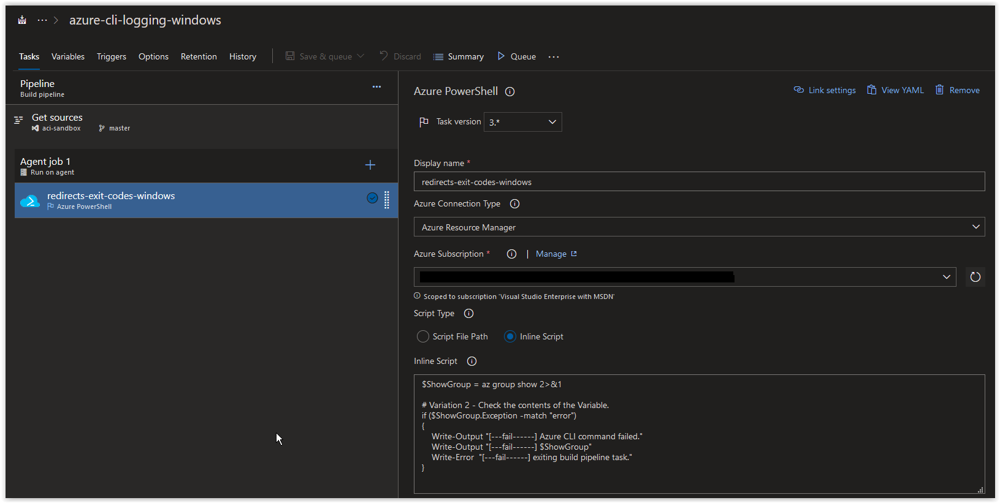
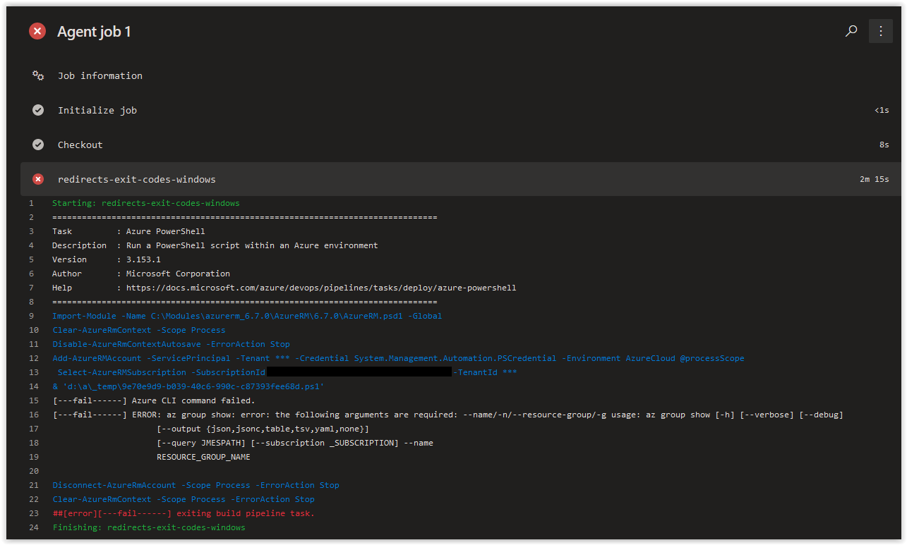
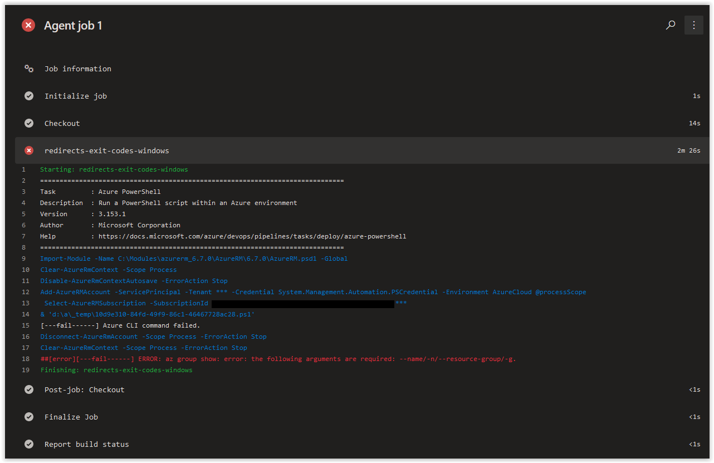

# Day 21 - Azure CLI Logging in Azure Build Pipelines, variable evaluation (Windows Edition)

In today's article we are going to go over evaluating variables in PowerShell scripts to manipulate the output of your Azure Build Pipelines in Azure PowerShell tasks.

We are going to be focusing on the same script that was used in **[Day 20](../articles/day.20.azure.cli.logging.build.pipes.redirects.exit.codes.win.md)** with some slight modifications.

<br />

```powershell
$ShowGroup = az group show 2>&1

# Variation 2 - Check the contents of the Variable.
if ($ShowGroup.Exception -match "error")
{
    Write-Output "[---fail------] Azure CLI command failed."
    Write-Output "[---fail------] $ShowGroup"
    Write-Error  "[---fail------] exiting build pipeline task."
}
```

First off, if you run the command that is encapsulated in the **ShowGroup** variable command from a PowerShell prompt.

```powershell
az group show 2>&1
```

You should back the following response.

```console
az : ERROR: az group show: error: the following arguments are required: --name/-n/--resource-group/-g
At line:1 char:1
+ az group show 2>&1
+ ~~~~~~~~~~~~~~~~~~
    + CategoryInfo          : NotSpecified: (ERROR: az group...source-group/-g:String) [], RemoteException
    + FullyQualifiedErrorId : NativeCommandError

usage: az group show [-h] [--verbose] [--debug]
                     [--output {json,jsonc,table,tsv,yaml,none}]
                     [--query JMESPATH] [--subscription _SUBSCRIPTION] --name
                     RESOURCE_GROUP_NAME
```

The reason we are getting an error is because we didn't provide the following arguments that are required by the **az group show** command.

```powershell
--name
--resource-group
```

> **NOTE:**  You'll also notice that there is an extra few lines about a *NativeCommandError*, this is because of the way that PowerShell handles the executions of external commands, which in this case, is the Azure CLI.

In the second part of the script, we are evaluating the contents of the *Exception* property in the **ShowGroup** variable to see if the word **error** is found in it.

```powershell
if ($ShowGroup.Exception -match "error")
{
    Write-Output "[---fail------] Azure CLI command failed."
    Write-Output "[---fail------] $ShowGroup"
    Write-Error  "[---fail------] exiting build pipeline task."
}
```

If the word **error** is found, then the following error output is returned.

```console
[---fail------] Azure CLI command failed.
[---fail------] ERROR: az group show: error: the following arguments are required: --name/-n/--resource-group/-g usage: az group show [-h] [--verbose] [--debug]
                     [--output {json,jsonc,table,tsv,yaml,none}]
                     [--query JMESPATH] [--subscription _SUBSCRIPTION] --name
                     RESOURCE_GROUP_NAME

if ($ShowGroup.Exception -match "error")
{
    Write-Output "[---fail------] Azure CLI command failed."
    Write-Output "[---fail------] $ShowGroup"
    Write-Error  "[---fail------] exiting build pipeline task."
} : [---fail------] exiting build pipeline task.
    + CategoryInfo          : NotSpecified: (:) [Write-Error], WriteErrorException
    + FullyQualifiedErrorId : Microsoft.PowerShell.Commands.WriteErrorException
```

> **NOTE:** The above output displayed is from copying and pasting the script directly into a PowerShell prompt. If you run this same script from file, the output is going to be slightly different. For this article, it won't affect the outcome of what we are demonstrating. However, you should be aware of this difference when using PowerShell scripts in your own environment.

<br />

Let's add the script as an inline script into a Build Pipeline in Azure DevOps, it should look similar to what is shown below.



<br />

If you run this script above in an Azure Build Pipeline, you should get back the following result.



<br />

This works very well and returns everything back as intended. However, there are times where you may want to customize your output so that everything is uniform in the logs and easier to read.

Let's modify the script to only display the first line of the error message held in the **ShowGroup** variable so it's displayed in *red* and is easier to find in the agent job logs.

```powershell
$ShowGroup = az group show 2>&1

# Variation 2 - Check the contents of the Variable.
if ($ShowGroup.Exception -match "error")
{
    Write-Output "[---fail------] Azure CLI command failed."
    Write-Error  "[---fail------] $($ShowGroup.Exception.Message[0])."
}
```
<br />

If you modify the inline script in your Azure Build Pipeline to match the modified script above, you should get back the following result.



<br />

The error message is now on a single line in *red* and is easier to find in the rest of the output from the agent job.

When working with variable evaluation in your scripts in an Azure Build Pipeline, you have the ability to control how errors are processed as well as how output from your scripts is displayed in agent jobs. Controlling the output provides you with better readability which can help you to determine where errors are occurring and where to troubleshoot.

***
SPONSOR: Need to stop and start your development VMs on a schedule? The Azure Resource Scheduler let's you schedule up to 10 Azure VMs for FREE! Learn more [HERE](https://azuremarketplace.microsoft.com/en-us/marketplace/apps/lumagatena.resourcescheduler?tab=Overview)
***

## Conclusion

In today's article we covered evaluating variables in PowerShell scripts to manipulate the output of your Azure Build Pipelines in Azure PowerShell tasks. If there's a specific topic you'd like covered or a question you have about this article, please create a **[New Issue](https://github.com/starkfell/100DaysOfIaC/issues)** in the [starkfell/100DaysOfIaC](https://github.com/starkfell/100DaysOfIaC/) GitHub repository.
