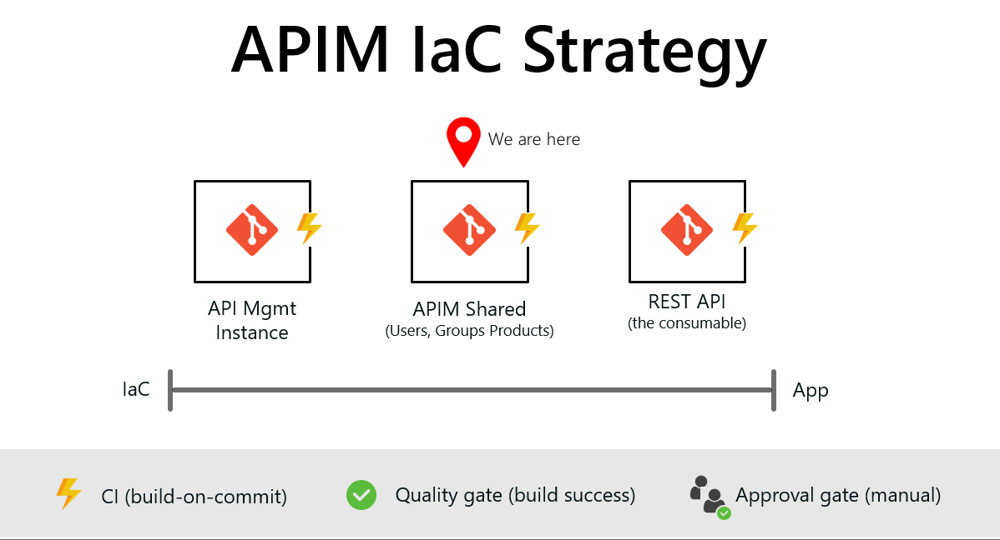
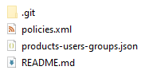
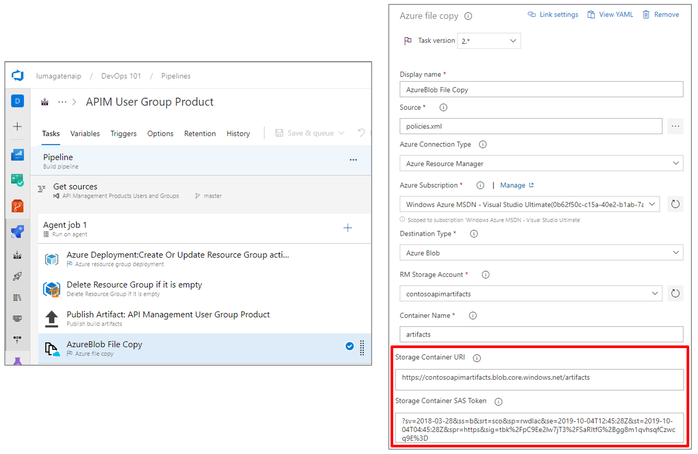

# Azure Storage in Infrastructure-as-Code (Part 1)

ARM templates are the ideal in Azure; idempotent, declarative, parameterized, and reusable. However, sometimes we have deployment artifacts that cannot easily be contained within an ARM template, and are better left to stand on their own.

The case in point for this example are the shared components of Azure API Management (APIM), specifically the APIM policies that define products, and the users and groups (the customers) that have access. In [Day 15](#https://github.com/starkfell/100DaysOfIaC/blob/master/articles/day.15.ci.pt2.md), we deployed an API Management Instance. Now, we are going to look at the shared components of APIM that straddle the line between infastructure (IaC) and the app (the REST APIs we are publishing), as shown in Figure 1.



**Figure 1**. APIM shared infrastructure

> **NOTE**: The contents of API Management Instance and APIM Shared repo are available in the **resources** folder of 100 Days repository.

And over the next three installments, we will move from BAD to BETTER to BEST, in terms of usability and security. In this installment, we will cover:

[Handling APIM policies(embedded XML)](#handling-apim-policies) <br/>
[Handling APIM policies (a better approach)](#handling-apim-policies-a-better-approach) <br/>
[Building the better approach (Azure Blob Storage)](#building-the-better-approach-azure-blob-storage) <br/>
[Designing the Build Pipeline](#designing-the-build-pipeline) <br/>
[Why is this better?](#why-is-this-better) <br/>
[Next Steps](#next-steps) <br/>

Those shared components that fall between the IaC and the app (API) itself may not be managed by my Ops engineer, and not likely by the developer, but someone response for release management.

To fully deploy this Azure API Management infrastructure, the deployment order would follow the repo structure in Figure 1:

- API Management Instance, *then*
- APIM Policies (users, groups, and products), *then*
- APIs (the app or service, in this context)

Again, it's that item in the middle that is our focus in today's discussion.

## Handling APIM policies (embedded XML)

**API Management policies** define users and groups being granted access, and the products (the APIs) they are allowed to access, and are defined in an **XML file**. We can embed XML inside an ARM template, but it looks like this:

``` JSON
{
            "type": "Microsoft.ApiManagement/service/products/policies",
            "name": "[concat(parameters('APIManagementInstanceName'), '/contosoproduct/policy')]",
            "apiVersion": "2017-03-01",
            "scale": null,
            "properties": {
                "policyContent": "<policies>\r\n  <inbound>\r\n    <base />\r\n    <rate-limit calls=\"20\" renewal-period=\"60\" />\r\n  </inbound>\r\n  <backend>\r\n    <base />\r\n  </backend>\r\n  <outbound>\r\n    <base />\r\n  </outbound>\r\n  <on-error>\r\n    <base />\r\n  </on-error>\r\n</policies>"
            }
```

**Figure 2**. XML document (APIM policy) embedded in an ARM template

This is ugly. It's tough to edit, because we cannot use an xml editor. It includes weird escape characters, and limits the complexity of our APIM policy in that a policy with much detail will be very difficult to maintain.

## Handling APIM policies (a better approach)

A better way to do this is to store the XML file is as a stand-alone xml file in a location accessible at deploy (release) time, and just point to it when we need it. As you can see in **Figure 3**, we simply reference the APIM policy with a URL pointer.

``` JSON
"parameters": {
        "APIManagementInstanceName": {
            "type": "string",
            "defaultValue": "MyAPIManagementInstance"
        },
        "productPolicy": {
            "type": "string",
            "defaultValue": "https://contosoapimartifacts.blob.core.windows.net/artifacts/policies.xml",
            "metadata": {
                "description": "Product policy XML."
              }
        }
    }
    
```

**Figure 3**. Referencing XML from an ARM template

That's an XML file I can edit in any XML editor. Ideally, my APIM policies and the ARM template that deploys those policies would look like what you see in my repo, shown in **Figure 4**.



**Figure 4**. APIM policy XML and related ARM template

## Building the better approach (Azure Blob Storage)

To facilitate this approach, I need blob storage where I can store artifacts. In preparation for building this pipeline, I created an Azure blob storage account that I will use as a shared container to store artifacts that need a temporary home to facilitate release, such as the XML file.

## Designing the Build Pipeline

The build pipeline for my shared elements is shown in Figure 5. Notice the Azure blob storage referenced by the **Azure file copy** task at the end of the build pipeline.

> **IMPORTANT**: And also notice there is a SAS key there, which is a secret we must store securely. More on that in the next installment.



**Figure 5**. Build pipeline for shared APIM compo

The build pipeline completes the following steps:

- Validates the ARM templates, using the method shown in [Day 12](#https://github.com/starkfell/100DaysOfIaC/blob/master/articles/day.12.contin.integration.md)
- Deletes the resource group, if empty
- Publishes our deployment template
- Copies another artifact (APIM XML policy) to Azure blob storage

At this point, once user acceptance testing is complete, we are ready to deploy.

## Why is this better?

In a word, usability. With the XML policy embedded in the ARM template, as you see in Figure 2, it takes a developer to edit that file, and it won't be a great experience. The approach we see in Figure 3, that policy file can be updated by a junior analyst or lightly technical build manager interacting with the customer-facing groups within the business (like Sales).

## Next Steps

Now, I am ready for release. In the next two installments, we'll take the next step and make this approach even better. More dynamic, and even more secure.
