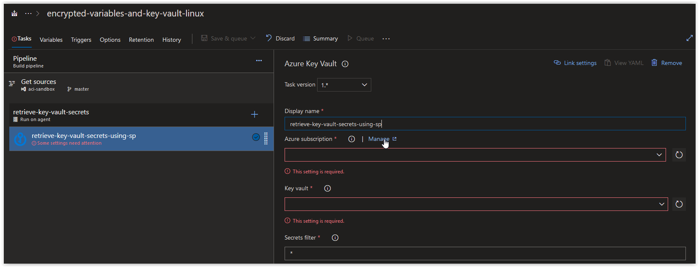
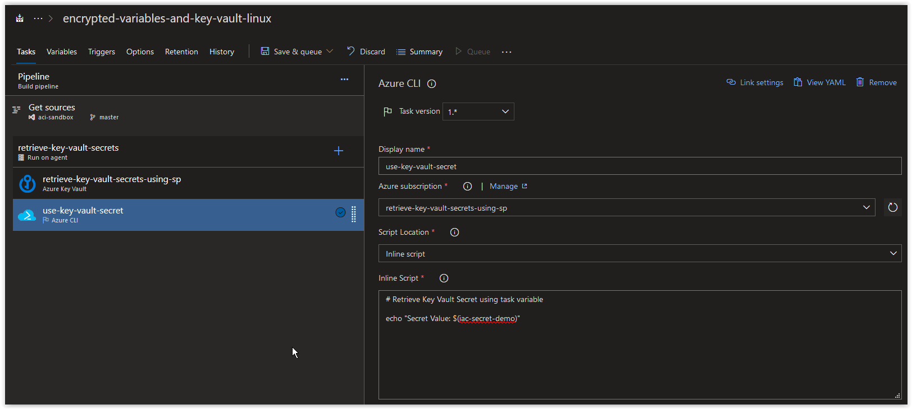
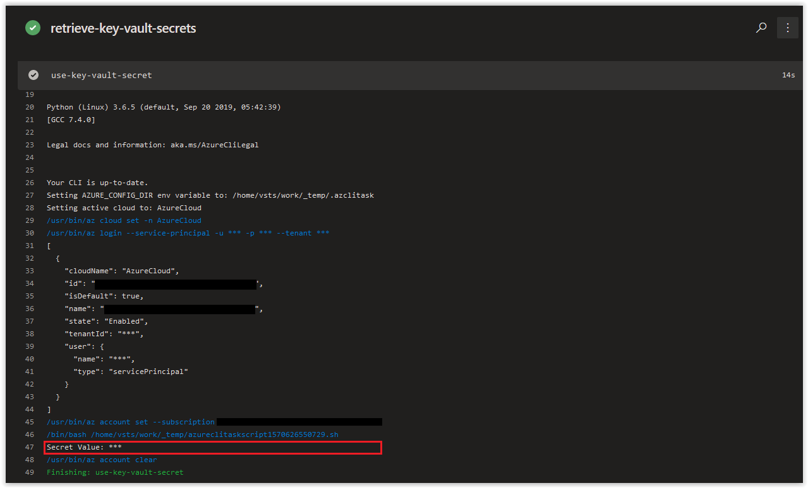

# Day 25 - Build Pipelines, Key Vault Integration (Linux Edition)

In today's article we are going to cover how we can use Key Vault in an Azure Build Pipeline.

> **NOTE:** This article was tested and written for an Azure Build Pipeline using a Microsoft-hosted Agent running Ubuntu 18.04 and a separate Linux Host running Ubuntu 18.04 with Azure CLI installed.

## Create a new Resource Group and an Azure Key Vault

On your Linux Host (with Azure CLI installed), open up a bash prompt and run the following command to create a new Resource Group.

```bash
az group create \
--name encrypted-variables-and-key-vault \
--location westeurope
```

You should get back the following output.

```console
{
  "id": "/subscriptions/00000000-0000-0000-0000-000000000000/resourceGroups/encrypted-variables-and-key-vault",
  "location": "westeurope",
  "managedBy": null,
  "name": "encrypted-variables-and-key-vault",
  "properties": {
    "provisioningState": "Succeeded"
  },
  "tags": null,
  "type": "Microsoft.Resources/resourceGroups"
}
```

Next, run the following command randomly generate 4 alphanumeric characters.

```bash
RANDOM_ALPHA=$(cat /dev/urandom | tr -dc 'a-z0-9' | fold -w 4 | head -n 1)
```

> **NOTE:** We are appending this to the name of our Key Vault to ensure its name is unique.

Next, run the following command to create an Azure Key Vault in the new Resource Group.

```bash
az keyvault create --name "iacvault${RANDOM_ALPHA}" \
--resource-group encrypted-variables-and-key-vault \
--location westeurope \
--output table
```

You should get back the following output when the task is finished.

```console
Location    Name          ResourceGroup
----------  ------------  ---------------------------------
westeurope  iacvault5qn1  encrypted-variables-and-key-vault
```

Next, add the following secret to the Key Vault.

```bash
az keyvault secret set --name iac-secret-demo \
--vault-name "iacvault${RANDOM_ALPHA}" \
--value "100Days0fIaC1!" \
--output table
```

You should get back the following response.

```console
Value
--------------
100Days0fIaC1!
```

<br />

## Create a Service Principal

Next, run the following command to create a new Service Principal.

```bash
AZURE_SP=$(/usr/bin/az ad sp create-for-rbac \
--role "contributor" \
--name "sp-for-keyvault-access" \
--years 3)
```

You should get back a result similar to what is shown below.

```console
Changing "sp-for-keyvault-access" to a valid URI of "http://sp-for-keyvault-access", which is the required format used for service principal names
Creating a role assignment under the scope of "/subscriptions/00000000-0000-0000-0000-000000000000"
  Retrying role assignment creation: 1/36
  Retrying role assignment creation: 2/36
```

<br />

Next retrieve your Azure Subscription ID.

```bash
AZURE_SUB_ID=$(az account show --query id --output tsv)
```

If the above command doesn't work, manually add your Azure Subscription ID to the variable.

```bash
AZURE_SUB_ID="00000000-0000-0000-0000-000000000000"
```

<br />

Assign the contributor role to the new Service Principal for the Key Vault.

```bash
az role assignment create \
--role "Contributor" \
--assignee "http://sp-for-keyvault-access" \
--scope "/subscriptions/${AZURE_SUB_ID}/resourceGroups/encrypted-variables-and-key-vault/providers/Microsoft.KeyVault/vaults/iacvault${RANDOM_ALPHA}"
```

You should get something back similar to what is shown below.

```json
{
  "canDelegate": null,
  "id": "/subscriptions/00000000-0000-0000-0000-000000000000/resourceGroups/encrypted-variables-and-key-vault/providers/Microsoft.KeyVault/vaults/iacvault5qn1/providers/Microsoft.Authorization/roleAssignments/3b940077-949e-4f8b-9013-154ba457b96f",
  "name": "3b940077-949e-4f8b-9013-154ba457b96f",
  "principalId": "0910c088-489e-44a2-9fbd-af486bb6fe6f",
  "principalName": "http://sp-for-keyvault-access",
  "principalType": "ServicePrincipal",
  "resourceGroup": "encrypted-variables-and-key-vault",
  "roleDefinitionId": "/subscriptions/00000000-0000-0000-0000-000000000000/providers/Microsoft.Authorization/roleDefinitions/b24988ac-6180-42a0-ab88-20f7382dd24c",
  "roleDefinitionName": "Contributor",
  "scope": "/subscriptions/00000000-0000-0000-0000-000000000000/resourceGroups/encrypted-variables-and-key-vault/providers/Microsoft.KeyVault/vaults/iacvault5qn1",
  "type": "Microsoft.Authorization/roleAssignments"
}
```

<br />

Retrieve the **appId** from the Azure Service Principal.

```bash
echo $AZURE_SP | jq .appId | tr -d '"'
```

You should get back the **appId** which should look similar to what is shown below, make a note of it.

```console
e1ff9486-f4a9-4744-a672-28fa98c0d5e1
```

<br />

Retrieve the **password** from the Azure Service Principal.

```bash
echo $AZURE_SP | jq .password | tr -d '"'
```

You should get back the **password** which should look similar to what is shown below, make a note of it.

```console
574366ad-1890-4b14-80ac-d716731bbb8b
```

<br />

## Grant the Service Principal Access to the Key Vault Secrets

Next, run the following command to grant the Service Principal to retrieve Secrets in the Key Vault.

```bash
az keyvault set-policy \
--name "iacvault${RANDOM_ALPHA}" \
--spn "http://sp-for-keyvault-access" \
--secret-permissions get list \
--output table
```

You should get back the following response.

```console
Location    Name          ResourceGroup
----------  ------------  ---------------------------------
westeurope  iacvault5qn1  encrypted-variables-and-key-vault
```

<br />

## Configure the Build Pipeline

Next, open up your Azure Build Pipeline and create a new Azure Key Vault task called **retrieve-key-vault-secrets-using-sp** and then click on **Manage** in the *Azure Subscription* section.



<br />

In the Service Connections blade, click on **New Service Connection** and then on **Azure Resource Manager**.


<br />

Next, in the **Add an Azure Resource Manager service connection** window, click on the link **use the full version of the service connection dialog**.


<br />

Next, in the **Add an Azure Resource Manager service connection** window, set the *Connection name* field to **retrieve-key-vault-secrets-using-sp**. Paste in the **appId** value from earlier in the *Service principal client ID* field and the **password** value in the *Service principal key* field. Afterwards, click on the **Verify connection** button. Once the connection is verified, click on the **OK** button.


<br />

Back in your Azure CLI task window, click on the **Refresh Azure subscription** button.


<br />

In the **Azure subscription** field, click on the drop-down arrow and select **retrieve-key-vault-secrets-using-sp** under *Available Azure service connections*.


<br />

In the **Key vault** field, click on the drop-down arrow and select the Key Vault that we created earlier.


<br />

Next, create a new Azure CLI Task called **use-key-vault-secret** and paste in the the code below into the inline Script section. Afterwards click on **Save & queue**.

```bash
# Retrieve Key Vault Secret using task variable

echo "Secret Value: $(iac-secret-demo)"
```



<br />

When the Job is finished running, review the contents of the Azure Key Vault Task **retrieve-key-vault-secrets-using-sp** and you'll see that the *iac-secret-demo* secret was retrieved successfully.


Next, review the contents of the Azure CLI Task **use-key-vault-secret**, to see that the *iac-secret=-demo* is displayed in all asterisks.



<br />

## Conclusion

In today's article we covered how to access Azure resources using a Service Principal that was granted IAM access and how that would behave in an Azure CLI Task in a Build Pipeline. If there's a specific scenario that you wish to be covered in future articles, please create a **[New Issue](https://github.com/starkfell/100DaysOfIaC/issues)** in the [starkfell/100DaysOfIaC](https://github.com/starkfell/100DaysOfIaC/) GitHub repository.
