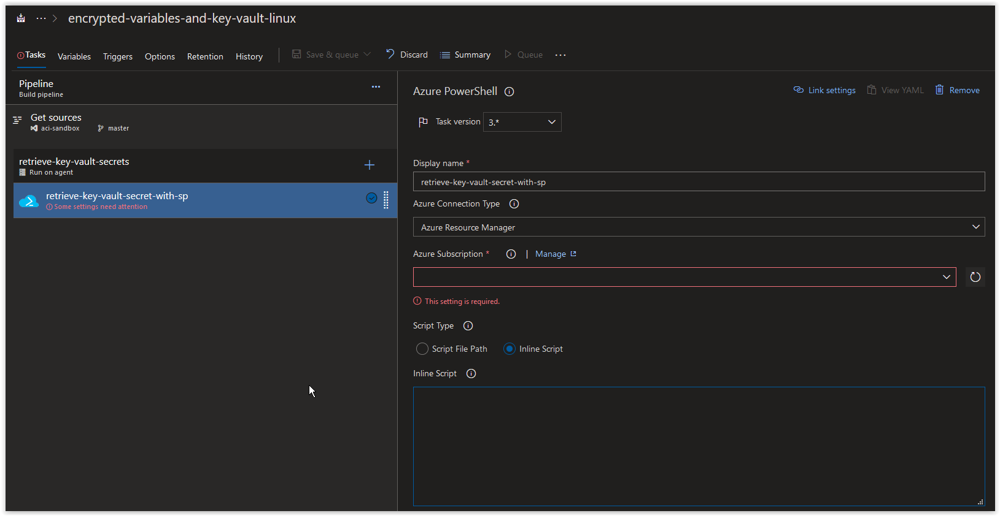
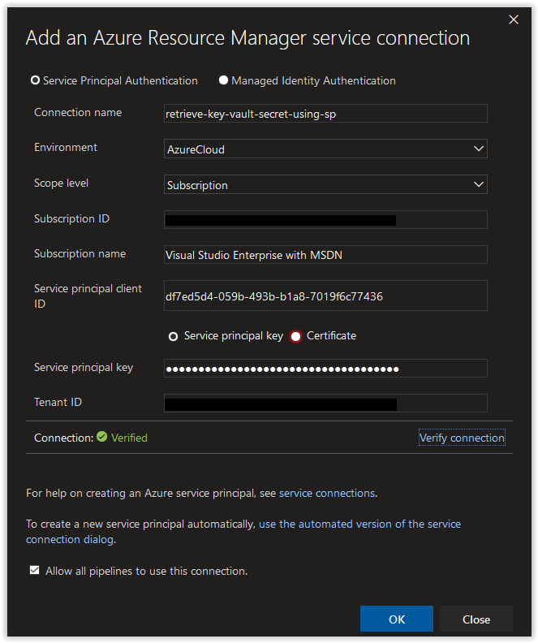
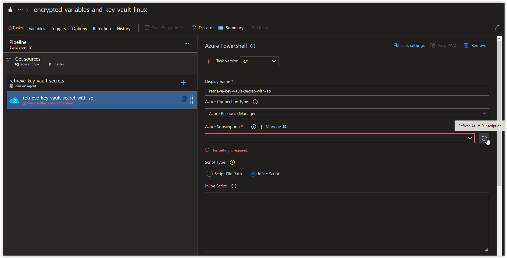
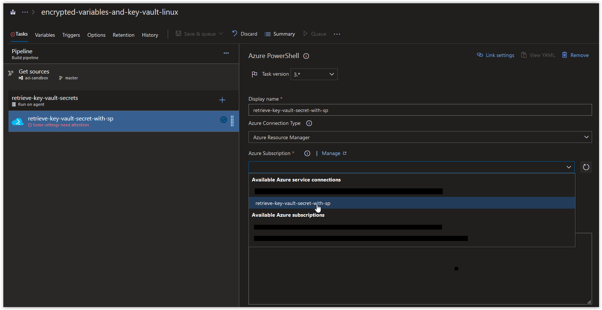
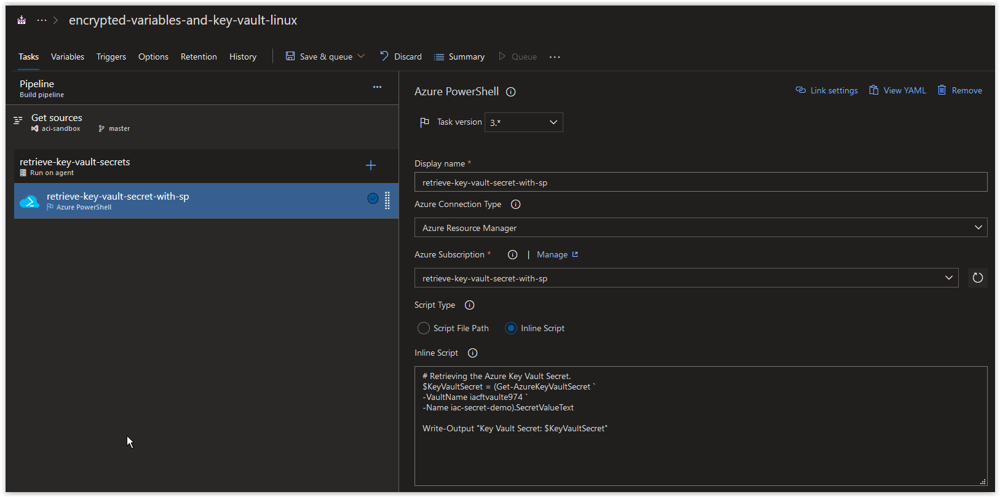
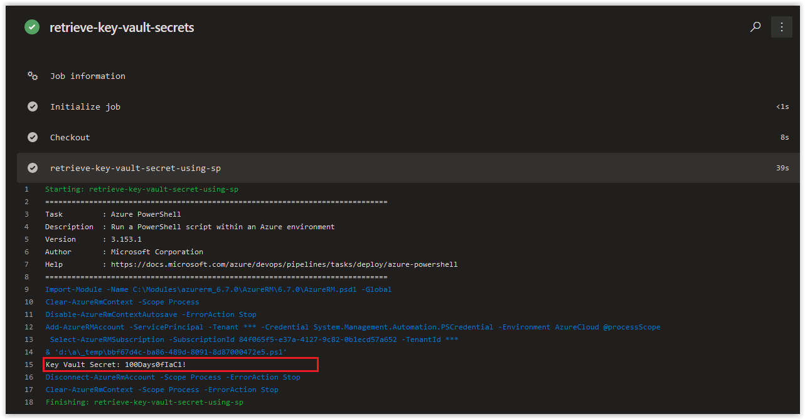

# Day 27 - Build Pipelines, Fine Tuning access to a Key Vault (Windows Edition)

In today's article we are going to cover how to fine-tune access to an Azure Key Vault in a Build Pipeline using a Service Principal.

> **NOTE:** This article was tested and written for an Azure Build Pipeline using a Microsoft-hosted Agent running vs2017-win2016 and a separate Windows Host running Windows 10 with Azure CLI installed.

In the previous two articles, we demonstrated how to use the Azure Key Vault task to access Secrets in an Azure Key Vault. One of the limitations of the Azure Key Vault task is that it requires you to provide *get* and *list* access to the Azure Key Vault to the Service Principal you are using. Well, what if you have certain restrictions in your company where you are required to only be able to access a specific secret but not have access to anything else in the Key Vault? Below we are providing you a method of accomplishing this.

**In this article:**

[Create a new Resource Group and an Azure Key Vault](#create-a-new-resource-group-and-an-azure-key-vault) </br>
[Create a Service Principal](#create-a-service-principal) </br>
[Grant the Service Principal Access to the Key Vault Secrets](#grant-the-service-principal-access-to-the-key-vault-secrets) </br>
[Configure the Build Pipeline](#configure-the-build-pipeline) </br>
[Conclusion](#conclusion) </br>

***
SPONSOR: Need to stop and start your development VMs on a schedule? The Azure Resource Scheduler let's you schedule up to 10 Azure VMs for FREE! Learn more [HERE](https://azuremarketplace.microsoft.com/en-us/marketplace/apps/lumagatena.resourcescheduler?tab=Overview)
***

## Create a new Resource Group and an Azure Key Vault

On your Windows Host (with Azure CLI installed), open up an elevated PowerShell Prompt and run the following command to create a new Resource Group.

```powershell
az group create `
--name fine-tune-access-key-vault `
--location westeurope
```

You should get back the following output.

```json
{
  "id": "/subscriptions/00000000-0000-0000-0000-000000000000/resourceGroups/fine-tune-access-key-vault",
  "location": "westeurope",
  "managedBy": null,
  "name": "fine-tune-access-key-vault",
  "properties": {
    "provisioningState": "Succeeded"
  },
  "tags": null,
  "type": "Microsoft.Resources/resourceGroups"
}
```

Next, run the following command randomly generate 4 alphanumeric characters.

```powershell
$RandomAlpha = (New-Guid).ToString().Substring("0","4")
```

> **NOTE:** We are appending this to the name of our Key Vault to ensure its name is unique.

Next, run the following command to create an Azure Key Vault in the new Resource Group.

```powershell
az keyvault create `
--name "iacftvault$RandomAlpha" `
--resource-group fine-tune-access-key-vault `
--location westeurope `
--output table
```

You should get back the following output when the task is finished.

```console
Location    Name            ResourceGroup
----------  --------------  ---------------------------------
westeurope  iacftvaulte974  fine-tune-access-key-vault
```

Next, add the following secret to the Key Vault.

```powershell
az keyvault secret set --name iac-secret-demo `
--vault-name "iacftvault$RandomAlpha" `
--value "100Days0fIaC1!" `
--output table
```

You should get back the following response.

```console
Value
--------------
100Days0fIaC1!
```

<br />

Next retrieve your Azure Subscription ID and store it in a variable.

```powershell
$AzureSubID = az account show --query id --output tsv
```

If the above command doesn't work, manually add your Azure Subscription ID to the variable.

```powershell
$AzureSubID = "00000000-0000-0000-0000-000000000000"
```

## Create a Service Principal

Next, run the following command to create a new Service Principal called **sp-for-keyvault-access** with no scope assignment.

```powershell
$AzureSP = az ad sp create-for-rbac `
--name "sp-restricted-keyvault-access" `
--role "reader" `
--scope "/subscriptions/$AzureSubID/resourceGroups/fine-tune-access-key-vault/providers/Microsoft.KeyVault/vaults/iacftvault$RandomAlpha" `
--years 1
```

You should get back a result similar to what is shown below.

```console
Changing "sp-for-keyvault-access" to a valid URI of "http://sp-for-keyvault-access", which is the required format used for service principal names
Creating a role assignment under the scope of "/subscriptions/00000000-0000-0000-0000-000000000000"
  Retrying role assignment creation: 1/36
  Retrying role assignment creation: 2/36
```

Next, run the following command to retrieve the **appId** of the Azure Service Principal.

```powershell
($AzureSP | ConvertFrom-Json).appId
```

Make a note of the result as we will be using it again soon.

```console
df7ed5d4-059b-493b-b1a8-7019f6c77436
```

<br />

Next, run the following command to retrieve the **password** of the Azure Service Principal.

```powershell
($AzureSP | ConvertFrom-Json).password
```

Make a note of the result as we will be using it again soon.

```console
6703ead8-8f4b-4e23-99c2-7794aab58496
```

<br />

## Grant the Service Principal Access to the Key Vault Secrets

Next, run the following command to grant the Service Principal **sp-for-keyvault-access** *get* access to Secrets in the Key Vault.

```powershell
az keyvault set-policy `
--name "iacftvault$RandomAlpha" `
--spn "http://sp-restricted-keyvault-access" `
--secret-permissions get `
--output table
```

You should get back a similar response.

```console
Location    Name            ResourceGroup
----------  --------------  --------------------------
westeurope  iacftvaulte974  fine-tune-access-key-vault
```

<br />

## Configure the Build Pipeline

Next, open up your Azure Build Pipeline and create a new Azure PowerShell task called **retrieve-key-vault-secret-with-sp** and then click on **Manage** in the *Azure Subscription* section.



<br />

In the Service Connections blade, click on **New Service Connection** and then on **Azure Resource Manager**.


<br />

Next, in the **Add an Azure Resource Manager service connection** window, click on the link **use the full version of the service connection dialog**.


<br />

Next, in the **Add an Azure Resource Manager service connection** window, set the *Connection name* field to **retrieve-key-vault-secret-using-sp**. Paste in the **appId** value from earlier in the *Service principal client ID* field and the **password** value in the *Service principal key* field. Afterwards, click on the **Verify connection** button. Once the connection is verified, click on the **OK** button.



<br />

Back in your Azure CLI task window, click on the **Refresh Azure subscription** button.



<br />

In the **Azure subscription** field, click on the drop-down arrow and select **retrieve-key-vault-secret-using-sp** under *Available Azure service connections*.



<br />

Next, create a new Azure PowerShell Task called **retrieve-key-vault-secret-using-sp**. In the **Azure Subscription** field, choose either your default Azure Resource Manager service connection or choose the **retrieve-key-vault-secret-using-sp** connection that you created earlier. Next, paste in the the code below into the inline Script section. Make sure to replace the *ValueName* with the actual name of your Azure Key Vault below.

```powershell
# Retrieving the Azure Key Vault Secret.
$KeyVaultSecret = (Get-AzureKeyVaultSecret `
-VaultName iacftvaulte974 `
-Name iac-secret-demo).SecretValueText

Write-Output "Key Vault Secret: $KeyVaultSecret"
```

> NOTE: If the Azure PowerShell Task is asking you for an *Azure PowerShell Version* to use, just choose the **Latest installed version** option.



<br />

Finally, click on **Save & queue**.

When the Job is finished running, review the contents of the PowerShell Task **retrieve-key-vault-secret-using-sp** and you'll see that the *iac-secret-demo* secret was retrieved successfully.



<br />

## Conclusion

In today's article we covered how to fine-tune access to an Azure Key Vault in a Build Pipeline using a Service Principal. If there's a specific scenario that you wish to be covered in future articles, please create a **[New Issue](https://github.com/starkfell/100DaysOfIaC/issues)** in the [starkfell/100DaysOfIaC](https://github.com/starkfell/100DaysOfIaC/) GitHub repository.
