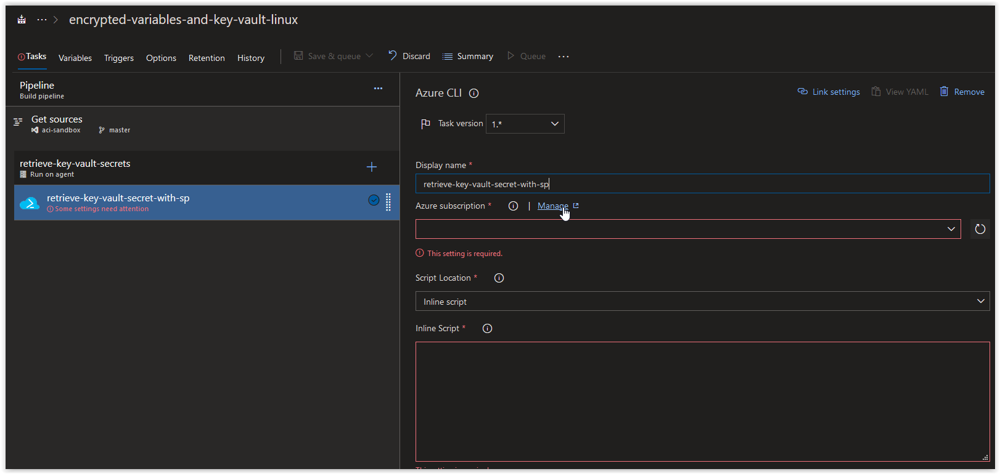
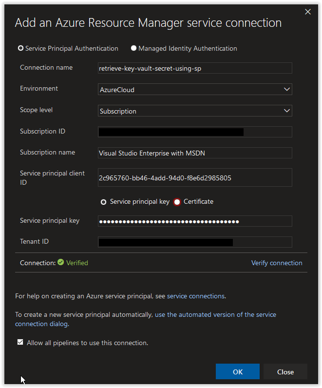
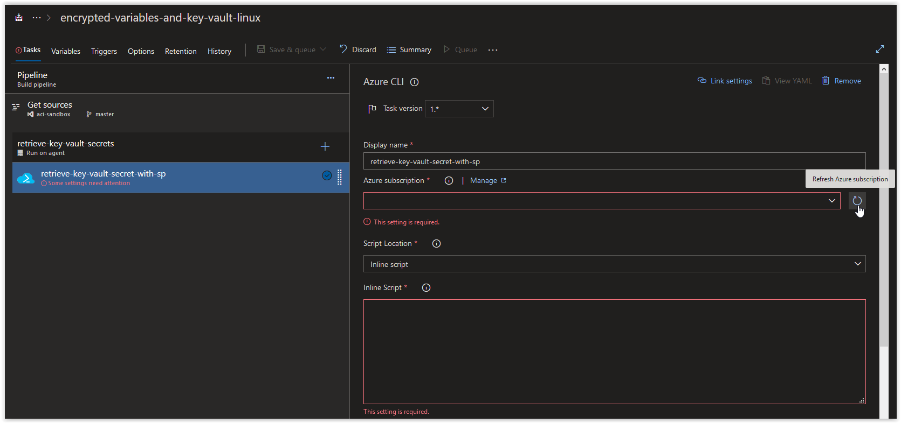
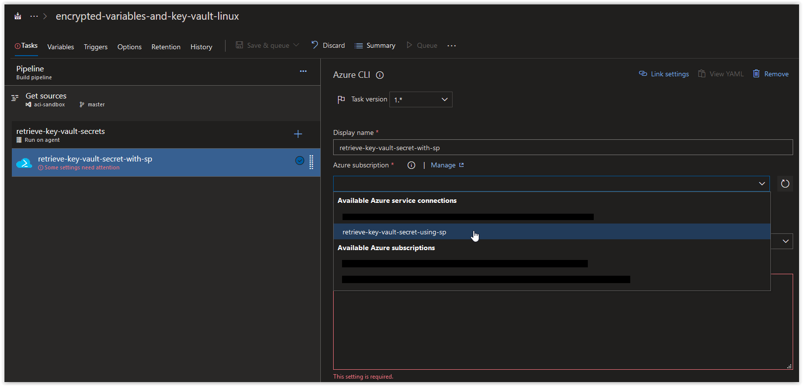
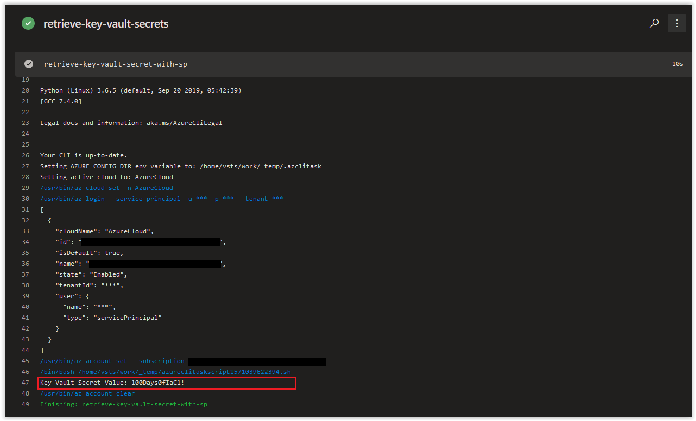

# Day 28 - Build Pipelines, Fine Tuning access to a Key Vault (Linux Edition)

In today's article we are going to cover how to fine-tune access to an Azure Key Vault in a Build Pipeline using a Service Principal. This article is the same identical topic from [Day 27](../articles/day.27.build.pipes.sp.direct.access.to.key.vault.windows.md), but specifically for Linux.

> **NOTE:** This article was tested and written for an Azure Build Pipeline using a Microsoft-hosted Agent running ubuntu-18.04 and a separate Linux Host running Ubuntu 18.04 with Azure CLI installed.

**In this article:**

[Create a new Resource Group and an Azure Key Vault](#create-a-new-resource-group-and-an-azure-key-vault) </br>
[Create a Service Principal](#create-a-service-principal) </br>
[Grant the Service Principal Access to the Key Vault Secrets](#grant-the-service-principal-access-to-the-key-vault-secrets) </br>
[Configure the Build Pipeline](#configure-the-build-pipeline) </br>
[Conclusion](#conclusion) </br>

<br />

## Create a new Resource Group and an Azure Key Vault

On your Linux Host (with Azure CLI installed), open up a bash prompt and run the following command to create a new Resource Group.

```bash
az group create \
--name fine-tune-access-key-vault \
--location westeurope
```

You should get back the following output.

```json
{
  "id": "/subscriptions/00000000-0000-0000-0000-000000000000/resourceGroups/fine-tune-access-key-vault",
  "location": "westeurope",
  "managedBy": null,
  "name": "fine-tune-access-key-vault",
  "properties": {
    "provisioningState": "Succeeded"
  },
  "tags": null,
  "type": "Microsoft.Resources/resourceGroups"
}
```

Next, run the following command randomly generate 4 alphanumeric characters.

```bash
RANDOM_ALPHA=$(cat /dev/urandom | tr -dc 'a-z0-9' | fold -w 4 | head -n 1)
```

> **NOTE:** We are appending this to the name of our Key Vault to ensure its name is unique.

Next, run the following command to create an Azure Key Vault in the new Resource Group.

```bash
az keyvault create \
--name "iacftvault${RANDOM_ALPHA}" \
--resource-group fine-tune-access-key-vault \
--location westeurope \
--output table
```

You should get back the following output when the task is finished.

```console
Location    Name            ResourceGroup
----------  --------------  ---------------------------------
westeurope  iacftvault31mr  fine-tune-access-key-vault
```

Next, add the following secret to the Key Vault.

```bash
az keyvault secret set --name iac-secret-demo \
--vault-name "iacftvault${RANDOM_ALPHA}" \
--value "100Days0fIaC1!" \
--output table
```

You should get back the following response.

```console
Value
--------------
100Days0fIaC1!
```

<br />

Next retrieve your Azure Subscription ID and store it in a variable.

```bash
AZURE_SUB_ID=$(az account show --query id --output tsv)
```

If the above command doesn't work, manually add your Azure Subscription ID to the variable.

```bash
AZURE_SUB_ID="00000000-0000-0000-0000-000000000000"
```

## Create a Service Principal

Next, run the following command to create a new Service Principal called **sp-restricted-keyvault-access** with no scope assignment.

```bash
AZURE_SP=$(az ad sp create-for-rbac \
--name "sp-restricted-keyvault-access" \
--role "reader" \
--scope "/subscriptions/$AZURE_SUB_ID/resourceGroups/fine-tune-access-key-vault/providers/Microsoft.KeyVault/vaults/iacftvault${RANDOM_ALPHA}" \
--years 1)
```

You should get back a result similar to what is shown below.

```console
Changing "sp-restricted-keyvault-access" to a valid URI of "http://sp-restricted-keyvault-access", which is the required format used for service principal names
Creating a role assignment under the scope of "/subscriptions/00000000-0000-0000-0000-000000000000"
  Retrying role assignment creation: 1/36
  Retrying role assignment creation: 2/36
```

Next, run the following command to retrieve the **appId** of the Azure Service Principal.

```bash
echo $AZURE_SP | jq .appId | tr -d '"'
```

Make a note of the result as we will be using it again soon.

```console
2c965760-bb46-4add-94d0-f8e6d2985805
```

<br />

Next, run the following command to retrieve the **password** of the Azure Service Principal.

```bash
echo $AZURE_SP | jq .password | tr -d '"'
```

Make a note of the result as we will be using it again soon.

```console
1e46de92-4c9d-43be-af36-ff26b87e30a3
```

<br />

## Grant the Service Principal Access to the Key Vault Secrets

Next, run the following command to grant the Service Principal **sp-restricted-keyvault-access** *get* access to Secrets in the Key Vault.

```bash
az keyvault set-policy \
--name "iacftvault${RANDOM_ALPHA}" \
--spn "http://sp-restricted-keyvault-access" \
--secret-permissions get \
--output table
```

You should get back a similar response.

```console
Location    Name            ResourceGroup
----------  --------------  --------------------------
westeurope  iacftvault31mr  fine-tune-access-key-vault
```

<br />

## Configure the Build Pipeline

Next, open up your Azure Build Pipeline and create a new Azure PowerShell task called **retrieve-key-vault-secret-with-sp** and then click on **Manage** in the *Azure Subscription* section.



<br />

In the Service Connections blade, click on **New Service Connection** and then on **Azure Resource Manager**.


<br />

Next, in the **Add an Azure Resource Manager service connection** window, click on the link **use the full version of the service connection dialog**.


<br />

Next, in the **Add an Azure Resource Manager service connection** window, set the *Connection name* field to **retrieve-key-vault-secret-using-sp**. Paste in the **appId** value from earlier in the *Service principal client ID* field and the **password** value in the *Service principal key* field. Afterwards, click on the **Verify connection** button. Once the connection is verified, click on the **OK** button.



<br />

Back in your Azure CLI task window, click on the **Refresh Azure subscription** button.



<br />

In the **Azure subscription** field, click on the drop-down arrow and select **retrieve-key-vault-secret-using-sp** under *Available Azure service connections*.



<br />

Next, create a new Azure CLI Task called **retrieve-key-vault-secret-using-sp**. In the **Azure Subscription** field, choose either your default Azure Resource Manager service connection or choose the **retrieve-key-vault-secret-using-sp** connection that you created earlier. Next, paste in the the code below into the inline Script section. Make sure to replace the *ValueName* with the actual name of your Azure Key Vault below.

```bash
# Retrieving the Azure Key Vault Secret.
KEY_VAULT_SECRET=$(az keyvault secret show \
--vault-name "iacftvault31mr" \
--name iac-secret-demo \
--query value \
--output tsv)

echo "Key Vault Secret Value: $KEY_VAULT_SECRET"
```


<br />

Finally, click on **Save & queue**.

When the Job is finished running, review the contents of the Azure CLI Task **retrieve-key-vault-secret-using-sp** and you'll see that the *iac-secret-demo* secret was retrieved successfully.



<br />

## Conclusion

In today's article we covered how to fine-tune access to an Azure Key Vault in a Build Pipeline using a Service Principal. If there's a specific scenario that you wish to be covered in future articles, please create a **[New Issue](https://github.com/starkfell/100DaysOfIaC/issues)** in the [starkfell/100DaysOfIaC](https://github.com/starkfell/100DaysOfIaC/) GitHub repository.
