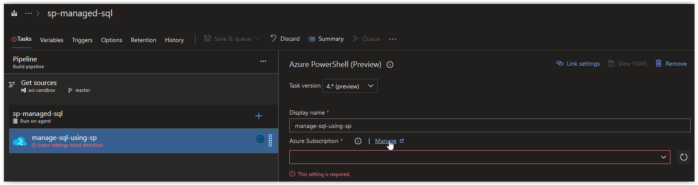
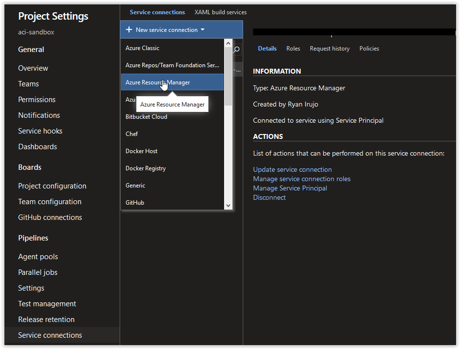
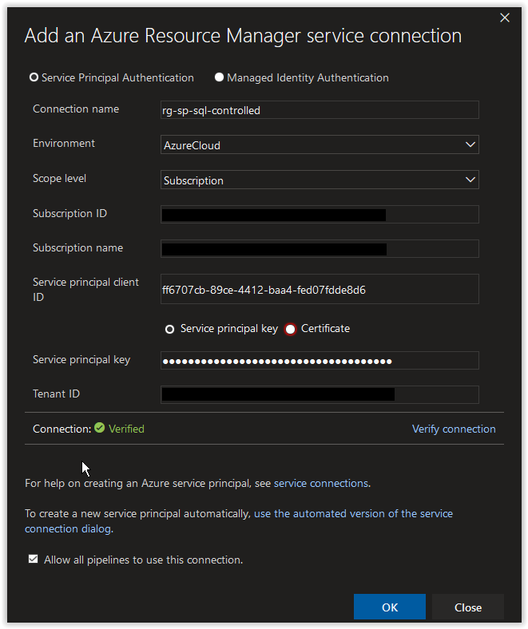
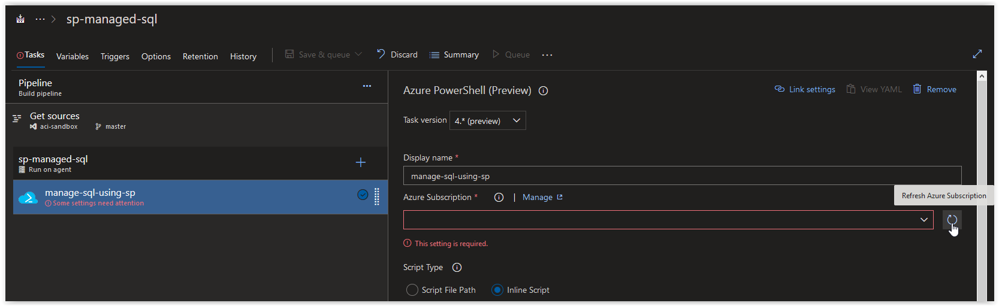
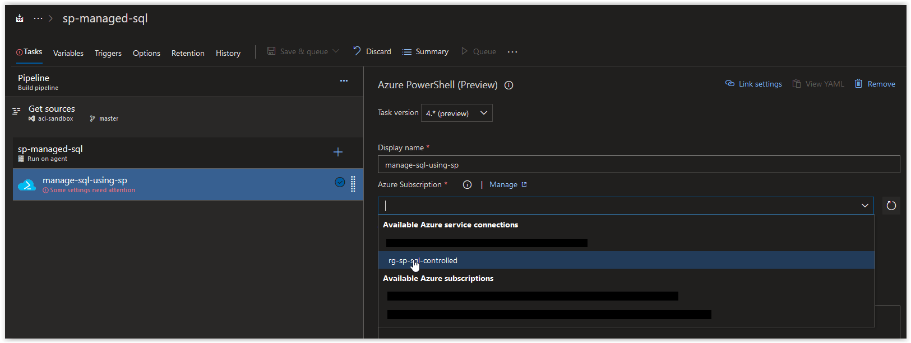
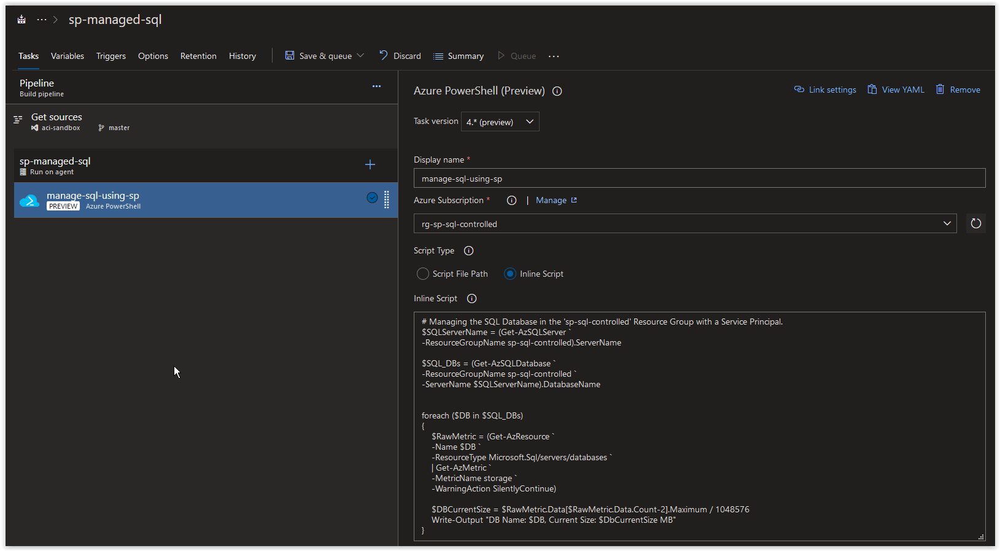
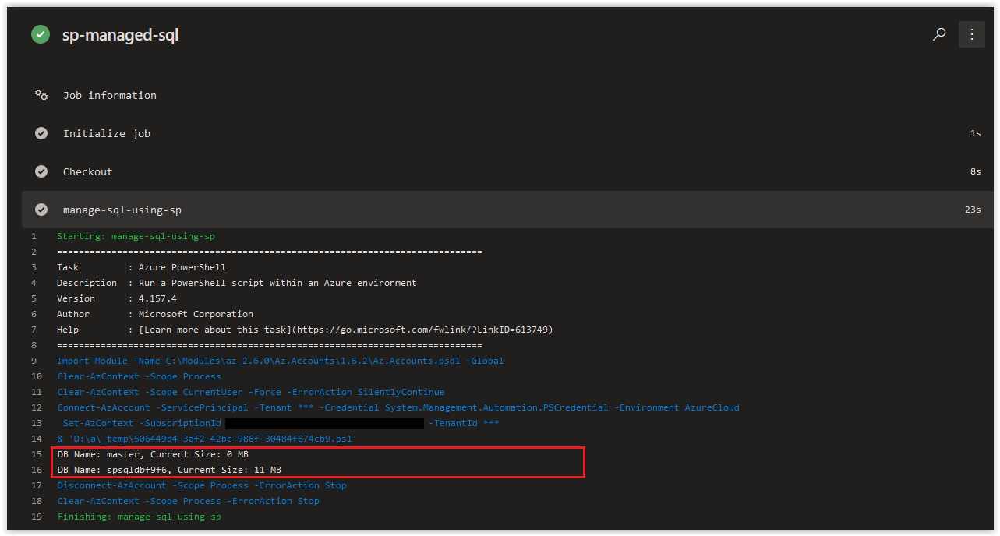

# Day 31 - Build Pipelines, using a Service Principal to manage SQL Resources (Linux Edition)

In today's article we are going to cover how to create and restrict a Service Principal to manage SQL Resources in a Build Pipeline. In Azure DevOps, you have several options natively available and in the Marketplace for deploying and managing SQL in Azure. We hope that the walkthrough below provides you with another method to add to your existing arsenal when you are determining what options are available for in a Build Pipeline.

> **NOTE:** This article was tested and written for an Azure Build Pipeline using a Microsoft-hosted Agent running vs2017-win2016 and a separate Windows Host running Windows 10 with Azure CLI installed.

**In this article:**

[Create a Resource Group, SQL Server and SQL DB](#create-a-resource-group-sql-server-and-sql-db) </br>
[Create a Service Principal](#create-a-service-principal) </br>
[Configure the Build Pipeline](#configure-the-build-pipeline) </br>
[Things to Consider](#things-to-consider) </br>
[Conclusion](#conclusion) </br>

## Create a Resource Group, SQL Server and SQL DB

<br />

On your Windows Host (with Azure CLI installed), open up an elevated PowerShell prompt and run the following command to create a new Resource Group.

```powershell
az group create `
--name sp-sql-controlled `
--location westeurope
```

You should get back the following output:

```console
{
  "id": "/subscriptions/00000000-0000-0000-0000-000000000000/resourceGroups/sp-sql-controlled",
  "location": "westeurope",
  "managedBy": null,
  "name": "sp-sql-controlled",
  "properties": {
    "provisioningState": "Succeeded"
  },
  "tags": null,
  "type": "Microsoft.Resources/resourceGroups"
}
```

<br />

Next, run the following command randomly generate 4 alphanumeric characters.

```powershell
$RandomAlpha = (New-Guid).ToString().Substring("0","4")
```

> **NOTE:** We are appending this to the name of our Azure SQL Server and DB to ensure uniqueness.

<br />

Next, run the following command to create a new Azure SQL Server.

```powershell
$NewSQLServer = az sql server create `
--admin-user "spsrvdemo" `
--admin-password "D0NotU2E1nPr0duct1on1!" `
--name "spsqlsrv$RandomAlpha" `
--resource-group sp-sql-controlled `
--location westeurope
```

The previous action will display the following output for a minute or two:

```console
 - Running ..
```

<br />

Run the following command to verify that the Azure SQL Server was provisioned successfully.

```powershell
($NewSQLServer | ConvertFrom-Json).state
```

You should get back the following output:

```console
"Ready"
```

<br />

Next, run the following command to create a new Azure SQL DB.

```powershell
$NewSQLDB = az sql db create `
--name "spsqldb$RandomAlpha" `
--server "spsqlsrv$RandomAlpha" `
--resource-group sp-sql-controlled `
--edition Basic `
--sample-name AdventureWorksLT `
--capacity 5
```

The previous action will display the following output for a minute or two:

```console
 - Running ..
```

<br />

Run the following command to verify that the Azure SQL DB was provisioned successfully.

```bash
($NewSQLDB | ConvertFrom-Json).status
```

You should get back the following output:

```console
"Online"
```

<br />

## Create a Service Principal

Next, run the following to retrieve your Azure Subscription ID and store it in a variable.

```powershell
$AzureSubscriptionId = az account show --query id --output tsv
```

If the above command doesn't work, manually add your Azure Subscription ID to the variable.

```powershell
$AzureSubscriptionId = "00000000-0000-0000-0000-000000000000"
```

On your Windows Host (with Azure CLI installed), open up an elevated PowerShell prompt and run the following command to create a new Service Principal.

```powershell
$AzureResourceSP = az ad sp create-for-rbac `
--role "contributor" `
--name "rg-sp-sql-controlled" `
--scope "/subscriptions/$AzureSubscriptionId/resourceGroups/sp-sql-controlled" `
--years 1
```

You should get back a result similar to what is shown below. You'll notice that the **contributor** right assignment is scoped to the Resource Group.

```console
Changing "rg-sp-sql-controlled" to a valid URI of "http://rg-sp-sql-controlled", which is the required format used for service principal names
Creating a role assignment under the scope of "/subscriptions/00000000-0000-0000-0000-000000000000/resourceGroups/sp-sql-controlled"
  Retrying role assignment creation: 1/36
  Retrying role assignment creation: 2/36
```

<br />

Retrieve the **appId** from the Azure Service Principal.

```powershell
($AzureResourceSP | ConvertFrom-Json).appId
```

You should get back the **appId** which should look similar to what is shown below, make a note of it.

```console
ff6707cb-89ce-4412-baa4-fed07fdde8d6
```

<br />

Retrieve the **password** from the Azure Service Principal.

```powershell
($AzureResourceSP | ConvertFrom-Json).password
```

You should get back the **password** which should look similar to what is shown below, make a note of it.

```console
44b4ce9a-0df0-4662-86de-dea697f220d0
```

<br />

## Configure the Build Pipeline

Next, open up your Azure Build Pipeline and create a new Azure PowerShell task called **manage-sql-using-sp** and then click on **Manage** in the *Azure Subscription* section.

> **NOTE:** We are using Azure PowerShell Task Version 4.0 (Preview) to take advantage of its support for the Az Module.



<br />

In the Service Connections blade, click on **New Service Connection** and then on **Azure Resource Manager**.



<br />

Next, in the **Add an Azure Resource Manager service connection** window, click on the link **use the full version of the service connection dialog**.


<br />

Next, in the **Add an Azure Resource Manager service connection** window, set the *Connection name* field to **rg-sp-sql-controlled**. Paste in the **appId** value from earlier in the *Service principal client ID* field and the **password** value in the *Service principal key* field. Afterwards, click on the **Verify connection** button. Once the connection is verified, click on the **OK** button.



<br />

Back in your Azure CLI task window, click on the **Refresh Azure subscription** button.



<br />

In the **Azure subscription** field, click on the drop-down arrow and select **rg-sp-sql-controlled** under *Available Azure service connections*.



<br />

Next, copy and paste in the code below into the inline Script section and then click on **Save & queue**. The purpose of this script is to retrieve the current size of all existing SQL Databases in on the SQL Server in the Resource Group.

```powershell
# Managing the SQL Database in the 'sp-sql-controlled' Resource Group with a Service Principal.
$SQLServerName = (Get-AzSQLServer `
-ResourceGroupName sp-sql-controlled).ServerName

$SQL_DBs = (Get-AzSQLDatabase `
-ResourceGroupName sp-sql-controlled `
-ServerName $SQLServerName).DatabaseName


foreach ($DB in $SQL_DBs)
{
    $RawMetric = (Get-AzResource `
    -Name $DB `
    -ResourceType Microsoft.Sql/servers/databases `
    | Get-AzMetric `
    -MetricName storage `
    -WarningAction SilentlyContinue)

    $DBCurrentSize = $RawMetric.Data[$RawMetric.Data.Count-2].Maximum / 1048576
    Write-Output "DB Name: $DB, Current Size: $DbCurrentSize MB"
}
```

<br />



<br />

When the job has completed, you should see the Storage Account Primary Key in the Job Logs.



<br />

## Things to Consider

The Service Principal we created is specifically targeting the Resource Group where the SQL Server and Databases are deployed. You can technically narrow down the Service Principal's access even further to the SQL Server and/or database; however, what kind of actions you'll be able to take may be more restricted than you intended.

The metrics for the **master** based that were queried using the *Get-AzMetric* module were legitimate; however all the returned entries for the times provided were null. Be aware that this type of behavior may happen in Azure PowerShell and Azure CLI and test your scripts thoroughly before implementing them in production.

The inline script that we provided is used to illustrate the types of options you have available to you. You could also do things such as checking a database for an existing set of columns or entries and then perform some type of action based on the results in the task(s) that follow.

<br />

## Conclusion

In today's article we covered how to create and restrict a Service Principal to manage SQL Resources in a Build Pipeline. If there's a specific scenario that you wish to be covered in future articles, please create a **[New Issue](https://github.com/starkfell/100DaysOfIaC/issues)** in the [starkfell/100DaysOfIaC](https://github.com/starkfell/100DaysOfIaC/) GitHub repository.
