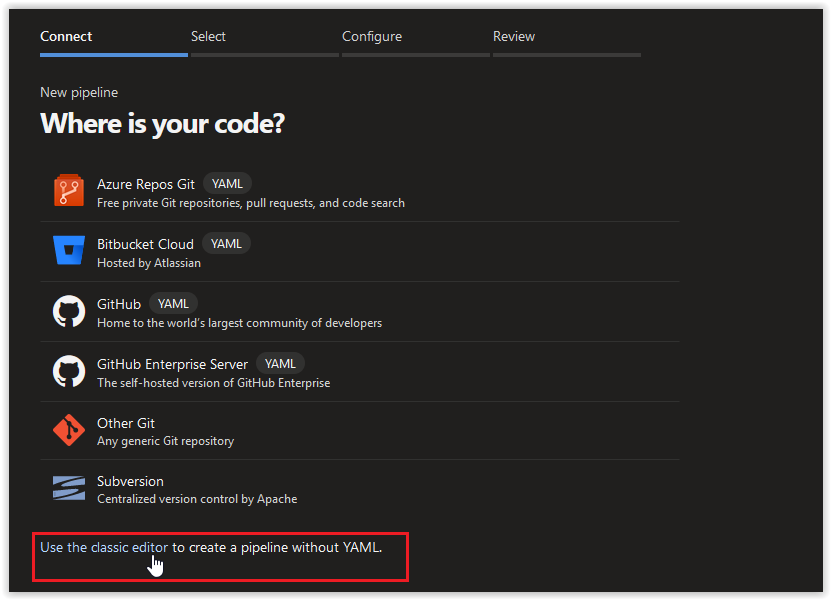

# Day 33 - YAML Pipelines in Azure DevOps: When and Why

*Today's post comes from guest contributor Tao Yang [@MrTaoYang](https://twitter.com/mrtaoyang). Tao is a Microsoft MVP who from 9-to-5 focuses on DevOps and governance in Azure for enterprise customers. You can find Tao blogging at [Managing Cloud and Datacenter by Tao Yang](https://blog.tyang.org/).*

Today, we will start our discussion on [Azure DevOps YAML pipelines](https://docs.microsoft.com/en-us/azure/devops/pipelines/yaml-schema?view=azure-devops&tabs=schema&WT.mc_id=DOP-MVP-5000997). YAML pipelines allow you to develop your CI/CD pipeline as code so it can be source-controlled, and stored together with the rest of your solution in the repository.

**In this article:**

[Pipeline as Code](#pipeline-as-code)  
[Why using YAML pipelines](#why-using-yaml-pipelines)  
[When to use YAML pipelines](#when-to-use-yaml-pipelines)  
[Conclusion](#conclusion)  

***
SPONSOR: Need to stop and start your development VMs on a schedule? The Azure Resource Scheduler let's you schedule up to 10 Azure VMs for FREE! Learn more [HERE](https://azuremarketplace.microsoft.com/en-us/marketplace/apps/lumagatena.resourcescheduler?tab=Overview)
***

## Pipeline as Code

When using CI/CD pipelines to deploy your infrastructure as code projects, the infrastructure you are deploying is defined in the form of source code, generally stored in a git repository. In addition to the IaC code and artifacts, you would also develop CI/CD pipelines to build, test and deploy the solution. Traditionally, you would use a GUI interface provided by your CI/CD tool to develop the pipelines.

Your code often changes. You would have already setup a thorough test and code review process to ensure only valid and high quality code is committed to the branch that's been targeted by the pipeline. However, if your pipeline was manually created using a GUI interface, it is not part of your source code. Therefore it is hard to code review and track changes to the pipeline itself.

To Address this issue, in recent years, all the major CI/CD and DevOps tooling providers such as Azure DevOps, Jenkins have started supporting the ***Pipeline as Code*** capability. As the name suggests, it allows you to define your pipelines as code, so you can stored it together with the rest of your code (that the pipeline deploys). In Azure DevOps, the language of code-driven pipelines is ***YAML***.

**YAML** stands for ***YAML Ain't Markup Language***; it is a human friendly data serialization language. Unlike XML that uses angle bracket tags(\<tag\>), and JSON uses curly brackets ({}) and square brackets ([]), YAML simply uses indentation, making it very readable.

## Why To Use YAML Pipelines
YAML pipelines give you better control of your overall IaC solution. If you have already setup a code review and approval process, any changes to the pipeline will go through the same process as your IaC code before deployments. This has also made it really easy if you want to migrate your Azure DevOps projects to another Azure DevOps account or project.

## When To Use YAML Pipelines
In Azure DevOps, YAML pipelines has become the default experience when setting up a pipeline from the portal. To create a classic pipeline using GUI, you must select the not-so-obvious "***Use the classic editor***" link at the bottom (as shown below).

 

Although YAML pipelines gives you ability to better manage the lifecycle of your pipelines, it does come with increased level of complexity:

1. The pipelines are defined in YAML, for those who have not used YAML in the past, this is another markup language you must learn.
2. You will need to learn the YAML pipeline schema, as well as the syntax and options for each task within the pipeline. This can be time consuming initially.

Based on my experience, I have discovered the following differences between YAML pipelines and classic pipelines:

1. YAML pipelines also don't separate CI (Build) and CD (Release) pipelines. You will create one pipeline for both CI and CD pipelines.
2. When setting release approvals in a [multi-stage YAML pipeline](https://docs.microsoft.com/en-us/azure/devops/pipelines/process/stages?view=azure-devops&tabs=yaml&WT.mc_id=DOP-MVP-5000997), you must utilize [environments](https://docs.microsoft.com/en-us/azure/devops/pipelines/process/environments?view=azure-devops&WT.mc_id=DOP-MVP-5000997) - since approvals are configured per environment.
3. Unlike classic pipelines, you cannot create recurring schedules for certain stages in release pipelines. Schedules will apply to the entire pipeline instead of a given stage.

Using YAML pipeline is certainly a stretch for someone who is new to Azure DevOps. If you are new to it, I suggest you to start with classic pipelines, get comfortable with creating classic pipelines, service connections, variables, etc. before jumping into YAML pipelines.

 

Once you can comfortably create pipelines in the classic editor, you should definitely start using YAML pipelines. Although it could be time consuming initially, you will become faster over time. When you are creating similar patterns, re-using previous pipelines are as easy as copy and paste relevant YAML code.

## Conclusion
In today's article, we have briefly explained the concept of pipeline-as-code and Azure DevOps YAML pipeline. We have also discussed why and when to use YAML pipelines. We will cover How to get started with YAML pipelines in the coming days.
