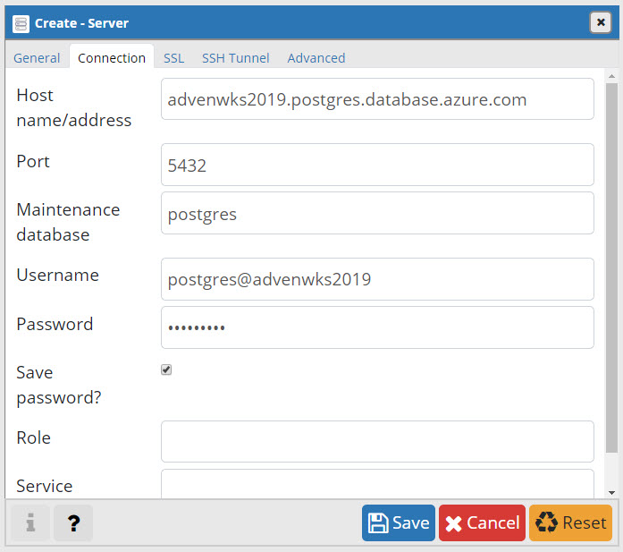
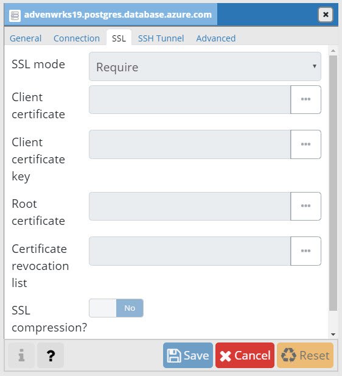
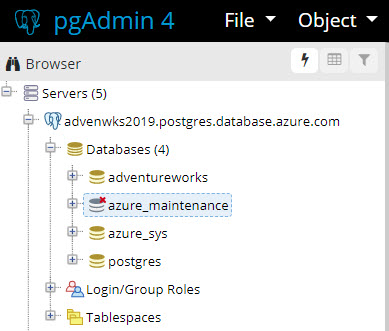

# Day 36 - Transform Existing Scripts to YAML Pipelines (Part 1)

Now that we have explored the what, when, why, and how of YAML pipelines, we're going to take a look at transforming your existing scripts into proper Infrastructure-as-Code through a PaaS database scenario. This installment will deploy and configure an [Azure Database for PostgreSQL](https://azure.microsoft.com/en-us/services/postgresql/) instance, create the AdventureWorks database, and then populate that database with data. 

Today, we’ll do all of this using the Azure CLI and native PostgreSQL psql client utility from a bash (.sh) script. So you can walk through the scenario, we're going to give you the script.

Tomorrow, we’ll convert this scripted deployment into a multi-stage YAML pipeline, demonstrating how you can transform your existing script resources into reliable Infrastructure-as-Code deployments. 

While you can run shell scripts on Windows with some work, I am using an Ubuntu 18.04 VM instance I deployed on Windows 10 using the [Linux Quick Create wizard](https://www.insidethemicrosoftcloud.com/new-linux-vm-experience-via-quick-create-on-windows-10/) in Hyper-V on Windows 10. A shell script, which is how we run Azure CLI, is a bit easier to support on Linux in my opinion.

> **NOTE**: You'll need a service principal to drive the deployment in this installment. Instructions for this are in Day 4 (Linux) and Day 6 (Windows) of the 100 Days of IaC series.

In this installment:

[Installing the PostgreSQL client utilities (psql)](#installing-the-postgresql-client-utilities-psql) </br>
[Azure Database for PostgreSQL Script](#azure-database-for-postgresql-script) </br>
[Script Resource Downloads](#script-resource-downloads) </br>
[Connecting to the Azure DB for PostgreSQL instance](#Connecting-to-the-azure-db-for-postgresql-instance) </br>

## Installing the PostgreSQL client utilities (psql)

We’ll need the PostgreSQL 10 client utilities, which includes the psql command line utility we’ll use in our script to populate the database with data. The instructions below only install the PostgreSQL client utilities, not a full database instance!

**Ubuntu 16.04 or 18.04**

On Ubuntu, you'll run this 1-line command:

``` Bash
sudo apt-get -y install postgresql-client-10
```
**Windows 10**

On Windows 10, it takes more work. You will need to download the PostgreSQL Enterprise Install and choose the ‘Command line only’ option in the gui-based installation wizard. You can find a download link for PostgreSQL 10.x [HERE](https://www.enterprisedb.com/downloads/postgres-postgresql-downloads)

## Azure Database for PostgreSQL Script

The sample script performs the following actions:

- Authenticates to specified Azure sub with a service principal
- Deploys an Azure DB for PostgreSQL server instance
- Configures server instance with values specified
- Creates the AdventureWorks database
- Populates the database (thanks to [Tonint](https://github.com/search?q=torint)!)

> **WARNING**: So we can demonstrate connecting to the database instance, this sample creates a firewall rule that opens this instance to the Internet! Make sure to tweak the IP address range in section 3 of the script for your environment.

**SYNTAX**

``` Bash
./createpostgres.sh -i {AZURE_SUBSCRIPTION_ID} -t {AZURE_SUBSCRIPTION_TENANT_ID} -l {AZURE_LOCATION} -r {POSTGRES_RG} -u {MGMT_SP_USERNAME} -p {MGMT_SP_PASSWORD} -d {DB_USERNAME} -x {DB_PASSWORD} -c {ENV_PREFIX} -v {POSTGRES_VERSION} -k {SKU_NAME} -b {BACKUP_RET} -y {GEO_BACKUP}
```

**EXAMPLE**

Get the example from the syntax help area in the script!

**FULL SCRIPT**

``` Bash
#!/bin/bash

#########################################################################################################
#
# Name:             Azure DB for PostgreSQL - AdventureWorks
#
# Description:      This script is responsible for deploying and configuring an Azure Database for PostgreSQL
#                   instance. Then, the script creates and populates the AdventureWorks database from
#                   from the command line with the native psql utility.
# 
#########################################################################################################

# Parse Script Parameters.
while getopts ":i:t:l:r:u:p:d:x:c:v:k:b:y:" opt; do
    case "${opt}" in
        i) # Azure Subscription ID.
             AZURE_SUBSCRIPTION_ID=${OPTARG}
             ;;
        t) # Azure Subscription Tenant ID.
             AZURE_SUBSCRIPTION_TENANT_ID=${OPTARG}
             ;;
        l) # Azure Location.
             AZURE_LOCATION=${OPTARG}
             ;;
        r) # The Resource Group name for the File Share & related resources.
             POSTGRES_RG=${OPTARG}
             ;;
        u) # Service Principal Username, used for deployment in Azure.
             MGMT_SP_USERNAME=${OPTARG}
             ;;
        p) # Service Principal Password, used for deployment in Azure.
             MGMT_SP_PASSWORD=${OPTARG}
             ;;
        d) # Postgres Admin Username that will be created for this instance
             DB_USERNAME=${OPTARG}
             ;;
        x) # Postgres Password. Note this must meet Microsoft's complexity requirements for this service.
             DB_PASSWORD=${OPTARG}
             ;;
        c) # The name for the Azure DB for PostgreSQL server instance.
             SVR_NAME=${OPTARG}
             ;;
        v) # Major and minor PostgreSQL version number.
             POSTGRES_VERSION=${OPTARG}
             ;;
        k) # Azure DB for Postgres SKU.
             SKU_NAME=${OPTARG}
             ;;
        b) # Azure File Share Quota. 
             BACKUP_RET=${OPTARG}
             ;;
        y) # Azure File Share Quota. 
             GEO_BACKUP=${OPTARG}
             ;;
        \?) # Unrecognised option - show help.
            echo -e \\n"Option [-${BOLD}$OPTARG${NORM}] is not allowed. All Valid Options are listed below:"
            echo -e "-i AZURE_SUBSCRIPTION_ID                    - The Azure Subscription ID."
            echo -e "-t AZURE_SUBSCRIPTION_TENANT_ID             - The Azure Subscription Tenant ID."
            echo -e "-l AZURE_LOCATION                           - The Azure Location where instance will be deployed."
            echo -e "-r POSTGRES_RG                              - Resource group name for Azure DB for PostgreSQL instance."
            echo -e "-u MGMT_SP_USERNAME                         - Management Service Principal Username."
            echo -e "-p MGMT_SP_PASSWORD                         - Management Service Principal Password."
            echo -e "-d DB_USERNAME                              - Postgres Username." 
            echo -e "-x DB_PASSWORD                              - Postgres Password."
            echo -e "-c SVR_NAME                               - The naming prefix for associated environment."
            echo -e "-v POSTGRES_VERSION                         - Postgres version nubmer to deploy."
            echo -e "-k SKU_NAME                                 - Azure DB for Postgres SKU."
            echo -e "-b BACKUP_RET                               - Backup data retention (in days)."
            echo -e "-y GEO_BACKUP                               - Enable or disable geo backup of postgres data."
            echo -e "Script Syntax is shown below:"
            echo -e "./createpostgres.sh -i {AZURE_SUBSCRIPTION_ID} -t {AZURE_SUBSCRIPTION_TENANT_ID} -l {AZURE_LOCATION} -r {POSTGRES_RG} -u {MGMT_SP_USERNAME} -p {MGMT_SP_PASSWORD} -d {DB_USERNAME} -x {DB_PASSWORD} -c {SVR_NAME} -v {POSTGRES_VERSION} -k {SKU_NAME} -b {BACKUP_RET} -y {GEO_BACKUP}"
            echo -e "An Example of how to use this script is shown below:"
            echo -e "./createpostgres.sh -i 0b62f50c-c15a-40e2-b1ab-7ac2596a1385 -t cf5b57b5-3bce-46f1-82b0-396341247726 -l eastus -r advwks-rg -u iac-sp -p '053c7e32-a074-4fea-a8fb-169883esdfwer' -d postgres -x 'MyP@ssw0rd!' -c advenwrks19 -v 9.6 -k GP_Gen5_2 -b 7 -y Disabled \\n"
            exit 2
            ;;
    esac
done
shift $((OPTIND-1))

# Logging in to Azure as the Management Service Principal.
# /usr/bin/az login --service-principal -u "$K8S_MGMT_SP_USERNAME" -p $K8S_MGMT_SP_PASSWORD --tenant $AZURE_SUBSCRIPTION_TENANT_ID 
/usr/bin/az login --service-principal -u "http://$MGMT_SP_USERNAME" -p $MGMT_SP_PASSWORD --tenant $AZURE_SUBSCRIPTION_TENANT_ID # > /dev/null 2>&0

if [ $? -eq 0 ]; then
    echo "[$(date -u)][---success---] Logged into Azure as the Service Principal [$MGMT_SP_USERNAME]."
else
    echo "[$(date -u)][---fail---] Failed to login to Azure as the Service Principal [$MGMT_SP_USERNAME]."
    exit 2
fi

# Setting the Azure Subscription to work with.
/usr/bin/az account set -s $AZURE_SUBSCRIPTION_ID > /dev/null 2>&0

if [ $? -eq 0 ]; then
    echo "[$(date -u)][---success---] Azure CLI set to Azure Subscription [$AZURE_SUBSCRIPTION_ID]."
else
    echo "[$(date -u)][---fail---] Failed to set Azure CLI to Azure Subscription [$AZURE_SUBSCRIPTION_ID]."
    exit 2
fi

###################################
# Step 1: Create the Resource Group
###################################

/usr/bin/az group show \
--resource-group $POSTGRES_RG \
--subscription $AZURE_SUBSCRIPTION_ID > /dev/null 2>&0

    if [ $? -eq 0 ]; then
            echo "[$(date -u)][---info---] Resource Group [$POSTGRES_RG] already exists."
    else
            echo "[$(date -u)][---info---] Resource Group [$POSTGRES_RG] not found."

        # Create a resource group
        # az group create --name $POSTGRES_FILE_RG --location $AZURE_LOCATION > /dev/null 2>&0

        az group create \
        --name $POSTGRES_RG \
        --location $AZURE_LOCATION > /dev/null 2>&0

        if [ $? -eq 0 ]; then
        echo "[$(date -u)][---success---] Created the Resource Group [$POSTGRES_RG] for the Postgres instance."
        else
        echo "[$(date -u)][---fail---] Failed to create the Resource Group [$POSTGRES_RG] for the Postgres instance."
        exit 2
        fi
    fi


###################################
# Step 2: Deploy the Postgres Server
###################################

az postgres server create \
--location $AZURE_LOCATION \
--name "$SVR_NAME" \
--version "$MAJOR_VERSION" \
--sku-name "$SKU_NAME" \
--admin-user "$DB_USERNAME" \
--admin-password "$DB_PASSWORD" \
--resource-group "$POSTGRES_RG" \
--backup-retention "$BACKUP_RET" \
--geo-redundant-backup "$GEO_BACKUP" \
--storage-size 51200  > /dev/null 2>&0


#############################################
# 3 Configure a firewall rule for the server
#############################################
# The ip address range that you want to allow to access your server
az postgres server firewall-rule create \
--resource-group "$POSTGRES_RG" \
--server "$SVR_NAME" \
--name AllowIps \
--start-ip-address 0.0.0.0 \
--end-ip-address 255.255.255.255  > /dev/null 2>&0

#############################################
# 4 Create the Adventureworks database
#############################################

# create the database 
az postgres db create -s "$SVR_NAME" -g "$POSTGRES_RG" -n adventureworks

############################################################
# Populate the database(s) [assumes .sql files are present]
############################################################

# populate the database (while avoiding the password prompt)
PGPASSWORD=$DB_PASSWORD psql -v sslmode=true -d adventureworks -h ${SVR_NAME}.postgres.database.azure.com -U postgres@${SVR_NAME} -a -f install.sql


```

## Script Resource Downloads

Get **createpostgres.sh** and **install.sql** from the [\resources](https://github.com/starkfell/100DaysOfIaC/tree/master/resources) folder and store in the same directory in your environment. Better yet, just clone this repo!

## Connecting to the Azure DB for PostgreSQL instance

To connect to your Azure DB for PostgreSQL server instance, download [pgAdmin 4](https://www.pgadmin.org/download/pgadmin-4-windows/)

Configure your server connection with the name of your server, username in username@server format, along with the password, as shown in Figure 1.



**Figure 1**. Server and user settings in pgAdmin

Make sure to enable SSL (Figure 2), as we enabled this in the deployment script.



**Figure 2**. SSL setting in pgAdmin

Then, save and connect! 



**Figure 3**. Azure DB for PostgreSQL connection in pgAdmin

## Conclusion

In this installment, we've demonstrated deployment and configuration of a PaaS service instance all from a shell script using Azure CLI and native tools. In the next installment, we'll transform this into a manageable, multi-stage Infrastructure-as-Code deployment in Azure Pipelines!