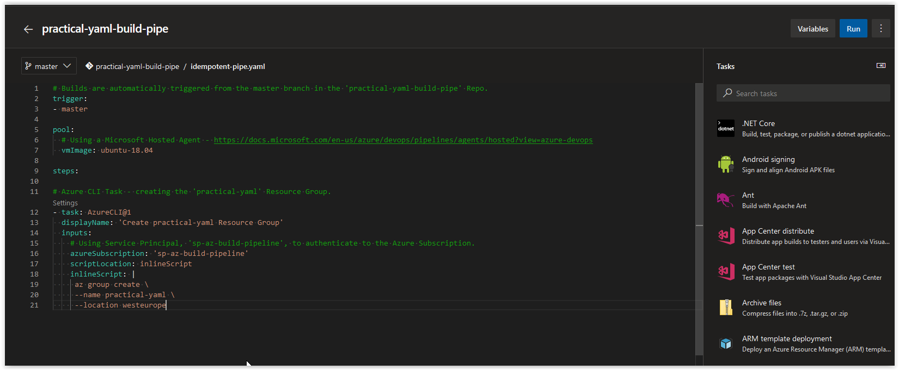
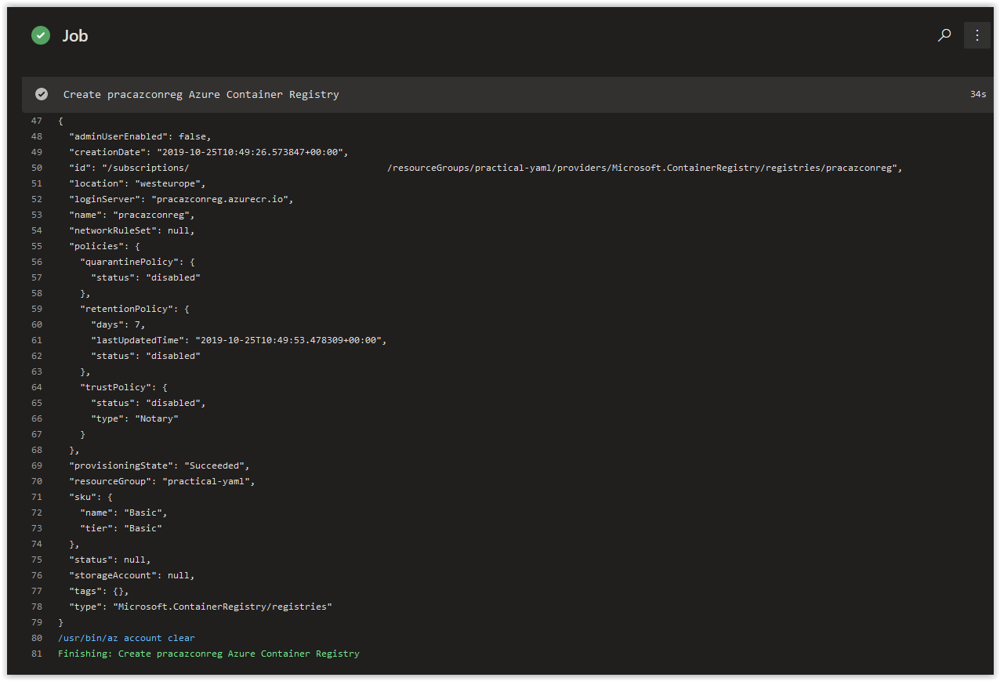
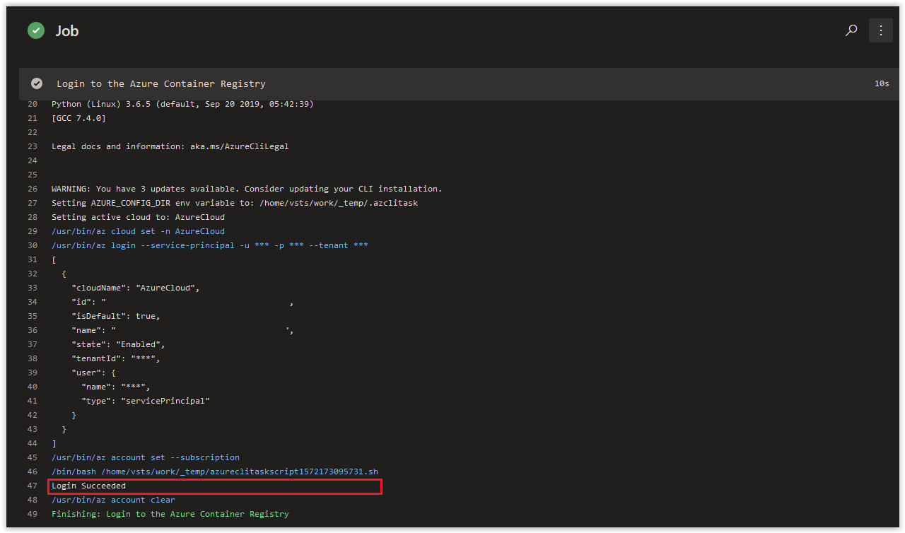

# Day 38 - Practical Guide for YAML Build Pipelines in Azure DevOps - Part 2

**Part 1** of this series can be found **[here](./day.35.building.a.practical.yaml.pipeline.part.1.md)**.*

Today, we are going to add in tasks to our Build Pipeline to Deploy an Azure Container Registry and then login to it.

**In this article:**

[Grant Service Principal Ownership of practical-yaml Resource Group](#grant-service-principal-ownership-of-practical-yaml-resource-group)</br>
[Add in task for Deploying an Azure Container Registry](#add-in-task-for-deploying-an-azure-container-registry)</br>
[Add in task for Logging in to the Azure Container Registry](#add-in-task-for-logging-in-to-the-azure-container-registry)</br>
[Things to Consider](#things-to-consider)</br>
[Conclusion](#conclusion)</br>

## Grant Service Principal Ownership of practical-yaml Resource Group

Because we are going to use the **sp-az-build-pipeline-creds** Service Principal to manage *everything* in the **practical-yaml** Resource Group, we are going to grand it **Owner** access to the Resource Group.

</br>

On your Linux Host (with Azure CLI installed), open up a bash prompt and run the following command to retrieve your Azure Subscription ID.

```bash
AZURE_SUB_ID=$(az account show --query id --output tsv)
```

If the above command doesn't work, manually add your Azure Subscription ID to the variable.

```powershell
AZURE_SUB_ID=("00000000-0000-0000-0000-000000000000")
```

Next, run the following command to grant the Service Principal **Owner** Access to the **practical-yaml** Resource Group.

```bash
az role assignment create \
--assignee http://sp-az-build-pipeline-creds \
--role Owner \
--scope "/subscriptions/$AZURE_SUB_ID/resourceGroups/practical-yaml"
```

You should get back a result similar to what is shown below.

```console
{
  "canDelegate": null,
  "id": "/subscriptions/00000000-0000-0000-0000-000000000000/resourceGroups/practical-yaml/providers/Microsoft.Authorization/roleAssignments/ef6c8286-8428-4c22-98e0-94c2d8b5eb3e",
  "name": "ef6c8286-8428-4c22-98e0-94c2d8b5eb3e",
  "principalId": "1ca70046-4c2f-4fdf-bda2-4bbd2606dfe7",
  "principalType": "ServicePrincipal",
  "resourceGroup": "practical-yaml",
  "roleDefinitionId": "/subscriptions/00000000-0000-0000-0000-000000000000/providers/Microsoft.Authorization/roleDefinitions/8e3af657-a8ff-443c-a75c-2fe8c4bcb635",
  "scope": "/subscriptions/00000000-0000-0000-0000-000000000000/resourceGroups/practical-yaml",
  "type": "Microsoft.Authorization/roleAssignments"
}
```

</br>

## Add in task for Deploying an Azure Container Registry

In Azure DevOps, open up the **practical-yaml-build-pipe** Build Pipeline and put it in Edit mode. You'll notice that you have Tasks that are available to you on the right side of the screen that you can use as templates in the **idempotent-pipe.yaml** file.



</br>

Add in the following code to the **idempotent-pipe.yaml** file.

> **NOTE:** Replace all instances of **pracazconreg** with a unique name or append some alphanumeric characters after it; otherwise, you'll be trying to deploy to an Azure Container Registry that already exists...sorry, I used it first!

</br>

```yaml
# Azure CLI Task - creating the 'pracazconreg' Azure Container Registry.
- task: AzureCLI@1
  displayName: 'Create pracazconreg Azure Container Registry'
  inputs:
    # Using Service Principal, 'sp-az-build-pipeline', to authenticate to the Azure Subscription.
    azureSubscription: 'sp-az-build-pipeline'
    scriptLocation: inlineScript
    inlineScript: |
     az acr create \
     --name pracazconreg \
     --resource-group practical-yaml \
     --sku Basic
```

</br>

The **idempotent-pipe.yaml** file should now match what is shown below.

```yaml
# Builds are automatically triggered from the master branch in the 'practical-yaml-build-pipe' Repo.
trigger:
- master

pool:
  # Using a Microsoft Hosted Agent - https://docs.microsoft.com/en-us/azure/devops/pipelines/agents/hosted?view=azure-devops
  vmImage: ubuntu-18.04

steps:

# Azure CLI Task - creating the 'practical-yaml' Resource Group.
- task: AzureCLI@1
  displayName: 'Create practical-yaml Resource Group'
  inputs:
    # Using Service Principal, 'sp-az-build-pipeline', to authenticate to the Azure Subscription.
    azureSubscription: 'sp-az-build-pipeline'
    scriptLocation: inlineScript
    inlineScript: |
     az group create \
     --name practical-yaml \
     --location westeurope

# Azure CLI Task - creating the 'pracazconreg' Azure Container Registry.
- task: AzureCLI@1
  displayName: 'Create pracazconreg Azure Container Registry'
  inputs:
    # Using Service Principal, 'sp-az-build-pipeline', to authenticate to the Azure Subscription.
    azureSubscription: 'sp-az-build-pipeline'
    scriptLocation: inlineScript
    inlineScript: |
     az acr create \
     --name pracazconreg \
     --resource-group practical-yaml \
     --sku Basic
```

</br>

Click on the **Save** button on the top right of the page to commit the change to the **master** branch. The Build Pipeline will immediately kick-off and should complete in about a minute.

In the Job log, you should see the successful deployment of the Azure Container Registry as shown below. Additionally, if you look in the Azure Portal, you should see the Azure Container Registry located in the **practical-yaml** Resource Group.



</br>

## Add in task for Logging in to the Azure Container Registry

Add in the following code to the bottom of the **idempotent-pipe.yaml** file.

> **NOTE:** Replace all instances of **pracazconreg** with a unique name or append some alphanumeric characters after it; otherwise, you'll be trying to deploy to an Azure Container Registry that already exists...sorry, I used it first!

</br>

```yaml
# Azure CLI Task - Login to ACR 'pracazconreg'.
- task: AzureCLI@1
  displayName: 'Login to the Azure Container Registry'
  inputs:
    # Using Service Principal, 'sp-az-build-pipeline', to authenticate to the Azure Subscription.
    azureSubscription: 'sp-az-build-pipeline'
    scriptLocation: inlineScript
    inlineScript: |
     az acr login \
     --name pracazconreg \
     --output table
```

</br>

The **idempotent-pipe.yaml** file should now match what is shown below.

```yaml
# Builds are automatically triggered from the master branch in the 'practical-yaml-build-pipe' Repo.
trigger:
- master

pool:
  # Using a Microsoft Hosted Agent - https://docs.microsoft.com/en-us/azure/devops/pipelines/agents/hosted?view=azure-devops
  vmImage: ubuntu-18.04

steps:

# Azure CLI Task - creating the 'practical-yaml' Resource Group.
- task: AzureCLI@1
  displayName: 'Create practical-yaml Resource Group'
  inputs:
    # Using Service Principal, 'sp-az-build-pipeline', to authenticate to the Azure Subscription.
    azureSubscription: 'sp-az-build-pipeline'
    scriptLocation: inlineScript
    inlineScript: |
     az group create \
     --name practical-yaml \
     --location westeurope

# Azure CLI Task - creating the 'pracazconreg' Azure Container Registry.
- task: AzureCLI@1
  displayName: 'Create pracazconreg Azure Container Registry'
  inputs:
    # Using Service Principal, 'sp-az-build-pipeline', to authenticate to the Azure Subscription.
    azureSubscription: 'sp-az-build-pipeline'
    scriptLocation: inlineScript
    inlineScript: |
     az acr create \
     --name pracazconreg \
     --resource-group practical-yaml \
     --sku Basic

# Azure CLI Task - Login to ACR 'pracazconreg'.
- task: AzureCLI@1
  displayName: 'Login to the Azure Container Registry'
  inputs:
    # Using Service Principal, 'sp-az-build-pipeline', to authenticate to the Azure Subscription.
    azureSubscription: 'sp-az-build-pipeline'
    scriptLocation: inlineScript
    inlineScript: |
     az acr login \
     --name pracazconreg \
     --output table
```

Click on the **Save** button on the top right of the page to commit the change to the **master** branch. The Build Pipeline will immediately kick-off and should complete in about a minute.

In the Job log, you should see the successful deployment of the Azure Container Registry as shown below. Additionally, if you look in the Azure Portal, you should see the Azure Container Registry located in the **practical-yaml** Resource Group.



</br>

## Things to Consider

As previously stated, our Service Principal still has **Contributor** access to the entire Azure Subscription. You may want to update the Service Principals access to the entire Azure Subscription to either **Reader** or remove it altogether so that it only has **Owner** access to the **practical-yaml** Resource Group.

</br>

## Conclusion

In today's article, we created a Build Pipeline as Code using YAML in Azure DevOps that created an empty Resource Group that we will deploy resources to in future installments of this series of blog posts. If there's a specific scenario that you wish to be covered in future articles, please create a **[New Issue](https://github.com/starkfell/100DaysOfIaC/issues)** in the [starkfell/100DaysOfIaC](https://github.com/starkfell/100DaysOfIaC/) GitHub repository.
