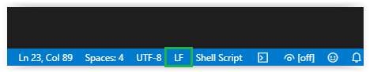
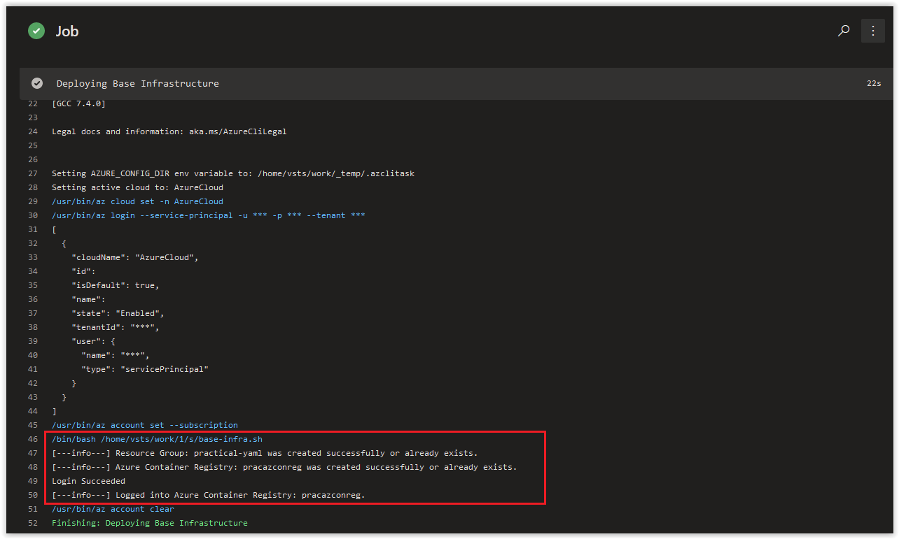

# Day 40 - Practical Guide for YAML Build Pipelines in Azure DevOps - Part 4

*The other posts in this Series can be found below.*

***[Day 35 - Practical Guide for YAML Build Pipelines in Azure DevOps - Part 1](./day.35.building.a.practical.yaml.pipeline.part.1.md)***</br>
***[Day 38 - Practical Guide for YAML Build Pipelines in Azure DevOps - Part 2](./day.38.building.a.practical.yaml.pipeline.part.2.md)***</br>
***[Day 39 - Practical Guide for YAML Build Pipelines in Azure DevOps - Part 3](./day.39.building.a.practical.yaml.pipeline.part.3.md)***</br>
***[Day 40 - Practical Guide for YAML Build Pipelines in Azure DevOps - Part 4](./day.40.building.a.practical.yaml.pipeline.part.4.md)***</br>

</br>

Today, we are going to refactor our Azure Build Pipeline into a single bash script and a single Azure CLI Task.

**In this article:**

[Clone the Azure DevOps Repo in VS Code](#clone-the-azure-devops-repo-in-vs-code)</br>
[Transform the existing tasks into a Bash Script](#transform-the-existing-tasks-into-a-bash-script)</br>
[Update the YAML Configuration for the Build Pipeline](#update-the-yaml-configuration-for-the-build-pipeline)</br>
[Things to Consider](#things-to-consider)</br>
[Conclusion](#conclusion)</br>

## Clone the Azure DevOps Repo in VS Code

Clone the **practical-yaml-build-pipe** repository in VS Code. If you need a refresher of how to do this, please go back and review **[Day 13](./day.13.git.started.in.vs.code.windows.edition.md)**.

> **NOTE**: Editing a Bash Script directly in a Repo in Azure DevOps in a Web Browser can change the End of Line sequence of the bash script. If this happens, your script is going to fail in an Azure CLI task, *spectacularly*! When making changes to the script that we are creating in the next few steps, make sure to change the End of Line sequence for the file from **CRLF** to **LF** in VS Code. The option to do this can be found on the bottom right hand of VS Code as shown below and can be set per file.



</br>

## Transform the existing tasks into a Bash Script

After you've successfully cloned your **practical-yaml-build-pipe** repository in VS Code, create a new file called **base-infra.sh**. Make sure the End of Line sequence of this file is changed from **CRLF** to **LF**.

Next, copy and paste the code below into it and commit it to the repository.

```bash
#!/bin/bash

az group create \
--name practical-yaml \
--location westeurope

az acr create \
--name pracazconreg \
--resource-group practical-yaml \
--sku Basic

az acr login \
--name pracazconreg \
--output table
```

</br>

While the script above will technically work when called in Azure CLI Task, there is no context as to where the script is supposed to run from or why it's performing it's specific actions. Update the script with the following comments as shown below.

```bash
#!/bin/bash

# Author:      Ryan Irujo
# Name:        base-infra.sh
# Description: Deploys Infrastructure to a target Azure Sub from an Azure CLI Task in Azure DevOps.

# Deploying the 'practical-yaml' Resource Group.
az group create \
--name practical-yaml \
--location westeurope

# Deploying the 'pracazconreg' Azure Container Registry.
az acr create \
--name pracazconreg \
--resource-group practical-yaml \
--sku Basic

# Logging into the 'pracazconreg' Azure Container Registry.
az acr login \
--name pracazconreg \
--output table
```

</br>

Now that we can identify the purpose of this script, we should update the output of the commands in the script to be more readable in the logs when the Build Pipeline is ran. If we left the script as is, you'd be able to identify if it ran successfully or not, but not without having to comb the entire log entry of the Azure CLI Task in the job.

Replace the existing content of the **base-infra.sh** script with the code below and commit it to the repository.

```bash
#!/bin/bash

# Author:      Ryan Irujo
# Name:        base-infra.sh
# Description: Deploys Infrastructure to a target Azure Sub from an Azure CLI Task in Azure DevOps.

# Deploying the 'practical-yaml' Resource Group.
az group create \
--name practical-yaml \
--location westeurope \
--output none && echo "[---info---] Resource Group: practical-yaml was created successfully or already exists."

# Deploying the 'pracazconreg' Azure Container Registry.
az acr create \
--name pracazconreg \
--resource-group practical-yaml \
--sku Basic && echo "[---info---] Azure Container Registry: pracazconreg was created successfully or already exists."

# Logging into the 'pracazconreg' Azure Container Registry.
az acr login \
--name pracazconreg \
--output none && echo "[---info---] Logged into Azure Container Registry: pracazconreg."
```

By modifying each command to use **--output none** and then echoing back a single sentence after running successfully, we should see only three lines of output at the end of our Azure CLI task when this script runs.

> **NOTE:** We are going to see four lines, but more on that in **Things to Consider**.

</br>

## Update the YAML Configuration for the Build Pipeline

Next, replace the existing configuration in the **idempotent-pipe.yaml** in VS Code and commit it to the repository.

```yaml
# Builds are automatically triggered from the master branch in the 'practical-yaml-build-pipe' Repo.
trigger:
- master

pool:
  # Using a Microsoft Hosted Agent - https://docs.microsoft.com/en-us/azure/devops/pipelines/agents/hosted?view=azure-devops
  vmImage: ubuntu-18.04

steps:

# Azure CLI Task - Deploying Base Infrastructure.
- task: AzureCLI@1
  displayName: 'Deploying Base Infrastructure'
  inputs:
    # Using Service Principal, 'sp-az-build-pipeline', to authenticate to the Azure Subscription.
    azureSubscription: 'sp-az-build-pipeline'
    scriptType: 'bash'
    scriptLocation: 'scriptPath'
    scriptPath: './base-infra.sh'
```

</br>

Review the latest job logs of the **practical-yaml-build-pipe** Build Pipeline and you should see the following output from the **Deploying Base Infrastructure** Azure CLI Task.



</br>

## Things to Consider

Every time we made a commit to the **practical-yaml-build-pipe** repository, the Build Pipeline was triggered to run. Be aware of this behavior when working with Build Pipelines in Production environments. You have several options of triggering Build Pipelines including by branch or disabling them altogether.

There were actually 4 lines of output instead of three. This is because of the way that the output of the **az acr login** currently behaves and is something we will address in **Part 5** when we look at further refining and parsing commands and returning output in the **base-infra.sh** script.

</br>

## Conclusion

In today's article we refactored our Azure Build Pipeline into a single bash script and a single Azure CLI Task. If there's a specific scenario that you wish to be covered in future articles, please create a **[New Issue](https://github.com/starkfell/100DaysOfIaC/issues)** in the [starkfell/100DaysOfIaC](https://github.com/starkfell/100DaysOfIaC/) GitHub repository.
