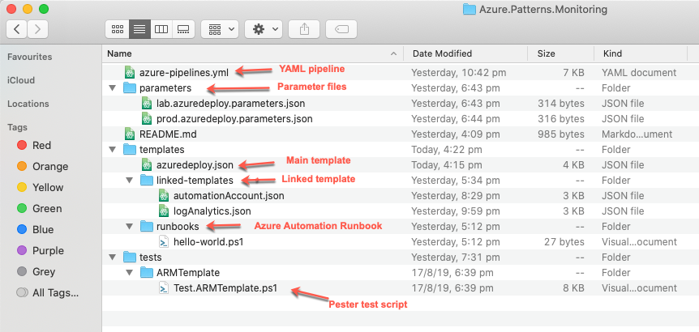
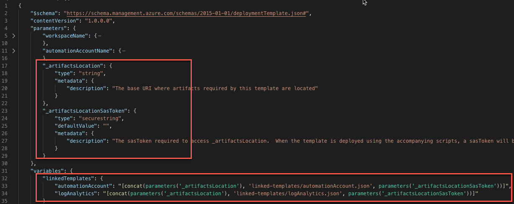
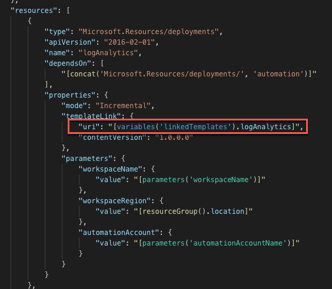
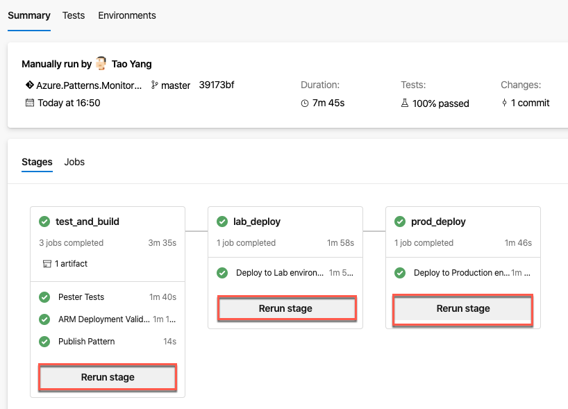

# Day 42 - Deploy Linked ARM Templates Using Storage Account in YAML Pipeline

*Today's post comes from guest contributor Tao Yang [@MrTaoYang](https://twitter.com/mrtaoyang). Tao is a Microsoft MVP who from 9-to-5 focuses on DevOps and governance in Azure for enterprise customers. You can find Tao blogging at [Managing Cloud and Datacenter by Tao Yang](https://blog.tyang.org/).*

Today, we are continuing our discussion on [Azure DevOps YAML pipelines](https://docs.microsoft.com/en-us/azure/devops/pipelines/yaml-schema?view=azure-devops&tabs=schema&WT.mc_id=DOP-MVP-5000997). We will focus on how to resolve a common challenge that many people are facing - deploying linked ARM templates.

**In this article:**

[Challenges When Deploying Linked Templates](#challenges-when-deploying-linked-templates)  
[Solution - Using Azure Storage Accounts](#solution---using-azure-storage-accounts)  
[Walkthrough](#walkthrough)  
[Conclusion](#conclusion)  

> **NOTE:** The sample solution we used in this article (templates, pipeline) can be found [HERE](../resources/day42/).

## Challenges When Deploying Linked Templates

If the solution you are deploying contains linked templates, the linked templates must be accessible by the Azure Resource Manager via an public URI. This works great when your templates are stored in a SaaS-based public repository (such as [Azure Quickstart Template GitHub repo](https://github.com/Azure/azure-quickstart-templates)). If your code is stored in a private or on-prem repo that is not accessible via a simple HTTP GET request without any custom headers, you will not be able to deploy these linked templates directly from the repo. This is because most of the Git providers require some kind of authentication token in the HTTP request headers and you cannot specify such header for ARM.

If you have used Terraform in the past, you probably already know that with the Terraform templates you can reference Terraform modules (which serves similar purpose as linked ARM templates) using relative file path. At the time writing this article, this is not possible when using ARM templates. This limitation certainly adds complexity when deploying linked templates (or other artifacts that must be referenced using public facing URI such as Azure Automation runbooks). However, if you are using Azure Pipelines as the deployment tool, it is really not that hard - with the help of Azure Storage Accounts.

# Solution - Using Azure Storage Accounts

To authenticate to Azure Storage Accounts, you can append a time-based, delegated [shared access signature (SaS)](https://docs.microsoft.com/en-us/rest/api/storageservices/delegate-access-with-shared-access-signature?WT.mc_id=DOP-MVP-5000997) at the end of storage account URI. Since the SaS token is part of the URI, Azure Resource Manager is able to retrieve the files from Azure Storage Accounts using the SaS token.

In Azure Pipelines, Microsoft has provided a task called [Azure File Copy](https://docs.microsoft.com/en-us/azure/devops/pipelines/tasks/deploy/azure-file-copy?view=azure-devops&WT.mc_id=DOP-MVP-5000997). You can use this task to easily copy files or folders to Azure blob storage. This task generates SaS token, copy files to blob storage and then outputs the container URI and SaS token as task variables. To use this task, all you need is the Storage Account name and a Service Connection to your Azure subscription where the Storage Account resides.

With the help of the ***Azure File Copy*** task, your can define your ARM template and pipeline using the following steps:
1. Preparing the main ARM template
   1. define two (2) input parameters in the main ARM template:
      * blob container URI
      * SaS token
   2. Construct the linked template URIs based on the blob container URI, SaS token and the linked template relative paths within the blob container
   3. Reference the linked templates in the main ARM template using the URI constructed from the previous step
   4. Commit all your ARM templates into the Git repo (i.e. Azure Repos)
2. Add Azure File Copy task to your pipeline, configure it to copy required linked templates to a storage account.
3. Create a task to deploy the main template, pass in the blob container URI and SaS token task variables (generated from the previous step) to the deployment as override parameters.
4. ***Optional, but recommended*** - Delete artifacts from Azure Storage Account as soon as the ARM template deployment has finished (using Azure CLI or Azure PowerShell tasks).

# Walkthrough

To demonstrate this process, I have created a demo solution that deploys the following resources:
  
* Log Analytics workspace (via linked template)
* Azure Automation account (via linked template)
* Azure Automation runbook (To deploy it via ARM template, it requires to be accessible via a HTTP URI)

> **NOTE:** Assuming you already have created an Azure Storage Account to use for this purpose. The storage account must be publicly accessible. **DO NOT** connect it to any VNet Service Endpoints.

## 1. Preparing the ARM templates

I structured the files and folders as shown below.

In the main template, I defined the parameters for blob container URI and SaSS token, and constructed linked templates URIs as variables (as shown below).

Then use the constructed URI variable in the nested deployment (as shown below).

## 2. Preparing the YAML pipeline

The pipeline contains 3 stages:
1. Build & Test
2. Deploy to Lab environment
3. Deploy to Prod environment

I added a Azure File Copy task in each of the stages. In this case, although same files are being copied multiple times, I have configured this way because of the following reasons:
1. In Multi-stage YAML pipelines, task variables cannot be shared across different stages.
2. In real life, you may use different storage accounts for each environments, and artifacts are different in each environments too.
3. There is a task that deletes the files after ARM templates deployment, even when the previous tasks are failed. This ensures we don't leave the files in storage accounts as it may be considered as a security risk. It is easier to delete the files within the same stage, also making it possible to re-run a stage.

> **NOTE:** In the build & Test stage, the files are copied from the local copy of the Git repo on the build agent to a container of Azure blob storage. In the follow stages, files are copied from the build artifacts produced by the build & test stage. Pay close attention to the **SourcePath** and **containerName** parameter of the **AzureFileCopy@3** task in each stage.

The code snippet shown below is from the build & test stage. To deploy the main template, we have the following 3 tasks as explained earlier. Notice the final task **Remove Artifacts from Storage Account** has condition set to ***always()***, which means it will run regardless the result of previous tasks. This ensures we never leave any files to this public-facing storage account for a long period of time.

~~~ YAML
steps:
    - task: AzureFileCopy@3
      displayName: 'Copy Artifacts to Azure Storage Account'
      inputs:
        SourcePath: 'templates'
        azureSubscription: 'The-Big-MVP-Sub-1'
        Destination: AzureBlob
        storage: $(storageAccount)
        containerName: 'monitoring-buildartifacts'
        outputStorageUri: artifactsLocation
        outputStorageContainerSasToken: artifactsLocationSasToken
    - task: AzureResourceGroupDeployment@2
      displayName: 'Template Validation - Monitoring'
      inputs:
        azureSubscription: 'The-Big-MVP-Sub-1'
        resourceGroupName: '$(resourceGroup)'
        location: '$(location)'
        csmFile: templates/azuredeploy.json
        csmParametersFile: parameters/lab.azuredeploy.parameters.json
        overrideParameters: '-_artifactsLocation $(artifactsLocation) -_artifactsLocationSasToken $(artifactsLocationSasToken)'
        deploymentMode: Validation
    - task: AzureCLI@2
      displayName: Remove Artifacts from Storage Account
      condition: always()
      inputs:
        azureSubscription: 'The-Big-MVP-Sub-1'
        scriptType: ps
        scriptLocation: inlineScript
        inlineScript: az storage container delete --name monitoring-buildartifacts --account-name $(storageAccount)
~~~

If everything goes well, the pipeline should successfully run (as shown below), and you can manually re-run each stage, since file copy takes place within each stage.

# Conclusion

In this article, we have demonstrated how to leverage Azure Storage Accounts and Azure DevOps to easily deploy linked templates. The entire demo solution including all the templates and YAML pipeline can be found [HERE](../resources/dayzz/).
