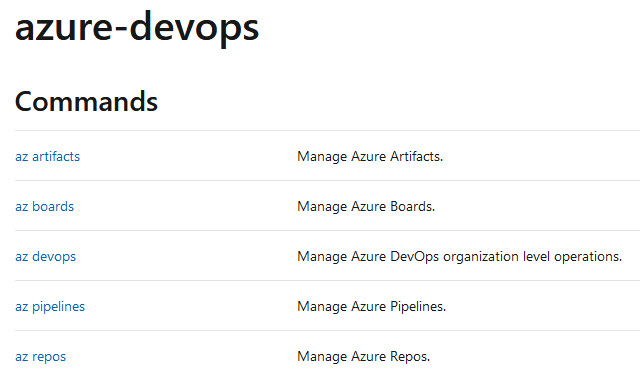
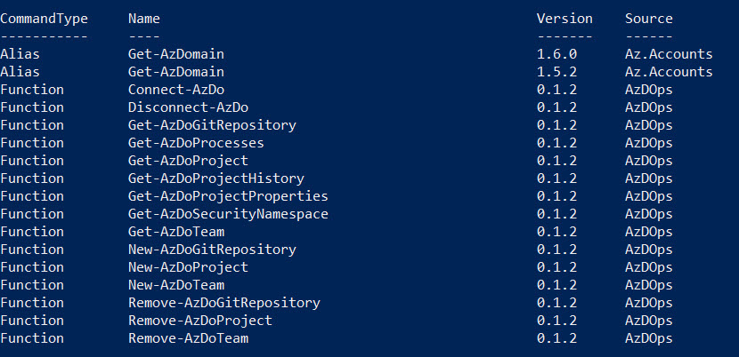

# Day 45 - Accessing Azure DevOps from the Command Line

Did you know you can access your Azure DevOps subscription from the command line? There are two extensions for accessing Azure DevOps from the command line you may not have heard about:

[Azure DevOps extension for the Azure CLI](#azure-devops-extension-for-the-azure-cli) </br>
[Azure DevOps PowerShell Module](#azure-devops-powershell-module) </br>

## Azure DevOps extension for the Azure CLI

The  Azure DevOps extension for the Azure CLI extension allows you to interact with Azure DevOps from the command line, potentially saving trips to the portal, navigating the UI, and opening up some opportunity for automation. Basically, you can just focus on the tasks at hand.

To get the extension running, follow these steps:

**Step 1: Install Azure CLI** - Follow the instructions available on Microsoft Docs to set up Azure CLI in your environment. At a minimum, your Azure CLI version must be 2.0.49. Since this is Azure CLI, it works from both Windows and Linux.

Don't know your Azure CLI version? Run `az --version` to check.

**Step 2: Add the Azure DevOps extension** - `az extension add --name azure-devops` You can use either `az extension list` or `az extension show --name azure-devops` to confirm the installation was successful.

**Step 3: Sign in** - Run `az login` to sign in as you would normally.

**Step 4: Configure defaults** - Although you can provide the organization and project for each command, Microsoft recommends you set these as defaults in the configuration for smoother operation.

``` Bash
az devops configure --defaults organization=https://dev.azure.com/lumagate project=100DaysOfIaC
```

**Where to find the docs**

For the documentation and for more information on the commands currently supported, take a look at the [Azure DevOps extension documentation](https://docs.microsoft.com/cli/azure/ext/azure-devops/?view=azure-cli-latest). Currently, the extension includes commands to access artifacts, Azure Boards, Azure DevOps org-level settings, Azure Pipelines, and Azure Repos, as shown in Figure 1.



**Figure 1**. Commands in the Azure CLI Extension for Azure DevOps

**Feature requests**

If you have any feature requests, leave them on the [Azure DevOps extension GitHub repo](https://github.com/Microsoft/azure-devops-cli-extension).

## Azure DevOps PowerShell Module

If PowerShell is more your speed when it comes to automation, you can try the Azure DevOps PowerShell Module. Begin by installing the module, direct from the PowerShell Gallery, from an elevated PowerShell prompt:

`Install-Module -Name AzDOps`

**Where to find the docs**

The new Azure PowerShell module uses the prefix ‘Az’. The complete list of cmdlets is available in the documentation [Microsoft Docs link](https://docs.microsoft.com/en-us/powershell/azure/new-azureps-module-az?view=azps-1.1.0) for the cmdlets - the cmdlets for Azure DevOps use 

Alternatively, you can just search for cmdlets containing 'AzDo':

`get-command *azdo*`

There are around 17 cmdlets, and you'll see overlapping functionality to what you'll find in the Azure CLI extension described above. The current list of AzDOps cmdlets are shown in Figure 2.




**Figure 2**. Azure PowerShell Module for Azure DevOps

**Connecting to Azure DevOops from PowerShell**

To connect to your Azure DevOps organization, first you'll need to create a personal access token (PAT). Open this link and follow the instructions. Afterwards, you can save both, the token as well as the name of your Azure DevOps organization as a string to a variable - then you can connect:

``` PowerShell
$token = "token"
$organizationName = "orgName"
Connect-AzDo -PersonalAccessTokens $token -OrganizationName $organizationName
```

Microsoft is planning an interactive connectivity option via Oauth2, which was still in the planning phases last I heard. Currently, they're using basic authentication.

Once you're connected, you can development some pretty useful automations, even without this module, like triggering a release in Azure DevOps from PowerShell via REST invocation, as demonstrated in [this thread on Stackoverflow](https://stackoverflow.com/questions/52876016/azure-devops-trigger-a-release-from-powershell-and-passing-process-variable-s).

## Conclusion

If you haven't thought about accessing Azure DevOps from the command line, we hope this gets you started down the road of automating the more repetitive and mundane aspects of your day-to-day routine. And on the topic of hands-free progress, if you missed yesterday's installment covering some of the features of Azure Repos, including policies, go back and have a look at [Day 44 - Why should you move to Azure Repos?](https://github.com/starkfell/100DaysOfIaC/blob/master/articles/day.44.move.to.azure.repos.md)
