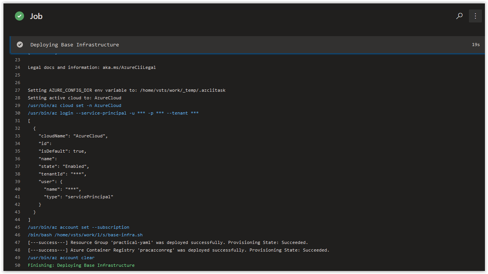

# Day 49 - Practical Guide for YAML Build Pipelines in Azure DevOps - Part 6

*The other posts in this Series can be found below.*

***[Day 35 - Practical Guide for YAML Build Pipelines in Azure DevOps - Part 1](./day.35.building.a.practical.yaml.pipeline.part.1.md)***</br>
***[Day 38 - Practical Guide for YAML Build Pipelines in Azure DevOps - Part 2](./day.38.building.a.practical.yaml.pipeline.part.2.md)***</br>
***[Day 39 - Practical Guide for YAML Build Pipelines in Azure DevOps - Part 3](./day.39.building.a.practical.yaml.pipeline.part.3.md)***</br>
***[Day 40 - Practical Guide for YAML Build Pipelines in Azure DevOps - Part 4](./day.40.building.a.practical.yaml.pipeline.part.4.md)***</br>
***[Day 41 - Practical Guide for YAML Build Pipelines in Azure DevOps - Part 5](./day.41.building.a.practical.yaml.pipeline.part.5.md)***</br>
***[Day 49 - Practical Guide for YAML Build Pipelines in Azure DevOps - Part 6](./day.49.building.a.practical.yaml.pipeline.part.6.md)***</br>

***
SPONSOR: Need to stop and start your development VMs on a schedule? The Azure Resource Scheduler let's you schedule up to 10 Azure VMs for FREE! Learn more [HERE](https://azuremarketplace.microsoft.com/en-us/marketplace/apps/lumagatena.resourcescheduler?tab=Overview)
***

Today, we are going to add error handling to the **az acr create** command and then add it back to the **base-infra.sh** bash script.

> **NOTE:** Replace all instances of **pracazconreg** in this article with the name you provided for the Azure Container Registry in **[Part 2](./day.38.building.a.practical.yaml.pipeline.part.2.md)**!

</br>

**In this article:**

[Adding Error Handling for ACR Creation](#adding-error-handling-for-acr-creation)</br>
[Update the Bash Script](#update-the-bash-script)</br>
[Check on the Build Pipeline Job](#check-on-the-build-pipeline-job)</br>
[Things to Consider](#things-to-consider)</br>
[Conclusion](#conclusion)</br>

## Adding Error Handling for ACR Creation

In Part 5, we added Error Handling to the Resource Group creation from the **az group create** command. We are going to add the same type of error handling now to **az acr create**.

At the end of [Part 5](./day.41.building.a.practical.yaml.pipeline.part.5.md), our **base-infra.sh** script looks as follows.

```bash
#!/bin/bash

# Author:      Ryan Irujo
# Name:        base-infra.sh
# Description: Deploys Infrastructure to a target Azure Sub from an Azure CLI Task in Azure DevOps.

# Deploying the 'practical-yaml' Resource Group.
CHECK_RG=$(az group create \
--name practical-yaml \
--location westeurope \
--query properties.provisioningState \
--output tsv)

if [ "$CHECK_RG" == "Succeeded" ]; then
    echo "[---success---] Resource Group 'practical-yaml' was deployed successfully. Provisioning State: $CHECK_RG."
else
    echo "[---fail------] Resource Group 'practical-yaml' was not deployed successfully. Provisioning State: $CHECK_RG."
    exit 2
fi
```

</br>

Next, we are going to walk through creating error handling for the **az acr create** command. On your Linux Host (with Azure CLI installed), open up a bash prompt and run the following command.

```bash
az acr create \
--name pracazconreg \
--resource-group practical-yaml \
--sku Basic
```

You should get the following output since the **pracazconreg** Azure Container Registry is already in place.

```json
{
  "adminUserEnabled": false,
  "creationDate": "2019-11-09T13:38:45.459627+00:00",
  "id": "/subscriptions/00000000-0000-0000-0000-000000000000/resourceGroups/practical-yaml/providers/Microsoft.ContainerRegistry/registries/pracazconreg",
  "location": "westeurope",
  "loginServer": "pracazconreg.azurecr.io",
  "name": "pracazconreg",
  "networkRuleSet": null,
  "policies": {
    "quarantinePolicy": {
      "status": "disabled"
    },
    "retentionPolicy": {
      "days": 7,
      "lastUpdatedTime": "2019-11-09T13:40:46.896754+00:00",
      "status": "disabled"
    },
    "trustPolicy": {
      "status": "disabled",
      "type": "Notary"
    }
  },
  "provisioningState": "Succeeded",
  "resourceGroup": "practical-yaml",
  "sku": {
    "name": "Basic",
    "tier": "Basic"
  },
  "status": null,
  "storageAccount": null,
  "tags": {},
  "type": "Microsoft.ContainerRegistry/registries"
}
```

</br>

Notice that the **provisioningState**  for the Azure Container Registry command is under the root structure of the JSON output; this is why it's query needs to be formatted differently than the query created for **az group create** command which returns the **provisioningState** under the **properties** section. Because commands can return slightly different output formats, *when you are querying Resources in Azure, make sure to test the JSON Output from your queries thoroughly when creating error handling!*

</br>

Next, run the following command to create the **pracazconreg** Azure Container Registry and return its **provisioningState**.

```bash
CHECK_ACR=$(az acr create \
--name pracazconreg \
--resource-group practical-yaml \
--sku Basic \
--query provisioningState \
--output tsv)
```

</br>

Run the following command to get see the results returned to the **$CHECK_ACR** variable.

```bash
echo $CHECK_ACR
```

You should get back the following response.

```console
Succeeded
```

</br>

## Update the Bash Script

Next, in VS Code, open the **base-infra.sh** file. Replace it's current contents with the code below and save and commit it to the repository.

```bash
#!/bin/bash

# Author:      Ryan Irujo
# Name:        base-infra.sh
# Description: Deploys Infrastructure to a target Azure Sub from an Azure CLI Task in Azure DevOps.

# Deploying the 'practical-yaml' Resource Group.
CHECK_RG=$(az group create \
--name practical-yaml \
--location westeurope \
--query properties.provisioningState \
--output tsv)

if [ "$CHECK_RG" == "Succeeded" ]; then
    echo "[---success---] Resource Group 'practical-yaml' was deployed successfully. Provisioning State: $CHECK_RG."
else
    echo "[---fail------] Resource Group 'practical-yaml' was not deployed successfully. Provisioning State: $CHECK_RG."
    exit 2
fi

# Deploying the 'pracazconreg' Azure Container Registry.
CHECK_ACR=$(az acr create \
--name pracazconreg \
--resource-group practical-yaml \
--sku Basic \
--query provisioningState \
--output tsv)

if [ "$CHECK_ACR" == "Succeeded" ]; then
    echo "[---success---] Azure Container Registry 'pracazconreg' was deployed successfully. Provisioning State: $CHECK_ACR."
else
    echo "[---fail------] Azure Container Registry 'pracazconreg' was not deployed successfully. Provisioning State: $CHECK_ACR."
    exit 2
fi

```

</br>

## Check on the Build Pipeline Job

Review the logs of the most current job in the **practical-yaml-build-pipe** Build Pipeline and you should see the following output from the **Deploying Base Infrastructure** Azure CLI Task.



</br>

> **NOTE:** Still wondering what happened to that ACR Login command right? Fear not, we'll be addressing it very soon in this series.

</br>

## Things to Consider

When you are querying Resources in Azure, make sure to test the JSON Output from your queries thoroughly when creating error handling!

</br>

## Conclusion

In today's article we added error handling to the **az acr create** command and then added it back to the **base-infra.sh** bash script. If there's a specific scenario that you wish to be covered in future articles, please create a **[New Issue](https://github.com/starkfell/100DaysOfIaC/issues)** in the [starkfell/100DaysOfIaC](https://github.com/starkfell/100DaysOfIaC/) GitHub repository.
