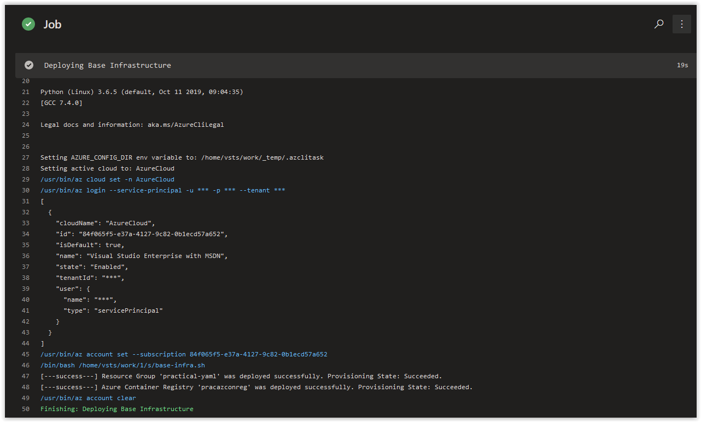

# Day 49 - Practical Guide for YAML Build Pipelines in Azure DevOps - Part 7

*The other posts in this Series can be found below.*

***[Day 35 - Practical Guide for YAML Build Pipelines in Azure DevOps - Part 1](./day.35.building.a.practical.yaml.pipeline.part.1.md)***</br>
***[Day 38 - Practical Guide for YAML Build Pipelines in Azure DevOps - Part 2](./day.38.building.a.practical.yaml.pipeline.part.2.md)***</br>
***[Day 39 - Practical Guide for YAML Build Pipelines in Azure DevOps - Part 3](./day.39.building.a.practical.yaml.pipeline.part.3.md)***</br>
***[Day 40 - Practical Guide for YAML Build Pipelines in Azure DevOps - Part 4](./day.40.building.a.practical.yaml.pipeline.part.4.md)***</br>
***[Day 41 - Practical Guide for YAML Build Pipelines in Azure DevOps - Part 5](./day.41.building.a.practical.yaml.pipeline.part.5.md)***</br>
***[Day 48 - Practical Guide for YAML Build Pipelines in Azure DevOps - Part 6](./day.48.building.a.practical.yaml.pipeline.part.6.md)***</br>
***[Day 49 - Practical Guide for YAML Build Pipelines in Azure DevOps - Part 7](./day.49.building.a.practical.yaml.pipeline.part.7.md)***</br>

</br>

Today, we are going to add the **acr login** command back into the YAML Build Pipeline.

Keep in mind that when you separate certain scripts into different pipeline tasks, that you need to ensure that any data you are using/passing between scripts it's accidentally cut off from the next task. At the end of each task, the credentials for the task are cleared, but the data from the previous command CAN be passed on to the next task. What is actually easiest is to finish up the logic that you were working on in the task first before moving on.

**In this article:**

[Building and Pushing a Container](#building-and-pushing-a-container)</br>
[Adding the commands into a new Task[]()</br>
[Things to Consider](#things-to-consider)</br>
[Conclusion](#conclusion)</br>

## Building and Pushing a Container

You may be asking, Why are we taking out the **az acr login** command from the script and putting in its own task? The other two commands in our pipeline are responsible for actually deploying infrastructure into Azure: A Resource Group and an Azure Container Registry. The **az acr login** command is used to *interact* with an existing Azure Container Registry and then is followed by additional actions acting upon the resource. For our purposes, we are going to be logging into the Azure Container Registry so we can push, pull, and build docker container images. In the upcoming posts, we will be adding additional logic to the script that the **az acr login**

```bash
az acr build -t practical/nginx:$(date +%F-%H%M%S) -t practical/nginx:latest -r pracazconreg .
```

This process is going to take a couple of minutes to run. When it's finished, the output from it should look similar to what is shown below.

```console
Packing source code into tar to upload...
Uploading archived source code from '/tmp/build_archive_efd30ede45a44370a0b91f497f203f9d.tar.gz'...
Sending context (105.955 MiB) to registry: pracazconreg...
Queued a build with ID: cb5
Waiting for an agent...
2019/11/10 16:21:48 Downloading source code...
2019/11/10 16:21:55 Finished downloading source code
2019/11/10 16:21:56 Using acb_vol_037eb13a-917e-4f34-a404-aa3bd6359aed as the home volume
2019/11/10 16:21:56 Setting up Docker configuration...
2019/11/10 16:21:57 Successfully set up Docker configuration
2019/11/10 16:21:57 Logging in to registry: pracazconreg.azurecr.io
2019/11/10 16:21:58 Successfully logged into pracazconreg.azurecr.io
2019/11/10 16:21:58 Executing step ID: build. Timeout(sec): 28800, Working directory: '', Network: ''
2019/11/10 16:21:58 Scanning for dependencies...
2019/11/10 16:21:58 Successfully scanned dependencies
2019/11/10 16:21:58 Launching container with name: build
Sending build context to Docker daemon  171.5MB
Step 1/6 : FROM alpine:latest
latest: Pulling from library/alpine
89d9c30c1d48: Pulling fs layer
89d9c30c1d48: Download complete
89d9c30c1d48: Pull complete
Digest: sha256:c19173c5ada610a5989151111163d28a67368362762534d8a8121ce95cf2bd5a
Status: Downloaded newer image for alpine:latest
 ---> 965ea09ff2eb
Step 2/6 : RUN apk update && apk add net-tools vim jq wget curl nginx
 ---> Running in ff70c5798afa
fetch http://dl-cdn.alpinelinux.org/alpine/v3.10/main/x86_64/APKINDEX.tar.gz
fetch http://dl-cdn.alpinelinux.org/alpine/v3.10/community/x86_64/APKINDEX.tar.gz
v3.10.3-19-g7f993019c4 [http://dl-cdn.alpinelinux.org/alpine/v3.10/main]
v3.10.3-13-g8068beb776 [http://dl-cdn.alpinelinux.org/alpine/v3.10/community]
OK: 10338 distinct packages available
(1/17) Installing ca-certificates (20190108-r0)
(2/17) Installing nghttp2-libs (1.39.2-r0)
(3/17) Installing libcurl (7.66.0-r0)
(4/17) Installing curl (7.66.0-r0)
(5/17) Installing oniguruma (6.9.2-r0)
(6/17) Installing jq (1.6-r0)
(7/17) Installing mii-tool (1.60_git20140218-r2)
(8/17) Installing net-tools (1.60_git20140218-r2)
(9/17) Installing pcre (8.43-r0)
(10/17) Installing nginx (1.16.1-r1)
Executing nginx-1.16.1-r1.pre-install
(11/17) Installing lua5.3-libs (5.3.5-r2)
(12/17) Installing ncurses-terminfo-base (6.1_p20190518-r0)
(13/17) Installing ncurses-terminfo (6.1_p20190518-r0)
(14/17) Installing ncurses-libs (6.1_p20190518-r0)
(15/17) Installing vim (8.1.1365-r0)
(16/17) Installing nginx-vim (1.16.1-r1)
(17/17) Installing wget (1.20.3-r0)
Executing busybox-1.30.1-r2.trigger
Executing ca-certificates-20190108-r0.trigger
OK: 46 MiB in 31 packages
Removing intermediate container ff70c5798afa
 ---> 9940ec47319f
Step 3/6 : WORKDIR /opt
 ---> Running in 6f66e42f4ae4
Removing intermediate container 6f66e42f4ae4
 ---> 3e700591431c
Step 4/6 : EXPOSE 80
 ---> Running in 594750bea0be
Removing intermediate container 594750bea0be
 ---> 3b23ce1da1a8
Step 5/6 : EXPOSE 443
 ---> Running in 3919716c3a38
Removing intermediate container 3919716c3a38
 ---> 3fb27e9674e8
Step 6/6 : ENTRYPOINT ["tail", "-f", "/dev/null"]#
 ---> Running in 374e74b786dc
Removing intermediate container 374e74b786dc
 ---> 83e47658b909
Successfully built 83e47658b909
Successfully tagged pracazconreg.azurecr.io/practical/nginx:2019-11-10-162016
Successfully tagged pracazconreg.azurecr.io/practical/nginx:latest
2019/11/10 16:22:12 Successfully executed container: build
2019/11/10 16:22:12 Executing step ID: push. Timeout(sec): 1800, Working directory: '', Network: ''
2019/11/10 16:22:12 Pushing image: pracazconreg.azurecr.io/practical/nginx:2019-11-10-162016, attempt 1
The push refers to repository [pracazconreg.azurecr.io/practical/nginx]
5e9486b2905e: Preparing
77cae8ab23bf: Preparing
77cae8ab23bf: Pushed
5e9486b2905e: Pushed
2019-11-10-162016: digest: sha256:231ab60f1b8070b526968dcd12385e9b388a9a42676a1af61b4f21e958fa37e4 size: 740
2019/11/10 16:22:17 Successfully pushed image: pracazconreg.azurecr.io/practical/nginx:2019-11-10-162016
2019/11/10 16:22:17 Pushing image: pracazconreg.azurecr.io/practical/nginx:latest, attempt 1
The push refers to repository [pracazconreg.azurecr.io/practical/nginx]
5e9486b2905e: Preparing
77cae8ab23bf: Preparing
77cae8ab23bf: Layer already exists
5e9486b2905e: Layer already exists
latest: digest: sha256:231ab60f1b8070b526968dcd12385e9b388a9a42676a1af61b4f21e958fa37e4 size: 740
2019/11/10 16:22:18 Successfully pushed image: pracazconreg.azurecr.io/practical/nginx:latest
2019/11/10 16:22:18 Step ID: build marked as successful (elapsed time in seconds: 14.192109)
2019/11/10 16:22:18 Populating digests for step ID: build...
2019/11/10 16:22:22 Successfully populated digests for step ID: build
2019/11/10 16:22:22 Step ID: push marked as successful (elapsed time in seconds: 6.534584)
2019/11/10 16:22:22 The following dependencies were found:
2019/11/10 16:22:22
- image:
    registry: pracazconreg.azurecr.io
    repository: practical/nginx
    tag: 2019-11-10-162016
    digest: sha256:231ab60f1b8070b526968dcd12385e9b388a9a42676a1af61b4f21e958fa37e4
  runtime-dependency:
    registry: registry.hub.docker.com
    repository: library/alpine
    tag: latest
    digest: sha256:c19173c5ada610a5989151111163d28a67368362762534d8a8121ce95cf2bd5a
  git: {}
- image:
    registry: pracazconreg.azurecr.io
    repository: practical/nginx
    tag: latest
    digest: sha256:231ab60f1b8070b526968dcd12385e9b388a9a42676a1af61b4f21e958fa37e4
  runtime-dependency:
    registry: registry.hub.docker.com
    repository: library/alpine
    tag: latest
    digest: sha256:c19173c5ada610a5989151111163d28a67368362762534d8a8121ce95cf2bd5a
  git: {}

Run ID: cb5 was successful after 34s
```

While the process was successful, we need to minimize the output we are going to have to parse later.

</br>


* 

## Adding Error Handling for ACR Creation and Login

In Part 5, we added Error Handling to the Resource Group creation from the **az group create** command. We are going to add the same type of error handling now to **az acr create** and **az acr login**.

At the end of Part 5, our **bas-infra.sh** script was the same as what is shown below.

```bash
#!/bin/bash

# Author:      Ryan Irujo
# Name:        base-infra.sh
# Description: Deploys Infrastructure to a target Azure Sub from an Azure CLI Task in Azure DevOps.

# Deploying the 'practical-yaml' Resource Group.
CHECK_RG=$(az group create \
--name practical-yaml \
--location westeurope \
--query properties.provisioningState \
--output tsv)

if [ "$CHECK_RG" == "Succeeded" ]; then
    echo "[---success---] Resource Group 'practical-yaml' was deployed successfully. Provisioning State: $CHECK_RG."
else
    echo "[---fail------] Resource Group 'practical-yaml' was not deployed successfully. Provisioning State: $CHECK_RG."
    exit 2
fi
```

</br>

Next, we are going to walk through creating error handling for the **az acr create** command. On your Linux Host (with Azure CLI installed), open up a bash prompt and run the following command.

```bash
az acr create \
--name pracazconreg \
--resource-group practical-yaml \
--sku Basic
```

You should get the following output since the **pracazconreg** Azure Container Registry is already in place.

```json
{
  "adminUserEnabled": false,
  "creationDate": "2019-11-09T13:38:45.459627+00:00",
  "id": "/subscriptions/00000000-0000-0000-0000-000000000000/resourceGroups/practical-yaml/providers/Microsoft.ContainerRegistry/registries/pracazconreg",
  "location": "westeurope",
  "loginServer": "pracazconreg.azurecr.io",
  "name": "pracazconreg",
  "networkRuleSet": null,
  "policies": {
    "quarantinePolicy": {
      "status": "disabled"
    },
    "retentionPolicy": {
      "days": 7,
      "lastUpdatedTime": "2019-11-09T13:40:46.896754+00:00",
      "status": "disabled"
    },
    "trustPolicy": {
      "status": "disabled",
      "type": "Notary"
    }
  },
  "provisioningState": "Succeeded",
  "resourceGroup": "practical-yaml",
  "sku": {
    "name": "Basic",
    "tier": "Basic"
  },
  "status": null,
  "storageAccount": null,
  "tags": {},
  "type": "Microsoft.ContainerRegistry/registries"
}
```

</br>

Unlike the output from the **az group create** command used to create the **practical-yaml** Resource Group where the **provisioningState** is under the **properties** section; the **provisioningState**  for the Azure Container Registry command is under the root structure of the JSON output; this is why it's query needs to be formatted differently than the query created for **az group create** command. This brings me to the main point of this post.

> *When querying Resources in Azure, make sure to test the JSON Output from your queries thoroughly when creating error handling!*</br>

</br>

Next, run the following command below to create and query the state of the **pracazconreg** Azure Container Registry.

```bash
CHECK_ACR=$(az acr create \
--name pracazconreg \
--resource-group practical-yaml \
--sku Basic \
--query provisioningState \
--output tsv)
```

</br>

Run the following command to get see the results in the **$CHECK_ACR** variable.

```bash
echo $CHECK_ACR
```

You should get back the following response.

```console
Succeeded
```

</br>

## Update the Bash Script

Next, in VS Code, open the **base-infra.sh** file. Replace it's current contents with the code below and save and commit it to the repository.

```bash
#!/bin/bash

# Author:      Ryan Irujo
# Name:        base-infra.sh
# Description: Deploys Infrastructure to a target Azure Sub from an Azure CLI Task in Azure DevOps.

# Deploying the 'practical-yaml' Resource Group.
CHECK_RG=$(az group create \
--name practical-yaml \
--location westeurope \
--query properties.provisioningState \
--output tsv)

if [ "$CHECK_RG" == "Succeeded" ]; then
    echo "[---success---] Resource Group 'practical-yaml' was deployed successfully. Provisioning State: $CHECK_RG."
else
    echo "[---fail------] Resource Group 'practical-yaml' was not deployed successfully. Provisioning State: $CHECK_RG."
    exit 2
fi

# Deploying the 'pracazconreg' Azure Container Registry.
CHECK_ACR=$(az acr create \
--name pracazconreg \
--resource-group practical-yaml \
--sku Basic \
--query provisioningState \
--output tsv)

if [ "$CHECK_ACR" == "Succeeded" ]; then
    echo "[---success---] Azure Container Registry 'pracazconreg' was deployed successfully. Provisioning State: $CHECK_ACR."
else
    echo "[---fail------] Azure Container Registry 'pracazconreg' was not deployed successfully. Provisioning State: $CHECK_ACR."
    exit 2
fi

```

</br>

## Check on the Build Pipeline Job

Review the logs of the most current job in the **practical-yaml-build-pipe** Build Pipeline and you should see the following output from the **Deploying Base Infrastructure** Azure CLI Task.



</br>

> **NOTE:** Still wondering what happened to that ACR Login command right? Fear not, we'll be addressing it very soon in this series.

</br>

## Conclusion

In today's article we further refined the **base-infra.sh** bash script and demonstrated the process of adding in your own error handling. If there's a specific scenario that you wish to be covered in future articles, please create a **[New Issue](https://github.com/starkfell/100DaysOfIaC/issues)** in the [starkfell/100DaysOfIaC](https://github.com/starkfell/100DaysOfIaC/) GitHub repository.
