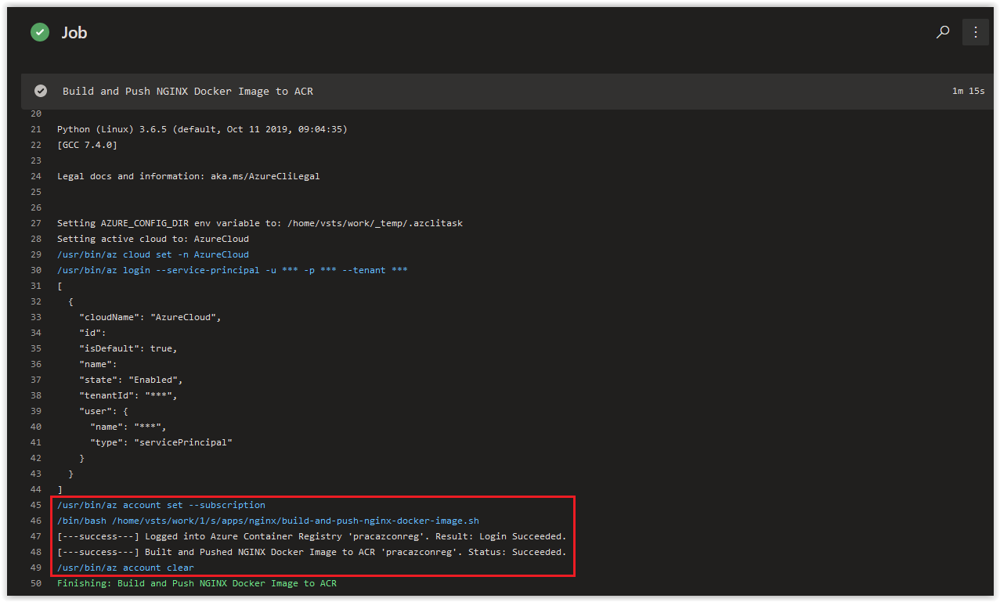

# Day 50 - Practical Guide for YAML Build Pipelines in Azure DevOps - Part 7

*The other posts in this Series can be found below.*

***[Day 35 - Practical Guide for YAML Build Pipelines in Azure DevOps - Part 1](./day.35.building.a.practical.yaml.pipeline.part.1.md)***</br>
***[Day 38 - Practical Guide for YAML Build Pipelines in Azure DevOps - Part 2](./day.38.building.a.practical.yaml.pipeline.part.2.md)***</br>
***[Day 39 - Practical Guide for YAML Build Pipelines in Azure DevOps - Part 3](./day.39.building.a.practical.yaml.pipeline.part.3.md)***</br>
***[Day 40 - Practical Guide for YAML Build Pipelines in Azure DevOps - Part 4](./day.40.building.a.practical.yaml.pipeline.part.4.md)***</br>
***[Day 41 - Practical Guide for YAML Build Pipelines in Azure DevOps - Part 5](./day.41.building.a.practical.yaml.pipeline.part.5.md)***</br>
***[Day 49 - Practical Guide for YAML Build Pipelines in Azure DevOps - Part 6](./day.49.building.a.practical.yaml.pipeline.part.6.md)***</br>
***[Day 50 - Practical Guide for YAML Build Pipelines in Azure DevOps - Part 7](./day.50.building.a.practical.yaml.pipeline.part.7.md)***</br>

</br>

Today, we are going to add the **acr login** command to a bash script for building and pushing a container into an Azure Container Registry as part of a task in our YAML Build Pipeline.

> **NOTE:** Replace all instances of **pracazconreg** in this article with the name you provided for the Azure Container Registry in **[Part 2](./day.38.building.a.practical.yaml.pipeline.part.2.md)**!

</br>

**In this article:**

[Creating the Build and Push Container Script with Error Handling](#creating-the-build-and-push-container-script-with-error-handling)</br>
[Add new directories to the Repository](#add-new-directories-to-the-repository)</br>
[Add the Dockerfile to the Repository](#add-the-dockerfile-to-the-repository)</br>
[Create the new Bash Script in the Repository](#create-the-new-bash-script-in-the-repository)</br>
[Update the YAML File for the Build Pipeline](#update-the-yaml-file-for-the-build-pipeline)</br>
[Check on the Build Pipeline Job](#check-on-the-build-pipeline-job)</br>
[Things to Consider](#things-to-consider)</br>
[Conclusion](#conclusion)</br>

## Creating the Build and Push Container Script with Error Handling

You may be asking, Why are we taking out the **az acr login** command from the script and putting in its own task? The other two commands in our pipeline are responsible for actually deploying infrastructure into Azure: A Resource Group and an Azure Container Registry. The **az acr login** command is used to *interact* with an existing Azure Container Registry and then is followed by additional actions acting upon the resource. For our purposes, we are going to be logging into the Azure Container Registry so we can push, pull, and build docker container images.

</br>

On your Linux Host (with Azure CLI installed), open up a bash prompt and run the following command to login to your Azure Container Registry.

```bash
az acr login \
--name pracazconreg
```

You should get a similar response back.

```console
Login Succeeded
WARNING! Your password will be stored unencrypted in /home/{USERNAME}/.docker/config.json.
Configure a credential helper to remove this warning. See
https://docs.docker.com/engine/reference/commandline/login/#credentials-store
```

</br>

Next, run the following command to create a blank **Dockerfile** in your current directory.

```bash
touch Dockerfile
```

</br>

Next, use a file editor (**vim** or **nano**) and copy the contents below into the **Dockerfile** and save it.

```bash
# Pulling Ubuntu Image from Docker Hub
FROM alpine:latest

# Updating packages list and installing the prerequisite packages
RUN apk update && apk add \
net-tools \
vim \
jq \
wget \
curl \
nginx

WORKDIR /opt
EXPOSE 80
EXPOSE 443

ENTRYPOINT ["tail", "-f", "/dev/null"]
```

</br>

Next, run the following command to build and push the NGINX container to the **** Azure Container Registry. Make sure you are in the same directory as the **Dockerfile** or else the command will fail!

```bash
az acr build \
-t practical/nginx:$(date +%F-%H%M%S) \
-t practical/nginx:latest \
-r pracazconreg .
```

The build and push process will take a few minutes to run. When it's finished, the output from it should look similar to what is shown below.

```console
Packing source code into tar to upload...
Uploading archived source code from '/tmp/build_archive_d905742b039a49bcbe5ad01fd930e75d.tar.gz'...
Sending context (105.956 MiB) to registry: pracazconreg...
Queued a build with ID: cb6
Waiting for an agent...
2019/11/10 20:54:42 Downloading source code...
2019/11/10 20:54:48 Finished downloading source code
2019/11/10 20:54:49 Using acb_vol_838c4686-8a96-4bde-8757-c17aea3c796a as the home volume
2019/11/10 20:54:49 Setting up Docker configuration...
2019/11/10 20:54:50 Successfully set up Docker configuration
2019/11/10 20:54:50 Logging in to registry: pracazconreg.azurecr.io
2019/11/10 20:54:51 Successfully logged into pracazconreg.azurecr.io
2019/11/10 20:54:51 Executing step ID: build. Timeout(sec): 28800, Working directory: '', Network: ''
2019/11/10 20:54:51 Scanning for dependencies...
2019/11/10 20:54:52 Successfully scanned dependencies
2019/11/10 20:54:52 Launching container with name: build
Sending build context to Docker daemon  171.5MB
Step 1/6 : FROM alpine:latest
latest: Pulling from library/alpine
89d9c30c1d48: Pulling fs layer
89d9c30c1d48: Verifying Checksum
89d9c30c1d48: Download complete
89d9c30c1d48: Pull complete
Digest: sha256:c19173c5ada610a5989151111163d28a67368362762534d8a8121ce95cf2bd5a
Status: Downloaded newer image for alpine:latest
 ---> 965ea09ff2eb
Step 2/6 : RUN apk update && apk add net-tools vim jq wget curl nginx
 ---> Running in 1e128231ef2c
fetch http://dl-cdn.alpinelinux.org/alpine/v3.10/main/x86_64/APKINDEX.tar.gz
fetch http://dl-cdn.alpinelinux.org/alpine/v3.10/community/x86_64/APKINDEX.tar.gz
v3.10.3-19-g7f993019c4 [http://dl-cdn.alpinelinux.org/alpine/v3.10/main]
v3.10.3-13-g8068beb776 [http://dl-cdn.alpinelinux.org/alpine/v3.10/community]
OK: 10338 distinct packages available
(1/17) Installing ca-certificates (20190108-r0)
(2/17) Installing nghttp2-libs (1.39.2-r0)
(3/17) Installing libcurl (7.66.0-r0)
(4/17) Installing curl (7.66.0-r0)
(5/17) Installing oniguruma (6.9.2-r0)
(6/17) Installing jq (1.6-r0)
(7/17) Installing mii-tool (1.60_git20140218-r2)
(8/17) Installing net-tools (1.60_git20140218-r2)
(9/17) Installing pcre (8.43-r0)
(10/17) Installing nginx (1.16.1-r1)
Executing nginx-1.16.1-r1.pre-install
(11/17) Installing lua5.3-libs (5.3.5-r2)
(12/17) Installing ncurses-terminfo-base (6.1_p20190518-r0)
(13/17) Installing ncurses-terminfo (6.1_p20190518-r0)
(14/17) Installing ncurses-libs (6.1_p20190518-r0)
(15/17) Installing vim (8.1.1365-r0)
(16/17) Installing nginx-vim (1.16.1-r1)
(17/17) Installing wget (1.20.3-r0)
Executing busybox-1.30.1-r2.trigger
Executing ca-certificates-20190108-r0.trigger
OK: 46 MiB in 31 packages
Removing intermediate container 1e128231ef2c
 ---> 509c429c23d1
Step 3/6 : WORKDIR /opt
 ---> Running in 60402afc1424
Removing intermediate container 60402afc1424
 ---> 5fb3e51af94e
Step 4/6 : EXPOSE 80
 ---> Running in 612f1e6a6798
Removing intermediate container 612f1e6a6798
 ---> 3e5c84d1917c
Step 5/6 : EXPOSE 443
 ---> Running in d26d1f78f14c
Removing intermediate container d26d1f78f14c
 ---> 6736d8487318
Step 6/6 : ENTRYPOINT ["tail", "-f", "/dev/null"]
 ---> Running in 4b1cbc855cc6
Removing intermediate container 4b1cbc855cc6
 ---> 4b9c9e3f3c19
Successfully built 4b9c9e3f3c19
Successfully tagged pracazconreg.azurecr.io/practical/nginx:2019-11-10-205309
Successfully tagged pracazconreg.azurecr.io/practical/nginx:latest
2019/11/10 20:55:06 Successfully executed container: build
2019/11/10 20:55:06 Executing step ID: push. Timeout(sec): 1800, Working directory: '', Network: ''
2019/11/10 20:55:06 Pushing image: pracazconreg.azurecr.io/practical/nginx:2019-11-10-205309, attempt 1
The push refers to repository [pracazconreg.azurecr.io/practical/nginx]
3e4102e27711: Preparing
77cae8ab23bf: Preparing
77cae8ab23bf: Pushed
3e4102e27711: Pushed
2019-11-10-205309: digest: sha256:b3603d5b84ff8089039527dd7a6aaac166e91a590755e5e0258a19de05a8cef9 size: 740
2019/11/10 20:55:11 Successfully pushed image: pracazconreg.azurecr.io/practical/nginx:2019-11-10-205309
2019/11/10 20:55:11 Pushing image: pracazconreg.azurecr.io/practical/nginx:latest, attempt 1
The push refers to repository [pracazconreg.azurecr.io/practical/nginx]
3e4102e27711: Preparing
77cae8ab23bf: Preparing
77cae8ab23bf: Layer already exists
3e4102e27711: Layer already exists
latest: digest: sha256:b3603d5b84ff8089039527dd7a6aaac166e91a590755e5e0258a19de05a8cef9 size: 740
2019/11/10 20:55:17 Successfully pushed image: pracazconreg.azurecr.io/practical/nginx:latest
2019/11/10 20:55:17 Step ID: build marked as successful (elapsed time in seconds: 15.088483)
2019/11/10 20:55:17 Populating digests for step ID: build...
2019/11/10 20:55:21 Successfully populated digests for step ID: build
2019/11/10 20:55:21 Step ID: push marked as successful (elapsed time in seconds: 11.520400)
2019/11/10 20:55:21 The following dependencies were found:
2019/11/10 20:55:21
- image:
    registry: pracazconreg.azurecr.io
    repository: practical/nginx
    tag: 2019-11-10-205309
    digest: sha256:b3603d5b84ff8089039527dd7a6aaac166e91a590755e5e0258a19de05a8cef9
  runtime-dependency:
    registry: registry.hub.docker.com
    repository: library/alpine
    tag: latest
    digest: sha256:c19173c5ada610a5989151111163d28a67368362762534d8a8121ce95cf2bd5a
  git: {}
- image:
    registry: pracazconreg.azurecr.io
    repository: practical/nginx
    tag: latest
    digest: sha256:b3603d5b84ff8089039527dd7a6aaac166e91a590755e5e0258a19de05a8cef9
  runtime-dependency:
    registry: registry.hub.docker.com
    repository: library/alpine
    tag: latest
    digest: sha256:c19173c5ada610a5989151111163d28a67368362762534d8a8121ce95cf2bd5a
  git: {}

Run ID: cb6 was successful after 40s
```

While the build and push to the Azure Container Registry was successful, we need to minimize the output we are going to have to parse later. Run the command again with the **--no-logs** switch as shown below.

```bash
az acr build --no-logs \
-t practical/nginx:$(date +%F-%H%M%S) \
-t practical/nginx:latest \
-r pracazconreg .
```

Again, the build and push process will take a few minutes to run. When it's finished, the output from it should look similar to what is shown below.

```console
Packing source code into tar to upload...
Uploading archived source code from '/tmp/build_archive_f03f40e4f0994cf4904c2b0e6fd31c2d.tar.gz'...
Sending context (105.956 MiB) to registry: pracazconreg...
Queued a build with ID: cb7
Waiting for an agent...
{
  "agentConfiguration": {
    "cpu": 2
  },
  "createTime": "2019-11-10T22:59:37.650751+00:00",
  "customRegistries": null,
  "finishTime": "2019-11-10T23:00:14.330273+00:00",
  "id": "/subscriptions/84f065f5-e37a-4127-9c82-0b1ecd57a652/resourceGroups/practical-yaml/providers/Microsoft.ContainerRegistry/registries/pracazconreg/runs/cb7",
  "imageUpdateTrigger": null,
  "isArchiveEnabled": false,
  "lastUpdatedTime": "2019-11-10T23:00:14+00:00",
  "name": "cb7",
  "outputImages": [
    {
      "digest": "sha256:8306a2a85e3bdb8f0452f339f1f4356724aa9c928542ac8cc6537eeb14c91dad",
      "registry": "pracazconreg.azurecr.io",
      "repository": "practical/nginx",
      "tag": "2019-11-10-225805"
    },
    {
      "digest": "sha256:8306a2a85e3bdb8f0452f339f1f4356724aa9c928542ac8cc6537eeb14c91dad",
      "registry": "pracazconreg.azurecr.io",
      "repository": "practical/nginx",
      "tag": "latest"
    }
  ],
  "platform": {
    "architecture": "amd64",
    "os": "linux",
    "variant": null
  },
  "provisioningState": "Succeeded",
  "resourceGroup": "practical-yaml",
  "runErrorMessage": null,
  "runId": "cb7",
  "runType": "QuickRun",
  "sourceRegistryAuth": null,
  "sourceTrigger": null,
  "startTime": "2019-11-10T22:59:37.847301+00:00",
  "status": "Succeeded",
  "task": null,
  "timerTrigger": null,
  "type": "Microsoft.ContainerRegistry/registries/runs",
  "updateTriggerToken": null
}
```

</br>

As you can see, we are now getting down to something that's easier to parse. However, we still need to get rid of the top 5 lines of output which are not in JSON format. Since those first 5 lines are returned as *WARNINGS* we are going to redirect them to **/dev/null**. Under normal circumstances, this wouldn't be advisable, but we are going to check whether the command succeeded based on the content of the **status** field and not based on any Warnings or Errors that may have occurred. The final format of the command that will be used in our bash script is below.

```bash
PUSH_AND_BUILD=$(az acr build \
--no-logs \
-t practical/nginx:$(date +%F-%H%M%S) \
-t practical/nginx:latest \
-r pracazconreg . \
--query status \
--output tsv 2> /dev/null)
```

</br>

## Add new directories to the Repository

Next, in VS Code, create the following folders in the root of the repository.

```bash
apps/nginx
```

</br>

## Add the Dockerfile to the Repository

Next, in VS Code, add a file called **Dockerfile** in the **apps/nginx** directory. Copy the content below into the **Dockerfile** and then save and commit it to the repository.

```dockerfile
# Pulling Ubuntu Image from Docker Hub
FROM alpine:latest

# Updating packages list and installing the prerequisite packages
RUN apk update && apk add \
net-tools \
vim \
jq \
wget \
curl \
nginx

WORKDIR /opt
EXPOSE 80
EXPOSE 443

ENTRYPOINT ["tail", "-f", "/dev/null"]
```

</br>

## Create the new Bash Script in the Repository

Next, in VS Code, create a new file called the **build-and-push-nginx-docker-image.sh** in the **apps/nginx** directory. Copy and paste the contents below into it and save and commit it to the repository.

```bash
#!/bin/bash

# Author:      Ryan Irujo
# Name:        build-and-push-nginx-docker-image.sh
# Description: Builds and Pushes an NGINX Docker Image to an Azure Container Registry from an Azure CLI Task in Azure DevOps.

# Logging into the 'pracazconreg' Azure Container Registry.
ACR_LOGIN=$(az acr login \
--name pracazconreg \
--output tsv 2> /dev/null)

if [[ "$ACR_LOGIN" =~ "Succeeded" ]]; then
    echo "[---success---] Logged into Azure Container Registry 'pracazconreg'. Result: $ACR_LOGIN."
else
    echo "[---fail------] Failed to login to Azure Container Registry 'pracazconreg'. Result: $ACR_LOGIN."
    exit 2
fi

# Building and Pushing the NGINX Docker Image to the Azure Container Registry.
BUILD_AND_PUSH_NGINX=$(az acr build \
--no-logs \
-t practical/nginx:$(date +%F-%H%M%S) \
-t practical/nginx:latest \
-r pracazconreg . \
-f apps/nginx/Dockerfile \
--query status \
--output tsv 2> /dev/null)

if [ "$BUILD_AND_PUSH_NGINX" == "Succeeded" ]; then
    echo "[---success---] Built and Pushed NGINX Docker Image to ACR 'pracazconreg'. Status: $BUILD_AND_PUSH_NGINX."
else
    echo "[---fail------] Failed to build and Pushed NGINX Docker Image to ACR 'pracazconreg'. Status: $BUILD_AND_PUSH_NGINX."
    exit 2
fi

```

The folder structure of your Repository should look like what is shown below.


</br>

## Update the YAML File for the Build Pipeline

Next, in VS Code, replace the current contents of the **idempotent-pipe.yaml** file with what is shown below. Afterwards, save and commit your changes to the repository.

```yaml
# Builds are automatically triggered from the master branch in the 'practical-yaml-build-pipe' Repo.
trigger:
- master

pool:
  # Using a Microsoft Hosted Agent - https://docs.microsoft.com/en-us/azure/devops/pipelines/agents/hosted?view=azure-devops
  vmImage: ubuntu-18.04

steps:

# Azure CLI Task - Deploying Base Infrastructure.
- task: AzureCLI@2
  displayName: 'Deploying Base Infrastructure'
  inputs:
    # Using Service Principal, 'sp-az-build-pipeline', to authenticate to the Azure Subscription.
    azureSubscription: 'sp-az-build-pipeline'
    scriptType: 'bash'
    scriptLocation: 'scriptPath'
    scriptPath: './base-infra.sh'

# Azure CLI Task - Build and Push NGINX Docker Image to Azure Container Registry.
- task: AzureCLI@2
  displayName: 'Build and Push NGINX Docker Image to ACR'
  inputs:
    # Using Service Principal, 'sp-az-build-pipeline', to authenticate to the Azure Subscription.
    azureSubscription: 'sp-az-build-pipeline'
    scriptType: 'bash'
    scriptLocation: 'scriptPath'
    scriptPath: './apps/nginx/build-and-push-nginx-docker-image.sh'
```

As you can see above, we've added the **build-and-push-nginx-docker-image.sh** script to it's own Azure CLI Task.

</br>

## Check on the Build Pipeline Job

Review the logs of the most current job in the **practical-yaml-build-pipe** Build Pipeline and you should see the following output from the **Deploying Base Infrastructure** Azure CLI Task.



</br>

## Things to Consider

The **build-and-push-nginx-docker-image.sh** script and it's associated Azure CLI Task can be used as a template for other applications that either exist in this pipeline or different pipelines with minimal code refactoring. The directory structure presented in here provides the same type of benefit by ensuring that application specific files and resources aren't all crammed into a directory.

Keep in mind that when you separate certain scripts into different pipeline tasks, that you need to ensure that any data you are using/passing between scripts it's accidentally cut off from the next task. At the end of each task, the credentials for the task are cleared, but the data from the previous command CAN be passed on to the next task. What is actually easiest is to finish up the logic that you were working on in the task first before moving on.

<br/>

## Conclusion

In today's article we further refined the **base-infra.sh** bash script and demonstrated the process of adding in your own error handling. If there's a specific scenario that you wish to be covered in future articles, please create a **[New Issue](https://github.com/starkfell/100DaysOfIaC/issues)** in the [starkfell/100DaysOfIaC](https://github.com/starkfell/100DaysOfIaC/) GitHub repository.
