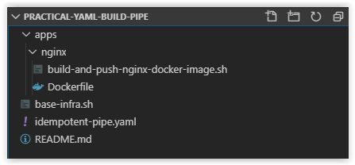

# Day 51 - Practical Guide for YAML Build Pipelines in Azure DevOps - Part 8

*The other posts in this Series can be found below.*

***[Day 35 - Practical Guide for YAML Build Pipelines in Azure DevOps - Part 1](./day.35.building.a.practical.yaml.pipeline.part.1.md)***</br>
***[Day 38 - Practical Guide for YAML Build Pipelines in Azure DevOps - Part 2](./day.38.building.a.practical.yaml.pipeline.part.2.md)***</br>
***[Day 39 - Practical Guide for YAML Build Pipelines in Azure DevOps - Part 3](./day.39.building.a.practical.yaml.pipeline.part.3.md)***</br>
***[Day 40 - Practical Guide for YAML Build Pipelines in Azure DevOps - Part 4](./day.40.building.a.practical.yaml.pipeline.part.4.md)***</br>
***[Day 41 - Practical Guide for YAML Build Pipelines in Azure DevOps - Part 5](./day.41.building.a.practical.yaml.pipeline.part.5.md)***</br>
***[Day 49 - Practical Guide for YAML Build Pipelines in Azure DevOps - Part 6](./day.49.building.a.practical.yaml.pipeline.part.6.md)***</br>
***[Day 50 - Practical Guide for YAML Build Pipelines in Azure DevOps - Part 7](./day.50.building.a.practical.yaml.pipeline.part.7.md)***</br>
***[Day 51 - Practical Guide for YAML Build Pipelines in Azure DevOps - Part 8](./day.51.building.a.practical.yaml.pipeline.part.8.md)***</br>

***
SPONSOR: Need to stop and start your development VMs on a schedule? The Azure Resource Scheduler let's you schedule up to 10 Azure VMs for FREE! Learn more [HERE](https://azuremarketplace.microsoft.com/en-us/marketplace/apps/lumagatena.resourcescheduler?tab=Overview)
***

Today, we are going to continue where we left off in **[Part 7](./day.50.building.a.practical.yaml.pipeline.part.7.md)** and add the content we were working on to a separate bash script and then create new task in the YAML Build Pipeline.

> **NOTE:** Replace all instances of **pracazconreg** in this article with the name you provided for the Azure Container Registry in **[Part 2](./day.38.building.a.practical.yaml.pipeline.part.2.md)**!

</br>

**In this article:**

[Add new directories to the Repository](#add-new-directories-to-the-repository)</br>
[Add the Dockerfile to the Repository](#add-the-dockerfile-to-the-repository)</br>
[Create the new Bash Script in the Repository](#create-the-new-bash-script-in-the-repository)</br>
[Update the YAML File for the Build Pipeline](#update-the-yaml-file-for-the-build-pipeline)</br>
[Check on the Build Pipeline Job](#check-on-the-build-pipeline-job)</br>
[Things to Consider](#things-to-consider)</br>
[Conclusion](#conclusion)</br>

## Add new directories to the Repository

Open up the **practical-yaml-build-pipe** repository in VS Code and create the following folders in the root of the repository.

```bash
apps/nginx
```

</br>

## Add the Dockerfile to the Repository

Next, add a file called **Dockerfile** in the **apps/nginx** directory. Copy the contents below into the **Dockerfile** and then save and commit it to the repository.

```dockerfile
# Pulling Ubuntu Image from Docker Hub
FROM alpine:latest

# Updating packages list and installing the prerequisite packages
RUN apk update && apk add \
net-tools \
vim \
jq \
wget \
curl \
nginx

WORKDIR /opt
EXPOSE 80
EXPOSE 443

ENTRYPOINT ["tail", "-f", "/dev/null"]
```

</br>

## Create the new Bash Script in the Repository

Next, in VS Code, create a new file called the **build-and-push-nginx-docker-image.sh** in the **apps/nginx** directory. Copy and paste the contents below into it and save and commit it to the repository.

```bash
#!/bin/bash

# Author:      Ryan Irujo
# Name:        build-and-push-nginx-docker-image.sh
# Description: Builds and Pushes an NGINX Docker Image to an Azure Container Registry from an Azure CLI Task in Azure DevOps.

# Logging into the 'pracazconreg' Azure Container Registry.
ACR_LOGIN=$(az acr login \
--name pracazconreg \
--output tsv 2> /dev/null)

if [[ "$ACR_LOGIN" =~ "Succeeded" ]]; then
    echo "[---success---] Logged into Azure Container Registry 'pracazconreg'. Result: $ACR_LOGIN."
else
    echo "[---fail------] Failed to login to Azure Container Registry 'pracazconreg'. Result: $ACR_LOGIN."
    exit 2
fi

# Building and Pushing the NGINX Docker Image to the Azure Container Registry.
BUILD_AND_PUSH_NGINX=$(az acr build \
--no-logs \
-t practical/nginx:$(date +%F-%H%M%S) \
-t practical/nginx:latest \
-r pracazconreg . \
-f apps/nginx/Dockerfile \
--query status \
--output tsv 2> /dev/null)

if [ "$BUILD_AND_PUSH_NGINX" == "Succeeded" ]; then
    echo "[---success---] Built and Pushed NGINX Docker Image to ACR 'pracazconreg'. Status: $BUILD_AND_PUSH_NGINX."
else
    echo "[---fail------] Failed to build and Pushed NGINX Docker Image to ACR 'pracazconreg'. Status: $BUILD_AND_PUSH_NGINX."
    exit 2
fi

```

The folder structure of your Repository should look like what is shown below.



</br>

## Update the YAML File for the Build Pipeline

Next, in VS Code, replace the current contents of the **idempotent-pipe.yaml** file with what is shown below. Afterwards, save and commit your changes to the repository.

```yaml
# Builds are automatically triggered from the master branch in the 'practical-yaml-build-pipe' Repo.
trigger:
- master

pool:
  # Using a Microsoft Hosted Agent - https://docs.microsoft.com/en-us/azure/devops/pipelines/agents/hosted?view=azure-devops
  vmImage: ubuntu-18.04

steps:

# Azure CLI Task - Deploying Base Infrastructure.
- task: AzureCLI@2
  displayName: 'Deploying Base Infrastructure'
  inputs:
    # Using Service Principal, 'sp-az-build-pipeline', to authenticate to the Azure Subscription.
    azureSubscription: 'sp-az-build-pipeline'
    scriptType: 'bash'
    scriptLocation: 'scriptPath'
    scriptPath: './base-infra.sh'

# Azure CLI Task - Build and Push NGINX Docker Image to Azure Container Registry.
- task: AzureCLI@2
  displayName: 'Build and Push NGINX Docker Image to ACR'
  inputs:
    # Using Service Principal, 'sp-az-build-pipeline', to authenticate to the Azure Subscription.
    azureSubscription: 'sp-az-build-pipeline'
    scriptType: 'bash'
    scriptLocation: 'scriptPath'
    scriptPath: './apps/nginx/build-and-push-nginx-docker-image.sh'
```

As you can see above, we've added the **build-and-push-nginx-docker-image.sh** script to it's own Azure CLI Task.

</br>

## Check on the Build Pipeline Job

Review the logs of the most current job in the **practical-yaml-build-pipe** Build Pipeline and you should see the following output from the **Deploying Base Infrastructure** Azure CLI Task.


</br>

## Things to Consider

The **build-and-push-nginx-docker-image.sh** script and it's associated Azure CLI Task can be used as a template for other applications that either exist in this pipeline or different pipelines with minimal code refactoring. The directory structure presented in here provides the same type of benefit by ensuring that application specific files and resources aren't all crammed into the same directory.

Keep in mind that when you separate certain scripts into different pipeline tasks, that you need to ensure that any data you are using/passing between scripts isn't accidentally cut off from the next task. At the end of each task, the credentials for the task are cleared; however, the data from the previous command CAN be passed on to the next task, but must be done so, *explicitly*.

</br>

## Conclusion

In today's article in we continued where we left off in **[Part 7](./day.50.building.a.practical.yaml.pipeline.part.7.md)** and added the content we were working on to a separate bash script and then created a new task in the YAML Build Pipeline. If there's a specific scenario that you wish to be covered in future articles, please create a **[New Issue](https://github.com/starkfell/100DaysOfIaC/issues)** in the [starkfell/100DaysOfIaC](https://github.com/starkfell/100DaysOfIaC/) GitHub repository.
