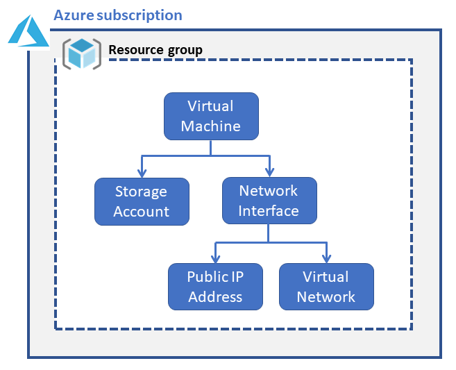

# Getting to know ARM and JSON (Part 2)

In [Day 5 - Getting to Know ARM and JSON](https://github.com/starkfell/100DaysOfIaC/blob/master/articles/day.5.getting.to.know.arm.and.json.md), which was basically an "Intro to ARM 101" post, we covered the basics of JSON, and Azure Resource Manager (ARM) templates structure, like parameters and variables. If you haven't read that installment already, or want to refresh your memory, give Day 5 a quick read.

In this article:

[Related Articles](#related-articles) </br>
[Resources](#resources) </br>
[A note on Dependencies](#a-note-on-dependencies) </br>
[ARM Template Functions](#arm-template-functions) </br>
[Protected Settings](#) </br>
[Outputs](#) </br>

***
SPONSOR: Need to stop and start your development VMs on a schedule? The Azure Resource Scheduler let's you schedule up to 10 Azure VMs for FREE! Learn more [HERE](https://azuremarketplace.microsoft.com/en-us/marketplace/apps/lumagatena.resourcescheduler?tab=Overview)
***

Now, we'll cover a few additional ARM template concepts before exploring additional ARM scenarios in the remaining 47 days.

## Related Articles

If you want to dig into ARM hands-on when you're done with today's post, here are a few other related articles featuring ARM in the series:

- [Day 17 - ARMing yourself with extensions in VS Code](https://github.com/starkfell/100DaysOfIaC/blob/master/articles/day.17.arm.template.extensions.vs.code.md)
- [Day 42 - Deploy Linked ARM Templates Using Storage Account in YAML Pipeline](https://github.com/starkfell/100DaysOfIaC/blob/master/articles/day.42.deploy.nested.arm.templates.using.storage.accounts.in.yaml.pipeline.md)
- [Day 47 - Deploying resources in Azure with help from ARM Template Functions](https://github.com/starkfell/100DaysOfIaC/blob/master/articles/day.47.deploy.mult.res.arm.md)

## Resources

This is the real meat of your ARM template. The **resources** section represents the resource types that are deployed or updated in a resource group or subscription. For example, when deploying a virtual machine in Azure, you will see resources including virtual machine, availability set, storage account, disk, network adapter, and network security group.

Each resource in resources can have a number of elements, including:

- **apiVersion** (required)
- **type** (required)
- **name** (required)
- **location** (required). You'll typically specify location once in a parameter and reference that value throughout your template.
- **tags** (optional). While options, tags are used frequently, often on the resource group, to specify project, ownership, environment, and cost center to name a few.
- **dependsOn** (optional). Used to specify dependent resources that must be deployed before the resource being described is deployed. See **Figure 1** for an example of dependencies in an ARM resource.
- **properties** (required). Describes the properties of the resource being deployed. Open the ARM template HERE in your browser and search on "properties".



**Figure 1**. ARM resource dependencies example (VM)

### A note on dependencies

The one I want to call out here is "**dependsOn**", which allows us to specify dependencies, for cases where you need to deploy resources in a specific order. One place I'd seen this used in years past was with networking, such as creating a VM, with a public IP address. If you try to create the NIC and reference a public IP resource that doesn’t yet exist, your deployment will fail. One fix for this is “dependsOn” section that lists all the dependencies that need to be created *before* the resource can be created.

You can also dependencies by nesting resources, in which case child resources are created after the parent resource is created. We have a working example of the dependencies illustrated in Figure 1 in the [Day 47 ARM Template (VM deployment)](https://github.com/starkfell/100DaysOfIaC/blob/master/resources/day47/multi-vm-temp.json).

> **WARNING**: Dependencies are handy, but should be used only when necessary because they limit the number of simultaneous operations for the resource manager, and longer dependency chains means longer deployment times. This is even more noticeable when using [linked templates](https://docs.microsoft.com/en-us/azure/azure-resource-manager/resource-group-linked-templates).

## ARM Template Functions

ARM template functions enable you to manipulate, calculate, compare, and construct values within ARM operations related to strings, numbers, arrays, and logic operations (e.g. Boolean, and, or, if, not). There are well over 50 helper functions you can use in your ARM templates, that fall into the following high-level categories.

We covered ARM templates in depth in [Day 47 - Deploying resources in Azure with help from ARM Template Functions](https://github.com/starkfell/100DaysOfIaC/blob/master/articles/day.47.deploy.mult.res.arm.md), and provided an example ARM template implementing some of the ARM template functions described. Open that article in a separate tab and give that a read, as ARM template functions deserved a dedicated article.

## Protected Settings

To ensure that data is stored in an encrypted format and is only decrypted on a VM is to use **protectedSettings**. Examples of data you'd store in protectedSettings would include the Log Analytics workspace ID. Here's what this example looks like in JSON:

``` JSON
{
	"type": "extensions",
	"name": "OMSExtension",
	"apiVersion": "[variables('apiVersion')]",
	"location": "[resourceGroup().location]",
	"dependsOn": [
		"[concat('Microsoft.Compute/virtualMachines/', variables('vmName'))]"
	],
	"properties": {
		"publisher": "Microsoft.EnterpriseCloud.Monitoring",
		"type": "MicrosoftMonitoringAgent",
		"typeHandlerVersion": "1.0",
		"autoUpgradeMinorVersion": true,
		"settings": {
			"workspaceId": "myWorkSpaceId"
		},
		"protectedSettings": {
			"workspaceKey": "myWorkspaceKey"
		}
	}
}
```

## Outputs

If we want to be able to print certain properties at the end of the ARM deployment, this is where **outputs** section of the template comes into play. This enables us to confirm that the ARM deployment did indeed do what we wanted it to do, and as well as to perhaps pipe the output onto a subsequent command and as input for further operations. I've  used to pass connection info (URLs and FQDNs) for resources created in an ARM template.

You can also pass outputs between tasks and even stages in Azure Pipelines, but that's a topic for another dedicated post.

## Conclusion

This installment has addressed a few additional ARM concepts that set the stage for some additional scenarios in Azure Pipelines, which we'll cover in later installments of this series. In the interim, run through the related articles above and get familiar with the JSON basics (day 5), ARM functions (day 47), and the concepts covered here.
