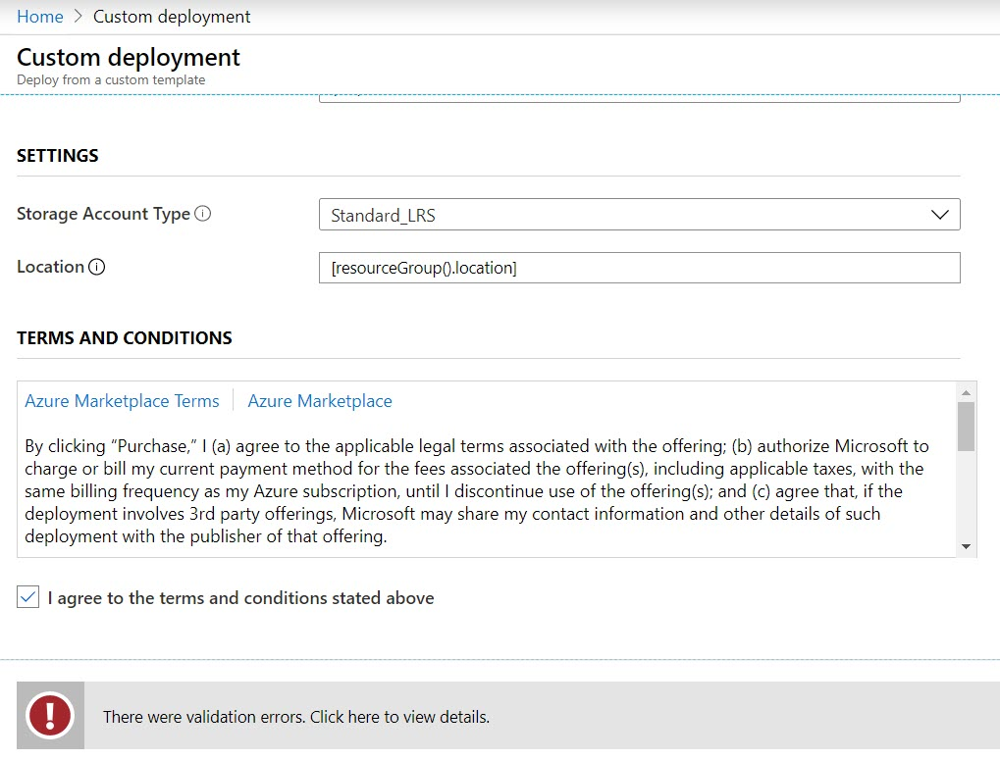

# Day 56 - Troubleshooting Azure Resource Manager (ARM) Template Deployment

If you are deploying ARM templates via Azure Pipelines, the Azure Portal, or PowerShell, it pays to know the basics of the types of errors you may get, where to find the error messages, and how to interpret them. Below are the resources you need to master Azure Resource Manager deployment errors no matter which deployment method you use.

In this article:

[ARM Deployment Error Types](#arm-deployment-error-types) </br>
[Finding error details in the Azure Portal](#finding-error-details-in-the-azure-portal) </br>
[Enable debug logging in PowerShell](#Enable-debug-logging-in-powershell) </br>
[Debugging in VS Code](#debugging-in-vs-code) </br>
[Finding error details in the Azure Portal](#finding-error-details-in-the-azure-portal) </br>
[ARM Error References and Tutorial](#arm-error-references-and-tutorial) </br>

## ARM Deployment Error Types

There are important differences between **template validation error**, and a **template deployment error**. A template validation error means there is a problem with the syntax or layout of your deployment template, which prevents the deployment from starting. A template deployment error means that your template syntax has been approved, but an error has occurred while provisioning the resources.

 Both types of errors return an error code you can use to troubleshoot the deployment. Both error types appear in the Azure Activity Log. However, validation errors don't appear in your deployment history because the deployment never started. If you use the template deployment in the Azure portal and your template is invalid, you'll see an error like that shown in Figure 1 when you click the purchase button:


 **Figure 1**. ARM Template Validation Error

## Finding error details in the Azure Portal

 If you have a conflict not caught in the pre-flight check, you can find the error in the properties of the failed deployment or the **Azure Activity Log**. To get to the Activity Logs 

1. Sign in to the Azure portal.
2. Select Monitor > Activity log.
3. Use the filters to find the log.

## Enable debug logging in PowerShell**

Sometimes you need more information about the request and response to learn what went wrong. During deployment, you can request that additional information is logged during a deployment.

In PowerShell, you can set the DeploymentDebugLogLevel parameter to All, ResponseContent, or RequestContent. For troubleshooting, set `-DeploymentDebugLogLevel All`

``` PowerShell
New-AzResourceGroupDeployment `
 -Name MyArmDeployment `
 -ResourceGroupName MyArmResGroup `
 -TemplateFile c:\scripts\ArmTemplates\storage.json `
 -DeploymentDebugLogLevel All
  ```

## Debugging in VS Code

If you load the Preview version of [Azure Resource Manager (ARM) Tools](#https://marketplace.visualstudio.com/items?itemName=msazurermtools.azurerm-vscode-tools) for VS Code, you can troubleshoot ARM template deployment directly in VS Code. According to the extension documentation, the new language server now has a better understanding of Azure Resource Manager templates and can therefore provide a better error and completion experience beyond that provided using standard JSON validation, and:
- Narrows down its schema validation based on the resource type and apiVersion properties of each resource.
- No longer suggests changing the resource type if the apiVersion is not supported, or if a property is missing or invalid (as tools using standard JSON validation would do)
- Errors provide better guidance for what actually needs to be fixed in each resource to match the schema

## ARM Error References and Tutorial

Here are the key additional resources you should review to master troubleshooting ARM template deployment, including a step-by-step tutorial simulating an ARM deployment error.

- Common error messages are available in [Troubleshoot common Azure deployment errors with Azure Resource Manager](https://docs.microsoft.com/en-us/azure/azure-resource-manager/resource-manager-common-deployment-errors)

- Details on how to review ARM template deployment history in the[View deployment history with Azure Resource Manager](https://docs.microsoft.com/en-us/azure/azure-resource-manager/resource-manager-deployment-operations)

- If you are interested, this is a great step-by-step tutorial from Microsoft that shows you how to create and troubleshoot an ARM deployment error: [Tutorial: Troubleshoot Resource Manager template deployments](https://docs.microsoft.com/en-us/azure/azure-resource-manager/resource-manager-tutorial-troubleshoot)

## Conclusion

Hopefully this gives you the resources you need to get comfortable with ARM deployment troubleshooting in a shortest possible time. Have a tip that's helped you troubleshoot ARM deployments? Leave a comment below.
