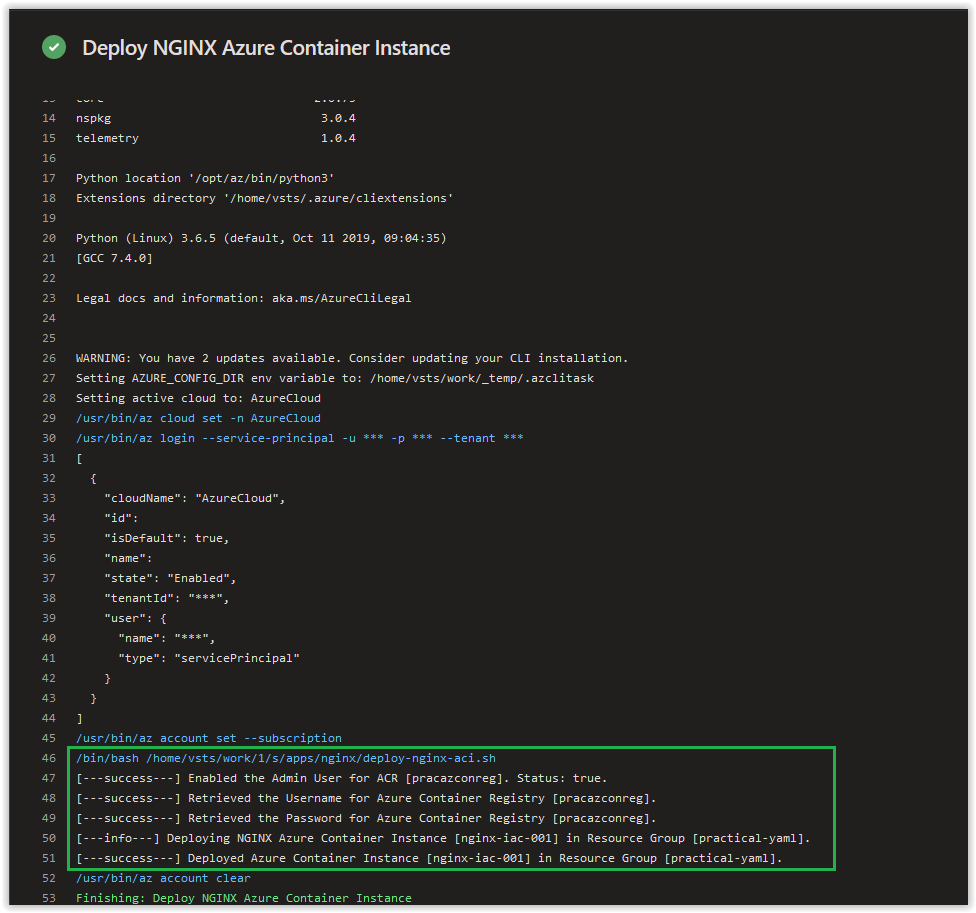

# Day 58 - Practical Guide for YAML Build Pipelines in Azure DevOps - Part 9

*The other posts in this Series can be found below.*

***[Day 35 - Practical Guide for YAML Build Pipelines in Azure DevOps - Part 1](./day.35.building.a.practical.yaml.pipeline.part.1.md)***</br>
***[Day 38 - Practical Guide for YAML Build Pipelines in Azure DevOps - Part 2](./day.38.building.a.practical.yaml.pipeline.part.2.md)***</br>
***[Day 39 - Practical Guide for YAML Build Pipelines in Azure DevOps - Part 3](./day.39.building.a.practical.yaml.pipeline.part.3.md)***</br>
***[Day 40 - Practical Guide for YAML Build Pipelines in Azure DevOps - Part 4](./day.40.building.a.practical.yaml.pipeline.part.4.md)***</br>
***[Day 41 - Practical Guide for YAML Build Pipelines in Azure DevOps - Part 5](./day.41.building.a.practical.yaml.pipeline.part.5.md)***</br>
***[Day 49 - Practical Guide for YAML Build Pipelines in Azure DevOps - Part 6](./day.49.building.a.practical.yaml.pipeline.part.6.md)***</br>
***[Day 50 - Practical Guide for YAML Build Pipelines in Azure DevOps - Part 7](./day.50.building.a.practical.yaml.pipeline.part.7.md)***</br>
***[Day 51 - Practical Guide for YAML Build Pipelines in Azure DevOps - Part 8](./day.51.building.a.practical.yaml.pipeline.part.8.md)***</br>
***[Day 58 - Practical Guide for YAML Build Pipelines in Azure DevOps - Part 9](./day.58.building.a.practical.yaml.pipeline.part.9.md)***</br>

</br>

Today, we are going to continue where we left off in **[Part 7](./day.51.building.a.practical.yaml.pipeline.part.8.md)** and add in the deployment of an Azure Container Instance using the NGINX Image from our Azure Container Registry **pracazconreg**.

> **NOTE:** Replace all instances of **pracazconreg** in this article with the name you provided for the Azure Container Registry in **[Part 2](./day.38.building.a.practical.yaml.pipeline.part.2.md)**!

</br>

**In this article:**

[Add in a new Bash Script for Deploying an Azure Container Instance](#add-in-a-new-bash-script-for-deploying-an-azure-container-instance)</br>
[deploy-nginx-aci.sh Script Breakdown](#deploy-nginx-acish-script-breakdown)</br>
[Update the YAML File for the Build Pipeline](#update-the-yaml-file-for-the-build-pipeline)</br>
[Check on the Build Pipeline Job](#check-on-the-build-pipeline-job)</br>
[Things to Consider](#things-to-consider)</br>
[Conclusion](#conclusion)</br>

## Add in a new Bash Script for Deploying an Azure Container Instance

Next, in VS Code, create a new file called **deploy-nginx-aci.sh** in the **apps/nginx** directory. Copy and paste the contents below into it and save and commit it to the repository.

```bash
#!/bin/bash

# Making sure that the Admin User to login to the Container Registry is enabled.
ENABLE_ADMIN_USER=$(az acr update \
-n pracazconreg \
--admin-enabled true \
--query adminUserEnabled \
--output tsv)

if [ "$ENABLE_ADMIN_USER" == "true" ]; then
    echo "[---success---] Enabled the Admin User for ACR [pracazconreg]. Status: $ENABLE_ADMIN_USER."
else
    echo "[---fail------] Failed to enable the Admin User for Azure Container Registry [pracazconreg]. Status: $ENABLE_ADMIN_USER."
    exit 2
fi

# Retrieving the Azure Container Registry Username.
ACR_USERNAME=$(/usr/bin/az acr credential show \
--name pracazconreg \
--query username --output tsv)

if [ $? -eq 0 ]; then
    echo "[---success---] Retrieved the Username for Azure Container Registry [pracazconreg]."
else
    echo "[---fail------] Failed to retrieve the Username for Azure Container Registry [pracazconreg]."
    echo "[---fail------] $ACR_USERNAME"
    exit 2
fi

# Retrieving the Azure Container Registry Password.
ACR_PASSWORD=$(/usr/bin/az acr credential show \
--name pracazconreg \
--query passwords[0].value --output tsv)

if [ $? -eq 0 ]; then
    echo "[---success---] Retrieved the Password for Azure Container Registry [pracazconreg]."
else
    echo "[---fail------] Failed to retrieve the Password for Azure Container Registry [pracazconreg]."
    echo "[---fail------] $ACR_PASSWORD"
    exit 2
fi

# Deploying NGINX to an Azure Container Instance.
echo "[---info---] Deploying NGINX Azure Container Instance [nginx-iac-001] in Resource Group [practical-yaml]."

DEPLOY_NGINX_ACI=$(az container create \
--resource-group "practical-yaml" \
--name "nginx-iac-001" \
--registry-username "$ACR_USERNAME" \
--registry-password "$ACR_PASSWORD" \
--image "pracazconreg.azurecr.io/practical/nginx:latest" \
--ip-address public \
--dns-name-label "nginx-iac-001" \
--ports 80 443 \
--protocol TCP \
--cpu 1 \
--memory 1)

if [ $? -eq 0 ]; then
    echo "[---success---] Deployed Azure Container Instance [nginx-iac-001] in Resource Group [practical-yaml]."
else
    echo "[---fail------] Failed to deploy Azure Container Instance [nginx-iac-001] in Resource Group [practical-yaml]."
    echo "[---fail------] $DEPLOY_NGINX_ACI"
    exit 2
fi
```

</br>

### deploy-nginx-aci.sh Script Breakdown

The **Making sure that the Admin User to login to the Container Registry is enabled.** section, we are forcing the Admin User of the Azure Container Registry to be enabled. If the Admin User is not enabled, the Service Principal won't be able to login using the Admin User and one of it's two associated passwords that are set by default.

In the sections **Retrieving the Azure Container Registry Username.** and **Retrieving the Azure Container Registry Password**, the Service Principal will be retrieving the Azure Container Registry Username and Password which will be used to login to the Azure Container Registry and access the NGINX Container Image.

Finally, in the last section, **Deploying NGINX to an Azure Container Instance**, the Service Principal deploys an Azure Container Instance called **nginx-iac-001** to the **practical-yaml** Resource Group.

</br>

## Update the YAML File for the Build Pipeline

Next, in VS Code, replace the current contents of the **idempotent-pipe.yaml** file with what is shown below. Afterwards, save and commit your changes to the repository.

```yaml
# Builds are automatically triggered from the master branch in the 'practical-yaml-build-pipe' Repo.
trigger:
- master

pool:
  # Using a Microsoft Hosted Agent - https://docs.microsoft.com/en-us/azure/devops/pipelines/agents/hosted?view=azure-devops
  vmImage: ubuntu-18.04

steps:

# Azure CLI Task - Deploying Base Infrastructure.
- task: AzureCLI@2
  displayName: 'Deploying Base Infrastructure'
  inputs:
    # Using Service Principal, 'sp-az-build-pipeline', to authenticate to the Azure Subscription.
    azureSubscription: 'sp-az-build-pipeline'
    scriptType: 'bash'
    scriptLocation: 'scriptPath'
    scriptPath: './base-infra.sh'

# Azure CLI Task - Build and Push NGINX Docker Image to Azure Container Registry.
- task: AzureCLI@2
  displayName: 'Build and Push NGINX Docker Image to ACR'
  inputs:
    # Using Service Principal, 'sp-az-build-pipeline', to authenticate to the Azure Subscription.
    azureSubscription: 'sp-az-build-pipeline'
    scriptType: 'bash'
    scriptLocation: 'scriptPath'
    scriptPath: './apps/nginx/build-and-push-nginx-docker-image.sh'

# Azure CLI Task - Deploy NGINX Azure Container Instance.
- task: AzureCLI@2
  displayName: 'Deploy NGINX Azure Container Instance'
  inputs:
    # Using Service Principal, 'sp-az-build-pipeline', to authenticate to the Azure Subscription.
    azureSubscription: 'sp-az-build-pipeline'
    scriptType: 'bash'
    scriptLocation: 'scriptPath'
    scriptPath: './apps/nginx/deploy-nginx-aci.sh'
```

As you can see above, we've added the **deploy-nginx-aci.sh** script to it's own Azure CLI Task called **Deploy NGINX Azure Container Instance**.

</br>

## Check on the Build Pipeline Job

Review the logs of the most current job in the **practical-yaml-build-pipe** Build Pipeline and you should see the following output from the **Deploying Base Infrastructure** Azure CLI Task.



</br>

## Things to Consider

The **nginx-iac-001** Azure Container Instance will be accessible and viewable from within the Azure Portal; however, nothing is coming up on the publicly accessible IP Address or DNS Name we set for the container in Azure. We are going to over how we can resolve this and other modifications we can make to to the container in the next article of this series.

</br>

## Conclusion

In today's article in we continued where we left off in **[Part 8](./day.51.building.a.practical.yaml.pipeline.part.8.md)** and added in the deployment of an Azure Container Instance using the NGINX Image from our Azure Container Registry **pracazconreg**. If there's a specific scenario that you wish to be covered in future articles, please create a **[New Issue](https://github.com/starkfell/100DaysOfIaC/issues)** in the [starkfell/100DaysOfIaC](https://github.com/starkfell/100DaysOfIaC/) GitHub repository.
