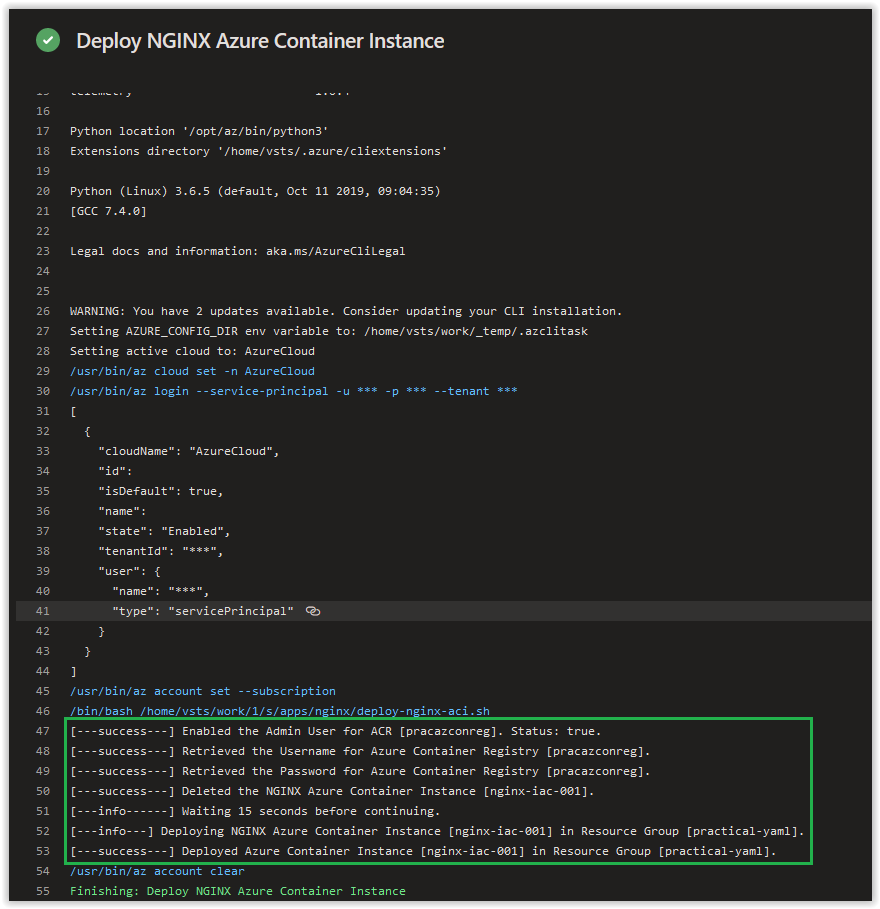
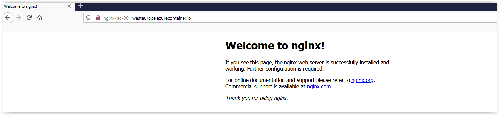

# Day 60 - Practical Guide for YAML Build Pipelines in Azure DevOps - Part 10

*The other posts in this Series can be found below.*

***[Day 35 - Practical Guide for YAML Build Pipelines in Azure DevOps - Part 1](./day.35.building.a.practical.yaml.pipeline.part.1.md)***</br>
***[Day 38 - Practical Guide for YAML Build Pipelines in Azure DevOps - Part 2](./day.38.building.a.practical.yaml.pipeline.part.2.md)***</br>
***[Day 39 - Practical Guide for YAML Build Pipelines in Azure DevOps - Part 3](./day.39.building.a.practical.yaml.pipeline.part.3.md)***</br>
***[Day 40 - Practical Guide for YAML Build Pipelines in Azure DevOps - Part 4](./day.40.building.a.practical.yaml.pipeline.part.4.md)***</br>
***[Day 41 - Practical Guide for YAML Build Pipelines in Azure DevOps - Part 5](./day.41.building.a.practical.yaml.pipeline.part.5.md)***</br>
***[Day 49 - Practical Guide for YAML Build Pipelines in Azure DevOps - Part 6](./day.49.building.a.practical.yaml.pipeline.part.6.md)***</br>
***[Day 50 - Practical Guide for YAML Build Pipelines in Azure DevOps - Part 7](./day.50.building.a.practical.yaml.pipeline.part.7.md)***</br>
***[Day 51 - Practical Guide for YAML Build Pipelines in Azure DevOps - Part 8](./day.51.building.a.practical.yaml.pipeline.part.8.md)***</br>
***[Day 58 - Practical Guide for YAML Build Pipelines in Azure DevOps - Part 9](./day.58.building.a.practical.yaml.pipeline.part.9.md)***</br>
***[Day 59 - Practical Guide for YAML Build Pipelines in Azure DevOps - Part 10](./day.59.building.a.practical.yaml.pipeline.part.10.md)***</br>

</br>

Today, we are going to continue where we left off in **[Part 9](./day.58.building.a.practical.yaml.pipeline.part.9.md)** we are going to update our Dockerfile configuration and add in an NGINX Configuration File so we have something to view online.

> **NOTE:** Replace all instances of **pracazconreg** in this article with the name you provided for the Azure Container Registry in **[Part 2](./day.38.building.a.practical.yaml.pipeline.part.2.md)**!

</br>

**In this article:**

[Update the Dockerfile](#update-the-dockerfile)</br>
[Create the NGINX Configuration File](#add-in-a-new-bash-script-for-deploying-an-azure-container-instance)</br>
[Update the deploy-nginx-aci.sh Script](#deploy-nginx-acish-script-breakdown)</br>
[Check on the Build Pipeline Job](#check-on-the-build-pipeline-job)</br>
[Things to Consider](#things-to-consider)</br>
[Conclusion](#conclusion)</br>

## Update the Dockerfile

The current state of the Dockerfile does have NGINX installed; however, it is not configured nor set to run.

In VS Code, open up the **Dockerfile** under **apps/nginx** and replace its current contents with the code shown below. Afterwards save and commit it to the repository.

```dockerfile
# Pulling NGINX Image from Docker Hub
FROM nginx:latest

# Updating packages list and installing the prerequisite packages
RUN apt-get update && apt-get install -y \
net-tools \
vim \
jq \
wget \
curl

RUN mkdir -p /etc/nginx
ADD apps/nginx/nginx.conf /etc/nginx/nginx.conf

EXPOSE 80
EXPOSE 443

ENTRYPOINT [ "nginx", "-g", "daemon off;"]
```

You'll notice that we have a new **ENTRYPOINT** that starts up NGINX and an **nginx.conf** file added to the container. Next, we'll create the **nginx.conf** file.

</br>

## Create the NGINX Configuration File

In VS Code, create a new file called **nginx.conf** under **apps/nginx**. Copy and paste the contents below into the file and then save and commit it to the repository.

```conf
# NGINX Configuration File located at /etc/nginx/nginx.conf.
user  nginx;
worker_processes  1;

error_log  /var/log/nginx/error.log warn;
pid        /var/run/nginx.pid;

events {
    worker_connections  1024;
}

http {
    include       /etc/nginx/mime.types;
    default_type  application/octet-stream;

    log_format  main  '$remote_addr - $remote_user [$time_local] "$request" '
                      '$status $body_bytes_sent "$http_referer" '
                      '"$http_user_agent" "$http_x_forwarded_for"';

    access_log  /var/log/nginx/access.log  main;

    sendfile        on;
    #tcp_nopush     on;

    keepalive_timeout  65;

    #gzip  on;

    include /etc/nginx/conf.d/*.conf;
}
```

</br>

## Update the deploy-nginx-aci.sh Script

In VS Code, open up the **deploy-nginx-aci.sh** script in **apps/nginx**. Copy and paste the contents below into the file and then save and commit it to the repository.

```bash
#!/bin/bash

# Making sure that the Admin User to login to the Container Registry is enabled.
ENABLE_ADMIN_USER=$(az acr update \
-n pracazconreg \
--admin-enabled true \
--query adminUserEnabled \
--output tsv)

if [ "$ENABLE_ADMIN_USER" == "true" ]; then
    echo "[---success---] Enabled the Admin User for ACR [pracazconreg]. Status: $ENABLE_ADMIN_USER."
else
    echo "[---fail------] Failed to enable the Admin User for Azure Container Registry [pracazconreg]. Status: $ENABLE_ADMIN_USER."
    exit 2
fi

# Retrieving the Azure Container Registry Username.
ACR_USERNAME=$(/usr/bin/az acr credential show \
--name pracazconreg \
--query username --output tsv)

if [ $? -eq 0 ]; then
    echo "[---success---] Retrieved the Username for Azure Container Registry [pracazconreg]."
else
    echo "[---fail------] Failed to retrieve the Username for Azure Container Registry [pracazconreg]."
    echo "[---fail------] $ACR_USERNAME"
    exit 2
fi

# Retrieving the Azure Container Registry Password.
ACR_PASSWORD=$(/usr/bin/az acr credential show \
--name pracazconreg \
--query passwords[0].value --output tsv)

if [ $? -eq 0 ]; then
    echo "[---success---] Retrieved the Password for Azure Container Registry [pracazconreg]."
else
    echo "[---fail------] Failed to retrieve the Password for Azure Container Registry [pracazconreg]."
    echo "[---fail------] $ACR_PASSWORD"
    exit 2
fi

# Removing the Previous NGINX Azure Container Instance if found.
DELETE_NGINX_ACI=$(az container delete \
--resource-group "practical-yaml" \
--name "nginx-iac-001" \
--yes)

if [ $? -eq 0 ]; then
    echo "[---success---] Deleted the NGINX Azure Container Instance [nginx-iac-001]."
    echo "[---info------] Waiting 15 seconds before continuing."
    sleep 15
else
    echo "[---fail------] Failed to delete the NGINX Azure Container Instance [nginx-iac-001]."
    echo "[---fail------] $DELETE_NGINX_ACI"
    exit 2
fi

# Deploying NGINX to an Azure Container Instance.
echo "[---info---] Deploying NGINX Azure Container Instance [nginx-iac-001] in Resource Group [practical-yaml]."

DEPLOY_NGINX_ACI=$(az container create \
--resource-group "practical-yaml" \
--name "nginx-iac-001" \
--registry-username "$ACR_USERNAME" \
--registry-password "$ACR_PASSWORD" \
--image "pracazconreg.azurecr.io/practical/nginx:latest" \
--ip-address public \
--dns-name-label "nginx-iac-001" \
--ports 80 443 \
--protocol TCP \
--cpu 1 \
--memory 1)

if [ $? -eq 0 ]; then
    echo "[---success---] Deployed Azure Container Instance [nginx-iac-001] in Resource Group [practical-yaml]."
else
    echo "[---fail------] Failed to deploy Azure Container Instance [nginx-iac-001] in Resource Group [practical-yaml]."
    echo "[---fail------] $DEPLOY_NGINX_ACI"
    exit 2
fi
```

</br>

You'll notice that the following section has been added.

```bash
# Removing the Previous NGINX Azure Container Instance if found.
DELETE_NGINX_ACI=$(az container delete \
--resource-group "practical-yaml" \
--name "nginx-iac-001" \
--yes)

if [ $? -eq 0 ]; then
    echo "[---success---] Deleted the NGINX Azure Container Instance [nginx-iac-001]."
    echo "[---info------] Waiting 15 seconds before continuing."
    sleep 15
else
    echo "[---fail------] Failed to delete the NGINX Azure Container Instance [nginx-iac-001]."
    echo "[---fail------] $DELETE_NGINX_ACI"
    exit 2
fi
```

This is to ensure that the latest image available in the Azure Container Registry is pulled after any updates are made in our build pipeline.

You do have a few options available to use natively in order to update your Azure Container Instance without deleting the entire container group; however, there are some limitations with it that you can read about **[here](https://docs.microsoft.com/en-us/azure/container-instances/container-instances-update)**.

## Check on the Build Pipeline Job

Review the logs of the most current job in the **practical-yaml-build-pipe** Build Pipeline and you should see the following output from the **Deploy NGINX Azure Container Instance** Azure CLI Task.



</br>

Lastly, you should now be able to visit the FQDN of your Azure Container Instance.



</br>

## Conclusion

In today's article in we continued where we left off in **[Part 7](./day.50.building.a.practical.yaml.pipeline.part.7.md)** and added the content we were working on to a separate bash script and then created a new task in the YAML Build Pipeline. If there's a specific scenario that you wish to be covered in future articles, please create a **[New Issue](https://github.com/starkfell/100DaysOfIaC/issues)** in the [starkfell/100DaysOfIaC](https://github.com/starkfell/100DaysOfIaC/) GitHub repository.