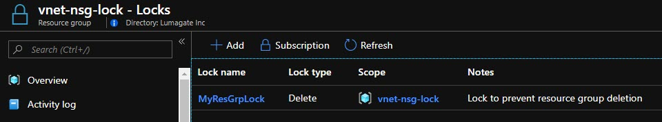
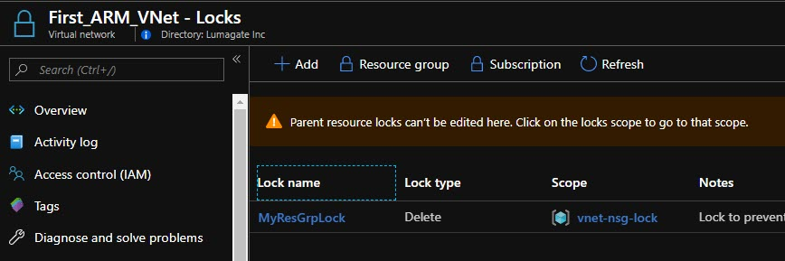

# Day 64 - Implementing Resource Locks in ARM Templates for Infrastructure-as-Code

As an admin, you might want to lock a subscription, resource group, or resource to prevent other users in your organization from accidentally deleting or modifying critical resources. You do this with **resource locks**. You can set the lock level to **CanNotDelete** or **ReadOnly** in ARM, PowerShell, or Azure CLI. In the Azure portal, the locks are called *Delete* and *Read-only*.

Understanding how to implement resource locks, lock inheritance, and ARM syntax are details you should have in hand for your Infrastructure-as-Code journey.

In this article:

[Resource Lock Types](#resource-lock-types) </br>
[Recommendations](#recommendations)
[Resource Lock Syntax for ARM](#resource-lock-syntax-for-arm) </br>
[Sample Resource Lock in ARM](#sample-resource-lock-in-arm) </br>
[How are resource locks applied?](#how-are-resource-locks-applied) </br>

## Resource Lock Types

There are two levels of lock restrictions

- **CanNotDelete** means authorized users can still read and modify a resource, but they can't delete the resource.
- **ReadOnly** means authorized users can read a resource, but they can't delete or update the resource. Applying this lock is similar to restricting all authorized users to the permissions granted by the Reader role.

## Recommendations

*I generally set **CanNotDelete** locks*. ReadOnly locks can produce strange results, because there are a surprising number of operations you would think only require read permission (because they don't modify the resource) that actually need write permissions also.

**I set resource locks at the resource group level whenever possible**. If I am locking a resource, I generally want all the parts that share the same lifecycle, as defined by the fact that they are hosted in the same Azure resource group.

The end result is that your locking strategy maps to the resource management boundary, is easier to remember that resource-specific locks across various resource types. An additional benefit is the syntax for apply a resource lock to a resource group is simpler, and the same every time, as you'll see in the next section.

## Resource Lock Syntax for ARM

When using a Resource Manager template to deploy a lock, you use different values for the name and type depending on the scope of the lock.

When applying a lock to a **resource**, use the following formats:

- name - {resourceName}/Microsoft.Authorization/{lockName}
- type - {resourceProviderNamespace}/{resourceType}/providers/locks

When applying a lock to a **resource group or subscription**, use the following formats:

- name - {lockName}
- type - Microsoft.Authorization/

## Sample Resource Lock in ARM

Below is the sample of a resource group lock. I have added this to the tail end of the resources section of the arm template that deploys an Azure VNET, three subnet, and network security groups for each.

``` JSON
{
            "type": "Microsoft.Authorization/locks",
            "apiVersion": "2015-01-01",
            "name": "MyResGrpLock",
            "properties":
            {
                "level": "CanNotDelete",
                "notes": "Lock to prevent resource group deletion"
            }
        }
```

And here is the above snippet in a full ARM template that deploys a VNET, 3 subnets (backend, frontend, and mid-tier), and NSGs for each subnet. You'll also find a copy of this template in the [Day 64](../resources/day64) folder

``` JSON
{
  "$schema": "https://schema.management.azure.com/schemas/2019-04-01/deploymentTemplate.json#",
  "contentVersion": "1.0.0.0",
  "parameters": {
    "virtualNetworkName": {
      "type": "string",
      "defaultValue": "Demo_ARM_VNet",
      "metadata": {
        "description": "This is your Virtual Network"
      }
    },
    "addressPrefix": {
      "type": "string",
      "defaultValue": "10.7.0.0/16",
      "metadata": {
        "description": "The CIDR address space for your Virtual Network in Azure"
      }
    },
    "FESubnetPrefix": {
      "type": "string",
      "defaultValue": "10.7.1.0/24",
      "metadata": {
        "description": "This is CIDR prefix for the FrontEnd Subnet"
      }
    },
    "AppSubnetPrefix": {
      "type": "string",
      "defaultValue": "10.7.2.0/24",
      "metadata": {
        "description": "This is CIDR prefix for the Application Subnet"
      }
    },
    "BESubnetPrefix": {
      "type": "string",
      "defaultValue": "10.7.3.0/24",
      "metadata": {
        "description": "This is CIDR prefix for the Database Subnet"
      }
    },
    "FENSGName": {
      "type": "string",
      "defaultValue": "FE_NSG",
      "metadata": {
        "description": "This is name of the networkSecurityGroup that will be assigned to FrontEnd Subnet"
      }
    },
    "AppNSGName": {
      "type": "string",
      "defaultValue": "App_NSG",
      "metadata": {
        "description": "This is name of the networkSecurityGroup that will be assigned to Application Subnet"
      }
    },
    "BENSGName": {
      "type": "string",
      "defaultValue": "BE_NSG",
      "metadata": {
        "description": "This is name of the networkSecurityGroup that will be assigned to Database Subnet"
      }
    },
    "location": {
      "type": "string",
      "defaultValue": "[resourceGroup().location]",
      "metadata": {
        "description": "Location for all resources."
      }
    }
  },
  "resources": [
    {
      "apiVersion": "2015-05-01-preview",
      "type": "Microsoft.Network/networkSecurityGroups",
      "name": "[parameters('FENSGName')]",
      "location": "[parameters('location')]",
      "properties": {
        "securityRules": [
          {
            "name": "rdp_rule",
            "properties": {
              "description": "Allow RDP",
              "protocol": "Tcp",
              "sourcePortRange": "*",
              "destinationPortRange": "3389",
              "sourceAddressPrefix": "Internet",
              "destinationAddressPrefix": "*",
              "access": "Allow",
              "priority": 100,
              "direction": "Inbound"
            }
          },
          {
            "name": "web_rule",
            "properties": {
              "description": "Allow WEB",
              "protocol": "Tcp",
              "sourcePortRange": "*",
              "destinationPortRange": "80",
              "sourceAddressPrefix": "Internet",
              "destinationAddressPrefix": "*",
              "access": "Allow",
              "priority": 101,
              "direction": "Inbound"
            }
          }
        ]
      }
    },
    {
      "apiVersion": "2015-05-01-preview",
      "type": "Microsoft.Network/networkSecurityGroups",
      "name": "[parameters('AppNSGName')]",
      "location": "[parameters('location')]",
      "properties": {
        "securityRules": [
          {
            "name": "Allow_FE",
            "properties": {
              "description": "Allow FE Subnet",
              "protocol": "Tcp",
              "sourcePortRange": "*",
              "destinationPortRange": "443",
              "sourceAddressPrefix": "[parameters('FESubnetPrefix')]",
              "destinationAddressPrefix": "*",
              "access": "Allow",
              "priority": 100,
              "direction": "Inbound"
            }
          },
          {
            "name": "Block_RDP_Internet",
            "properties": {
              "description": "Block RDP",
              "protocol": "Tcp",
              "sourcePortRange": "*",
              "destinationPortRange": "3389",
              "sourceAddressPrefix": "Internet",
              "destinationAddressPrefix": "*",
              "access": "Deny",
              "priority": 101,
              "direction": "Inbound"
            }
          },
          {
            "name": "Block_Internet_Outbound",
            "properties": {
              "description": "Block Internet",
              "protocol": "*",
              "sourcePortRange": "*",
              "destinationPortRange": "*",
              "sourceAddressPrefix": "*",
              "destinationAddressPrefix": "Internet",
              "access": "Deny",
              "priority": 200,
              "direction": "Outbound"
            }
          }
        ]
      }
    },
    {
      "apiVersion": "2015-05-01-preview",
      "type": "Microsoft.Network/networkSecurityGroups",
      "name": "[parameters('BENSGName')]",
      "location": "[parameters('location')]",
      "properties": {
        "securityRules": [
          {
            "name": "Allow_App",
            "properties": {
              "description": "Allow APP Subnet",
              "protocol": "Tcp",
              "sourcePortRange": "*",
              "destinationPortRange": "1433",
              "sourceAddressPrefix": "[parameters('AppSubnetPrefix')]",
              "destinationAddressPrefix": "*",
              "access": "Allow",
              "priority": 100,
              "direction": "Inbound"
            }
          },
          {
            "name": "Block_FE",
            "properties": {
              "description": "Block FE Subnet",
              "protocol": "*",
              "sourcePortRange": "*",
              "destinationPortRange": "*",
              "sourceAddressPrefix": "[parameters('FESubnetPrefix')]",
              "destinationAddressPrefix": "*",
              "access": "Deny",
              "priority": 101,
              "direction": "Inbound"
            }
          },
          {
            "name": "Block_App",
            "properties": {
              "description": "Block App Subnet",
              "protocol": "*",
              "sourcePortRange": "*",
              "destinationPortRange": "*",
              "sourceAddressPrefix": "[parameters('AppSubnetPrefix')]",
              "destinationAddressPrefix": "*",
              "access": "Deny",
              "priority": 102,
              "direction": "Inbound"
            }
          },
          {
            "name": "Block_Internet",
            "properties": {
              "description": "Block Internet",
              "protocol": "*",
              "sourcePortRange": "*",
              "destinationPortRange": "*",
              "sourceAddressPrefix": "*",
              "destinationAddressPrefix": "Internet",
              "access": "Deny",
              "priority": 200,
              "direction": "Outbound"
            }
          }
        ]
      }
    },
    {
      "apiVersion": "2015-05-01-preview",
      "type": "Microsoft.Network/virtualNetworks",
      "name": "[parameters('virtualNetworkName')]",
      "location": "[parameters('location')]",
      "dependsOn": [
        "[concat('Microsoft.Network/networkSecurityGroups/', parameters('FENSGName'))]",
        "[concat('Microsoft.Network/networkSecurityGroups/', parameters('AppNSGName'))]",
        "[concat('Microsoft.Network/networkSecurityGroups/', parameters('BENSGName'))]"
      ],
      "properties": {
        "addressSpace": {
          "addressPrefixes": [
            "[parameters('addressPrefix')]"
          ]
        },
        "subnets": [
          {
            "name": "FESubnet",
            "properties": {
              "addressPrefix": "[parameters('FESubnetPrefix')]",
              "networkSecurityGroup": {
                "id": "[resourceId('Microsoft.Network/networkSecurityGroups', parameters('FENSGName'))]"
              }
            }
          },
          {
            "name": "AppSubnet",
            "properties": {
              "addressPrefix": "[parameters('AppSubnetPrefix')]",
              "networkSecurityGroup": {
                "id": "[resourceId('Microsoft.Network/networkSecurityGroups', parameters('AppNSGName'))]"
              }
            }
          },
          {
            "name": "BESubnet",
            "properties": {
              "addressPrefix": "[parameters('BESubnetPrefix')]",
              "networkSecurityGroup": {
                "id": "[resourceId('Microsoft.Network/networkSecurityGroups', parameters('BENSGName'))]"
              }
            }
          }
        ]
      }
    },
    {
            "type": "Microsoft.Authorization/locks",
            "apiVersion": "2015-01-01",
            "name": "MyResGrpLock",
            "properties":
            {
                "level": "CanNotDelete",
                "notes": "Lock to prevent resource group deletion"
            }
        }
  ]
}
```

## How are resource locks applied?

When you apply a lock at a parent level (e.g. to a resource group), all resources within that scope *inherit* the same lock. So, in our example, the lock exists at the resource group, as shown in Figure 1, but also at the VNET and subnet levels, as shown in Figure 2.



**Figure 1**. Resource lock at the resource group level (via ARM) 



**Figure 2**. Inherited resource lock at the VNET level (via ARM)

>**NOTE**: Notice the inherited lock (resource 2) cannot be edited at the child level. You must edit at the parent (resource group) level from which it was inherited.

And resource locks apply even to resources you add later. So if we add another subnet to the VNET in the resource group, *it will inherit the lock automatically*.

Unlike role-based access control, you use management locks to apply a restriction to all users and roles.

Resource Manager locks apply only to operations that happen in the management plane, which consists of operations sent to https://management.azure.com. The locks do NOT restrict how resources perform their own functions. Resource changes are restricted, but resource operations aren't restricted. For example, a ReadOnly lock on a VM disk prevents changing the definition of the disk resource, but doesn't prevent you from creating, updating, or deleting data on the disk. Those data transactions are allowed because those operations aren't sent to https://management.azure.com.

## Conclusion

I hope you feel you have a handle on resource locks in Azure and ARM templates.  Take the lock snippet and try adding to your existing ARM templates to quickly incorporate resource locks into your Infrastructure-as-Code.
