# Day 65 - Integrating GitHub Enterprise with Azure Pipeline

*Today's post comes from guest contributor Tao Yang [@MrTaoYang](https://twitter.com/mrtaoyang). Tao is a Microsoft MVP who from 9-to-5 focuses on DevOps and governance in Azure for enterprise customers. You can find Tao blogging at [Managing Cloud and Datacenter by Tao Yang](https://blog.tyang.org/).*

Azure DevOps supports GitHub Enterprise (GHE) integration with Azure Board and Azure Pipelines. **This article only applies to Azure Pipeline integration.**

## Overview

It is possible to use Azure Pipeline even when your source code is not stored in Azure Repo. Azure DevOps provides native support to integrating Azure Pipelines and GitHub (both SaaS version and GitHub Enterprise). The diagram below (FIGURE 1) shows a typical flow on how a pipeline is triggered via GHE:

1. Developers commit code into on-prem GHE repo

2. The GHE invokes a webhook to trigger Azure DevOps to start Pipeline execution

3. If the Pipeline is configured to use Microsoft Hosted agents, Azure DevOps allocates agents to execute pipeline. If Self-Hosted agents are used, the on-prem self-hosted agents polls for the job to execute

4. The Azure DevOps agents (either Microsoft-Hosted or Self-Hosted) clones the git repo from GHE

5. The Azure DevOps agents deploys resources to either on-prem systems (using self-hosted agents), or public clouds using either self-hosted or Microsoft-hosted agents

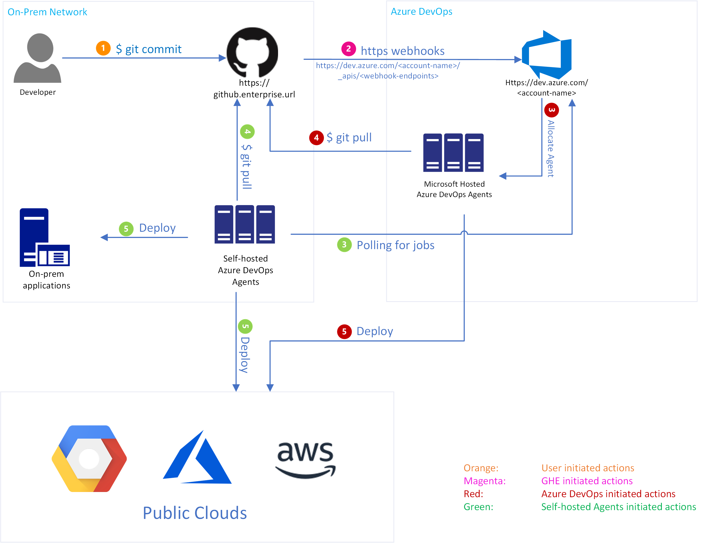
**FIGURE 1**

## Instruction

The GitHub Enterprise connection (for Azure Repo) is configured per Azure DevOps project. The following steps detail how I setup a YAML pipeline stored in the GHE instance in a lab environment:

1. In an Azure DevOps project, create a new pipeline and select **"GitHub Enterprise Server"**
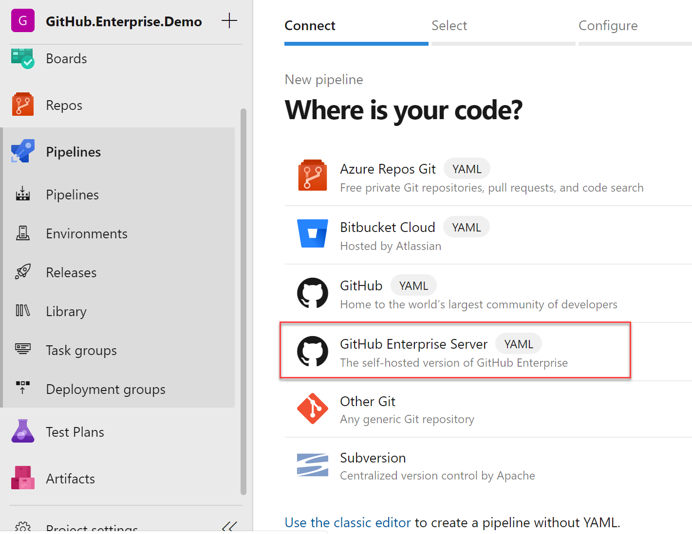
**FIGURE 2**

2. Connect to GitHub Enterprise Server
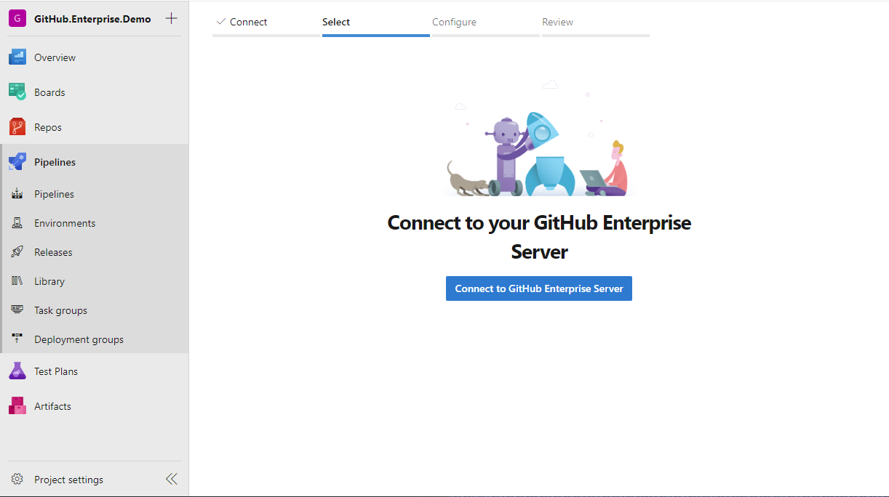
**FIGURE 3**

3. Connect to GitHub Server by providing the GHE server URL and your Personal Access Token (PAT)
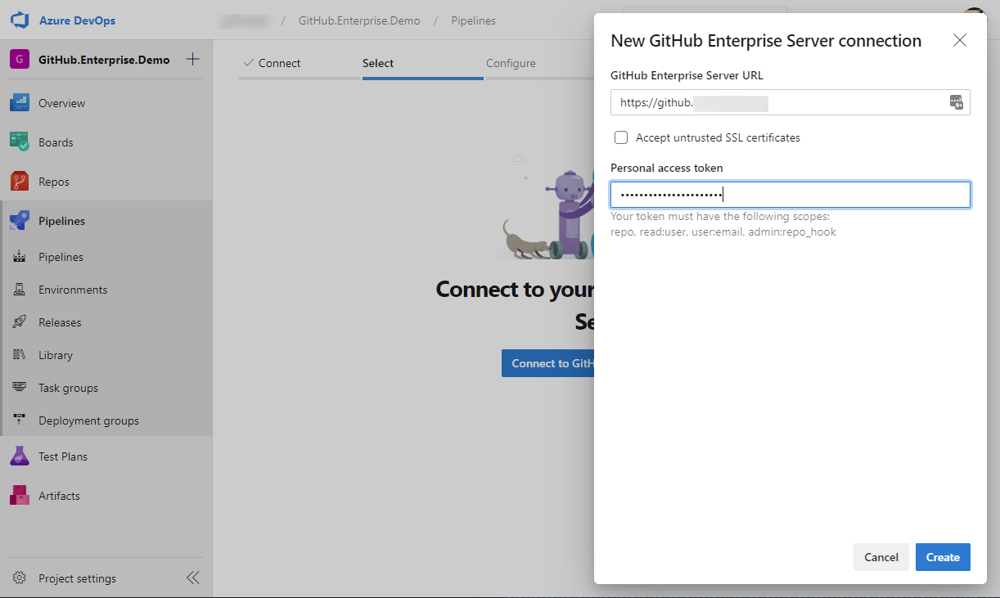
**FIGURE 4**

4. Select a GitHub project that you wish to connect to the Azure DevOps project:
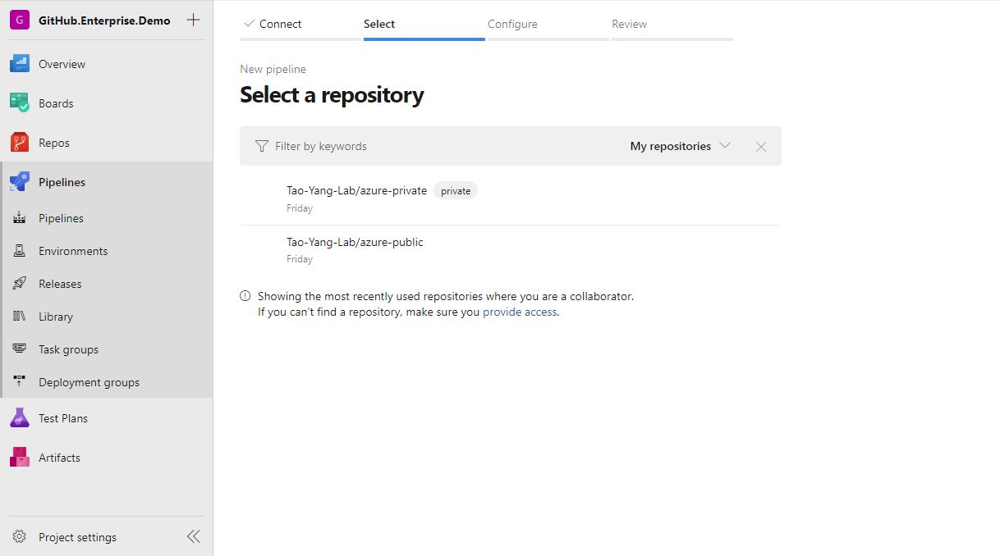
**FIGURE 5**

5. Azure DevOps will scan for the GitHub project and find Azure DevOps YAML pipelines located in the project. The default name for Azure DevOps YAML pipeline is called "*azure-pipelines.yml*". In this case, Azure DevOps automatically detected it on the root directory of the repo
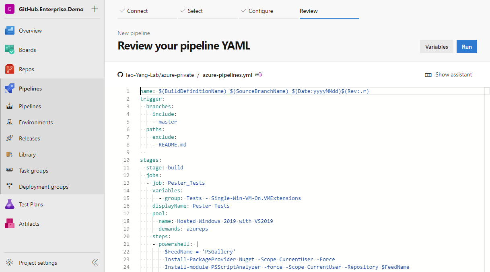
**FIGURE 6**

6. When the pipeline is executed, the Azure DevOps agent will clone the repo using HTTP
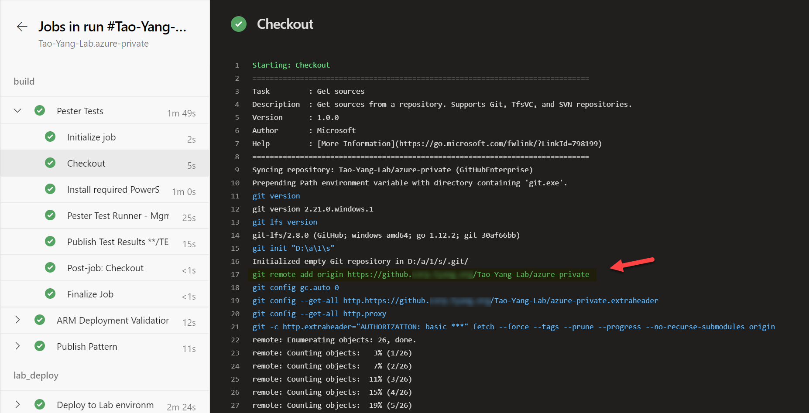
**FIGURE 7**

When the pipeline is imported from GHE, the following webhooks are automatically created in the GHE project targeting Azure DevOps APIs. These APIs requires authentication, the secrets are automatically populated

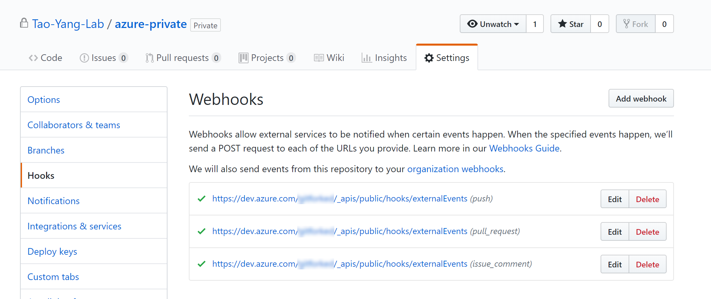
**FIGURE 8**

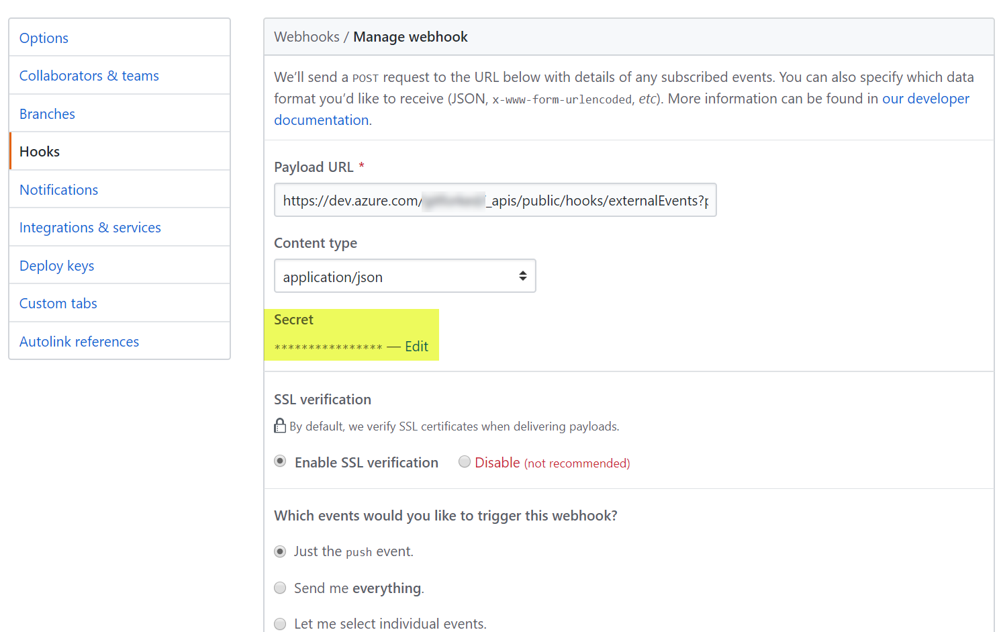
**FIGURE 9**

A Service Connection is also created in Azure DevOps for the GHE server
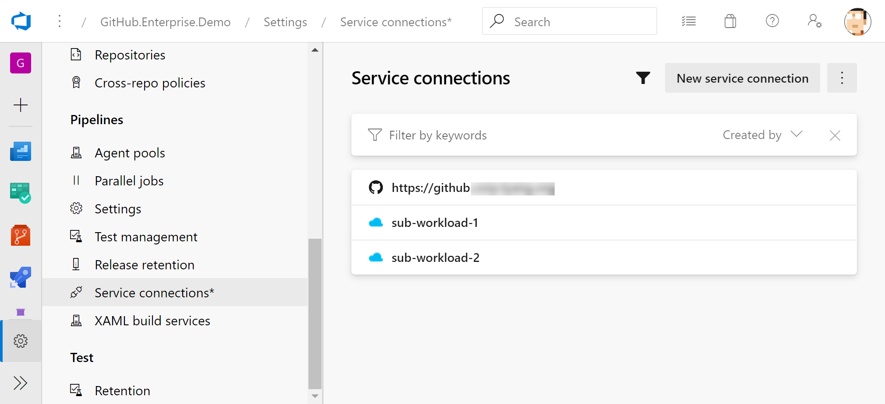
**FIGURE 10**

## Networking Considerations

In order to establish the connection described above, The GHE server URL must be resolvable by Azure DevOps, we must allow HTTPS inbound connection from Azure DevOps to the GHE server.

### DNS Name Resolution

* Azure DevOps must be able to resolve the GHE server URL from the Internet

* As shown in Figure 7, Azure DevOps agent uses the GHE server URL to clone the Git repo. The GHE server must also be resolvable by the Azure DevOps agent that's running the pipeline.

* When using on-prem self-hosted Azure DevOps agents, the GHE server URL used by Azure DevOps service connection must be resolvable and point to the GHE server. This requires both external DNS and internal DNS records point to the same endpoint. If the DNS record is not resolvable by the self-hosted agents, the pipeline execution will fail (as shown below):
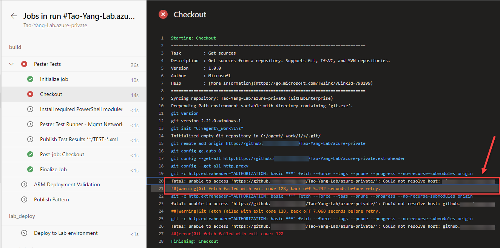
**FIGURE 11**

### Firewall Rules

* The Firewall requirements for Azure DevOps is documented at https://docs.microsoft.com/en-us/azure/devops/organizations/security/allow-list-ip-url?

* You can also find the Azure DevOps services IP addresses at https://docs.microsoft.com/en-us/azure/devops/migrate/migration-import?view=azuredevops#azure-devops-services-ips

## Conclusion

When using CI/CD pipelines in Azure DevOps, your source code does not have to be stored in Azure Repo. If your organisations have security requirements that dictates where the code should be stored, you should be aware of what are the native capabilities in Azure DevOps in terms of 3rd party repository support. WIf you are using another Git source control system and there is no native intergration with Azure DevOps, to use Azure Pipeline, you can always sync your on-prem repo to another supported Git provider, or even manually commit your code to multiple Git remote locations.
