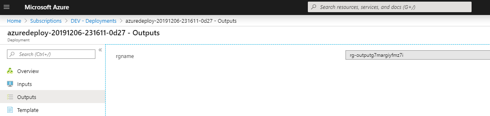

# Day 67 - Azure Resource Manager Outputs

*Today's post comes from guest contributor Alex Verkinderen [@AlexVerkinderen](https://twitter.com/alexverkinderen). Alexandre Verkinderen is an Azure MVP and a Cloud Architect with a strong focus on Devops, IaC and governance assisting large organizations on their Cloud journey. You can find Alex blogging at [mscloud.be](https://mscloud.be)*

In [Day 5 - getting to Know ARM and JSON](https://github.com/starkfell/100DaysOfIaC/blob/master/articles/day.5.getting.to.know.arm.and.json.md) and [Day 53 - Getting to know ARM and JSON(Part 2)](https://github.com/starkfell/100DaysOfIaC/blob/master/articles/day.53.arm.json.201.md) we covered most of the ARM template structure and functions. Have a read of those 2 installments if you haven't already.

In this article we will cover an often overlooked ARM capability: outputting values of deployed resources. We can use outputs in ARM templates for the following scenarios:

* When we want to pass parameters between templates
* Save the secrets like tokens and connection strings of deployed resources in Azure KeyVault
* Validate what we deployed was successfully created
* When we want to pass variables between tasks in our pipeline

Using outputs in your ARM template is optional. The deployment of your ARM template will not fail if you don't use it. However, even if you don't use outputs today we would still recommend, as a best practice, to include some outputs in your ARM template for future use.

In this installment we will deploy an ARM template that creates a new resource group, retrieve the output in our pipeline and use the resource group name to deploy a web application.

***
SPONSOR: Need to stop and start your development VMs on a schedule? The Azure Resource Scheduler let's you schedule up to 10 Azure VMs for FREE! Learn more [HERE](https://azuremarketplace.microsoft.com/en-us/marketplace/apps/lumagatena.resourcescheduler?tab=Overview)
***

### Adding output to your ARM template

To add an output to your ARM template simple add the following function at the end of your template (after the resource section):

``` JSON
  "outputs": {
    "KVName": {
      "type": "string",
      "value": "[variables('KVName')]"
    },
    "KVResourceID": {
      "type": "string",
      "value": "[resourceId('Microsoft.KeyVault/vaults', variables('KVName'))]"
    }
  }

```

This will output the name of the resource and the resourceID of the deployed resource. As a best practice we recommend outputting at least the name and resourceIDs. ResourceIDs are often used when working with linked templates for example to reference other resources.

## Create new resource group and output the resource group name

Let's start with a relatively simple example to create a new resource group through an ARM template and output the resource group name:

``` JSON
{
    "$schema": "https://schema.management.azure.com/schemas/2018-05-01/subscriptionDeploymentTemplate.json#",
    "contentVersion": "1.0.0.0",
    "parameters": {
        "guidValue": {
            "type": "string",
            "defaultValue": "[newGuid()]"
        },
        "rgPrefix": {
            "type": "string"
        },
        "rgLocation": {
            "type": "string"
        }
    },
    "variables": {
        "ResourceGroupName": "[take(concat(parameters('rgPrefix'), uniqueString(parameters('guidValue'))),24)]"
    },
    "resources": [
        {
            "type": "Microsoft.Resources/resourceGroups",
            "apiVersion": "2019-05-01",
            "location": "[parameters('rgLocation')]",
            "name": "[variables('ResourceGroupName')]",
            "properties": {
            }
        }
    ],
    "outputs": {
        "rgname": {
            "type": "string",
            "value": "[variables('ResourceGroupName')]"
        }
    }
}
```

If we would deploy the above template we would be able to see the output in the Azure Portal like this:



As you can see the ARM template is slightly different compared to other templates we discussed before. Typically, you deploy resources inside a resource group in your Azure subscription. The scope for this ARM template is on the subscription level and not on the resource group. We want to target the subscription as we need to create a new resource group. To be able to do this we need to change the schema inside our ARM template from   "https://schema.management.azure.com/schemas/2019-04-01/deploymentTemplate.json"  to "https://schema.management.azure.com/schemas/2018-05-01/subscriptionDeploymentTemplate.json#".

## Retrieve output in our pipeline

To be able to retrieve the output in our Pipeline we need to define the "DeploymentOutputs" in our Pipeline task. When we define the deploymentOutputs our pipeline will create a new pipeline variable containing the output of the ARM template. Create a new yaml Pipeline as described [here](https://github.com/starkfell/100DaysOfIaC/blob/master/articles/day.35.building.a.practical.yaml.pipeline.part.1.md#create-a-yaml-file-for-the-build-pipeline) based on the example below:

```yaml
# Deploy Resourcegroup against subscription

trigger:
- master

pool:
  vmImage: 'ubuntu-latest'

steps:
- task: AzureResourceManagerTemplateDeployment@3
  inputs:
    deploymentScope: 'Subscription'
    azureResourceManagerConnection: 'DEV'
    subscriptionId: ''
    location: 'Australia East'
    templateLocation: 'Linked artifact'
    csmFile: '000-ResourceGroup/azuredeploy.json'
    overrideParameters: '-rgPrefix "rg-output" -rgLocation "AustraliaEast"'
    deploymentMode: 'Incremental'
    deploymentOutputs: 'RGName'
```

We now have a new variable called $(RGName). However, the current AzureResourceManagerTemplateDeployment task in Azure Devops will save the output in JSON format like this:

```json
{"rgname":{"type":"String","value":"rg-outputgcon6ay7rcxgg"}}.
```

To be able to use the output in a following task we need to convert the JSON output to a string.

## Convert JSON output to string

The following PowerShell script will convert the generated output in a string and create a new pipeline variable that we can use in subsequent tasks:

```PowerShell
param (
    [Parameter(Mandatory=$true)]
    [string]
    $armOutputString = ''
)

Write-Output "Retrieved input: $armOutputString"
$armOutputObj = $armOutputString | convertfrom-json

$armOutputObj.PSObject.Properties | ForEach-Object {
    $type = ($_.value.type).ToLower()
    $keyname = "Output_"+$_.name
    $value = $_.value.value

    if ($type -eq "securestring") {
        Write-Output "##vso[task.setvariable variable=$keyname;issecret=true]$value"
        Write-Output "Added VSTS variable '$keyname' ('$type')"
    } elseif ($type -eq "string") {
        Write-Output "##vso[task.setvariable variable=$keyname]$value"
        Write-Output "Added VSTS variable '$keyname' ('$type') with value '$value'"
    }
     elseif ($type -eq "array") {
        Write-Output "##vso[task.setvariable variable=$keyname]$value"
        Write-Output "Added VSTS variable '$keyname' ('$type') with value '$value'"
    }
     else {
        Throw "Type '$type' is not supported for '$keyname'"
    }
}
```

Save this PowerSchell script as GetOutputs.ps1 and commit it to your repository.

## Building our Pipeline

Let's now put all the pieces together in a Pipeline:

1. Task1: Deploy ARM template to create a new resource group and output name
2. Task2: Convert JSON output to string
3. Task3: Use resource group to deploy a simple web app

In VS Code, edit the yaml file with what is shown below. Afterwards, save and commit your changes to the repository.

```yaml
# Deploy Resourcegroup against subscription

trigger:
- master

pool:
  vmImage: 'ubuntu-latest'

steps:
- task: AzureResourceManagerTemplateDeployment@3
  inputs:
    deploymentScope: 'Subscription'
    azureResourceManagerConnection: 'DEV'
    subscriptionId: ''
    location: 'Australia East'
    templateLocation: 'Linked artifact'
    csmFile: '000-ResourceGroup/azuredeploy.json'
    overrideParameters: '-rgPrefix "rg-output" -rgLocation "AustraliaEast"'
    deploymentMode: 'Incremental'
    deploymentOutputs: 'RGName'
- task: PowerShell@2
  inputs:
    filePath: 'GetOutputs.ps1'
    arguments: '-armOutputString ''$(RGName)'''
- task: AzureResourceManagerTemplateDeployment@3
  inputs:
    deploymentScope: 'Resource Group'
    azureResourceManagerConnection: 'DEV'
    subscriptionId: ''
    action: 'Create Or Update Resource Group'
    resourceGroupName: '$(Output_RGName)'
    location: 'Australia East'
    templateLocation: 'Linked artifact'
    csmFile: '101-Webapp-Basic-Windows/azuredeploy.json'
    overrideParameters: '-webAppName "webalex"'
    deploymentMode: 'Incremental'
```

## Conclusion

In this article we discussed how we can add outputs to our ARM template and use this output in our pipeline in subsequent tasks. You can find all Artifacts used in this article [here](../resources/day67)
