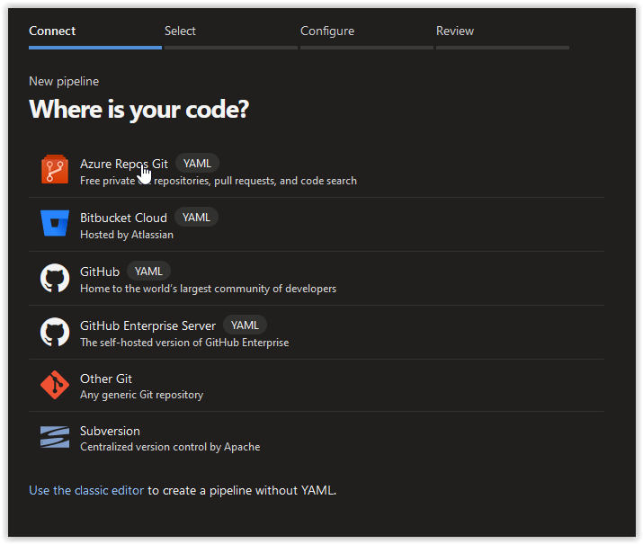
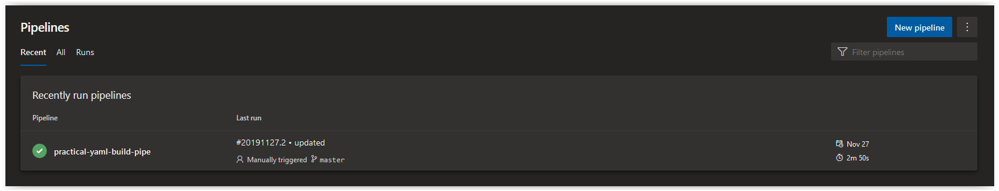
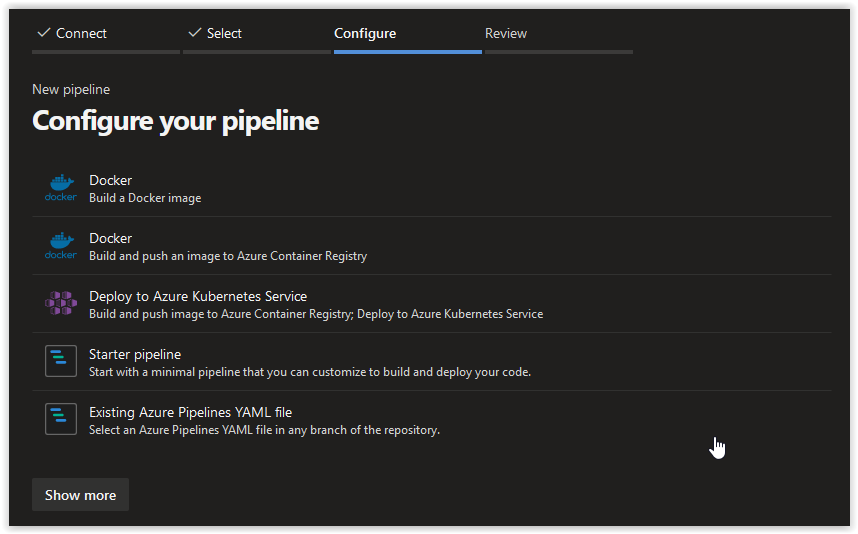
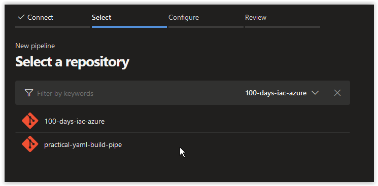
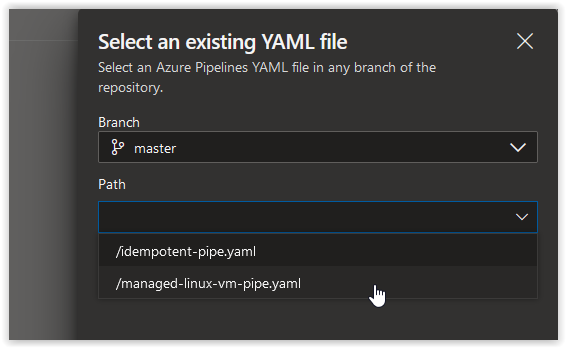
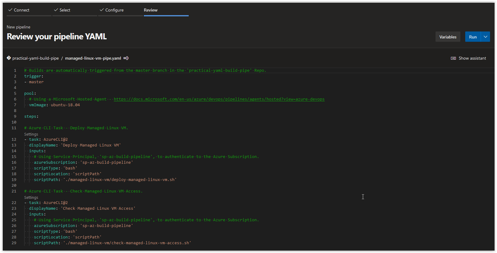
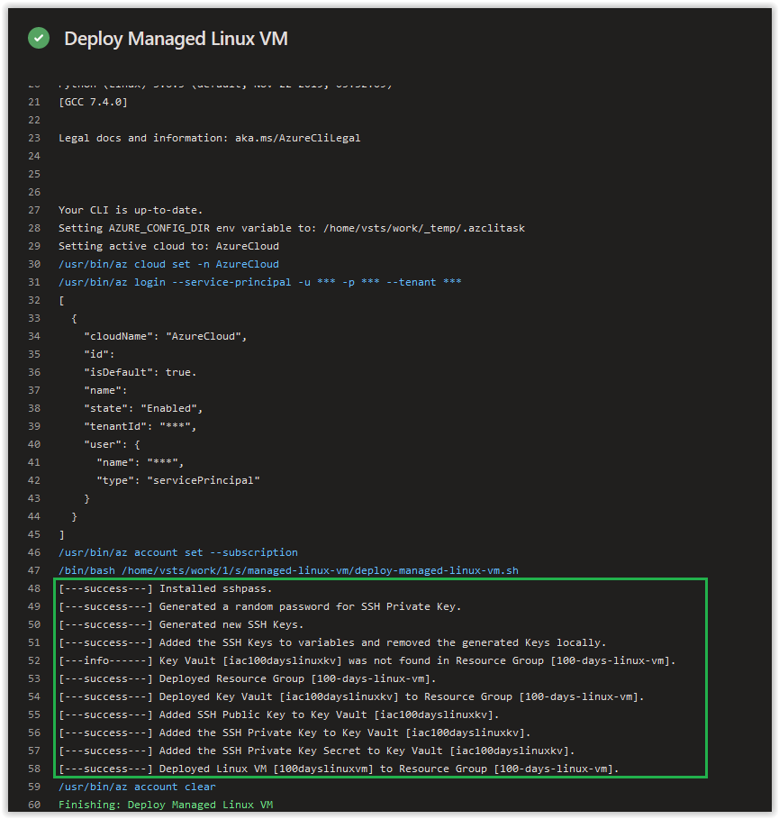
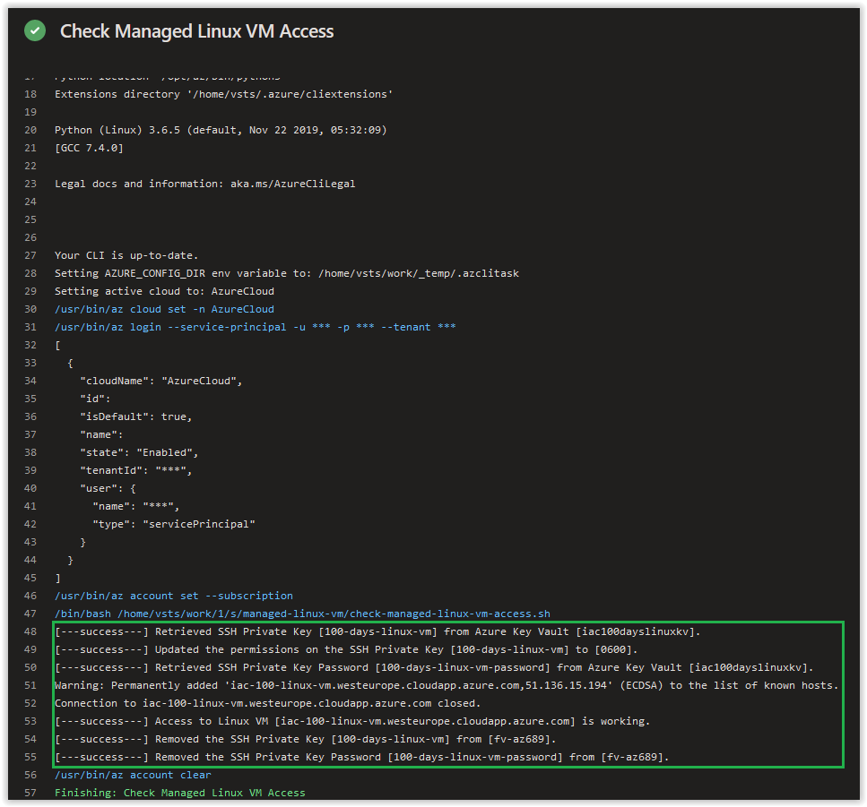

# Day 70 - Managing Access to Linux VMs using Azure Key Vault - Part 3

*This is the third in a series of posts about the options available to you to manage your Linux VMs in Azure using Azure Key Vault and how you can adapt this process in a YAML Pipeline. The other posts in this Series can be found below.*

***[Day 68 - Managing Access to Linux VMs using Azure Key Vault - Part 1](./day.68.manage.access.to.linux.vms.using.key.vault.part.1.md)***</br>
***[Day 69 - Managing Access to Linux VMs using Azure Key Vault - Part 2](./day.69.manage.access.to.linux.vms.using.key.vault.part.2.md)***</br>
***[Day 70 - Managing Access to Linux VMs using Azure Key Vault - Part 3](./day.70.manage.access.to.linux.vms.using.key.vault.part.3.md)***</br>

</br>

> **NOTE:** This article references the same resources and methods that was used in the Building a **[Practical YAML Pipelines Series](./day.35.building.a.practical.yaml.pipeline.part.1.md)**. If this is your first time working with YAML Pipelines in Azure DevOps, we recommend you start with **[Day 35](./day.35.building.a.practical.yaml.pipeline.part.1.md)** before continuing.

</br>

In today's article we will cover the following topics.

[Add new directory to the Repository](#add-new-directory-to-the-repository)</br>
[deploy-managed-linux-vm.sh Script](#deploy-managed-linux-vmsh-script)</br>
[check-managed-linux-vm-access.sh Script](#check-managed-linux-vm-accesssh-script)</br>
[managed-linux-vm-pipe.yaml file](#managed-linux-vm-pipeyaml-file)</br>
[Create a new Build Pipeline in Azure DevOps](#create-a-new-build-pipeline-in-azure-devops)</br>
[Check Build Pipeline Job Output](#check-build-pipeline-job-output)</br>
[Things to Consider](#things-to-consider)</br>
[Conclusion](#conclusion)</br>

## Add new directory to the Repository

Open up the **practical-yaml-build-pipe** repository in VS Code and create the following folder in the root of the repository.

```bash
managed-linux-vm
```

## deploy-managed-linux-vm.sh Script

Open up VS Code, create a new file called **deploy-managed-linux-vm.sh** in the **managed-linux-vm** directory. Copy and paste the contents below into it and save and commit it to the repository.

```bash
#!/bin/bash

# Author:      Ryan Irujo
# Name:        deploy-managed-linux-vm.sh
# Description: Generates a set of SSH Keys and Password and then deploys a new Resource Group and Azure Key Vault and then adds the
#              SSH Keys and Password to it. Lastly, it deploys a Linux VM using the generated SSH Keys.

# Installing sshpass
INSTALL_SSH_PASS=$(sudo apt-get install -y sshpass)

if [ $? -eq 0 ]; then
    echo "[---success---] Installed sshpass."
else
    echo "[---fail------] Failed to install sshpass."
    echo $INSTALL_SSH_PASS
    exit 2
fi

# Generating a new Password for the SSH Private Key.
SSH_KEY_PASSWORD=$(openssl rand -base64 20)

if [ $? -eq 0 ]; then
    echo "[---success---] Generated a random password for SSH Private Key."
else
    echo "[---fail------] Failed to generate a random password for SSH Private Key."
    echo $SSH_KEY_PASSWORD
    exit 2
fi

# Generating new SSH Keys.
GENERATE_NEW_SSH_KEYS=$(ssh-keygen \
-t rsa \
-b 4096 \
-C "100-days-linux-vm" \
-f ~/.ssh/100-days-linux-vm \
-N "$SSH_KEY_PASSWORD")

if [ $? -eq 0 ]; then
    echo "[---success---] Generated new SSH Keys."
else
    echo "[---fail------] Failed to generate new SSH Keys."
    echo $GENERATE_NEW_SSH_KEYS
    exit 2
fi

# Adding the SSH Keys to variables and removing the generated Keys locally.
SSH_PUBLIC_KEY=$(cat ~/.ssh/100-days-linux-vm.pub) && \
SSH_PRIVATE_KEY=$(cat ~/.ssh/100-days-linux-vm) && \
rm -rf ~/.ssh/100-days-linux-vm*

if [ $? -eq 0 ]; then
    echo "[---success---] Added the SSH Keys to variables and removed the generated Keys locally."
else
    echo "[---fail------] Failed to add the SSH Keys to variables and remove the generated Keys locally."
    exit 2
fi

# Checking to see if the Azure Key Vault already exists.
CHECK_AZURE_KV=$(az keyvault show \
--name "iac100dayslinuxkv" \
--resource-group "100-days-linux-vm" \
--query properties.provisioningState \
--output tsv 2>&1)

if [[ "$CHECK_AZURE_KV" == "Succeeded" ]]; then
    echo "[---success---] Key Vault [iac100dayslinuxkv] found in Resource Group [100-days-linux-vm]."
elif [[ "$CHECK_AZURE_KV" == *"not found"* ]]; then
    echo "[---info------] Key Vault [iac100dayslinuxkv] was not found in Resource Group [100-days-linux-vm]."

    # Creating a new Resource Group.
    CREATE_RESOURCE_GROUP=$(az group create \
    --name "100-days-linux-vm" \
    --location "westeurope" \
    --output none)

    if [ $? -eq 0 ]; then
        echo "[---success---] Deployed Resource Group [100-days-linux-vm]."
    else
        echo "[---fail------] Failed to deploy Resource Group [100-days-linux-vm]."
        echo $CREATE_RESOURCE_GROUP
        exit 2
    fi

    # Creating a new Azure Key Vault.
    CREATE_AZURE_KV=$(az keyvault create \
    --name "iac100dayslinuxkv" \
    --resource-group "100-days-linux-vm" \
    --output none)

    if [ $? -eq 0 ]; then
        echo "[---success---] Deployed Key Vault [iac100dayslinuxkv] to Resource Group [100-days-linux-vm]."
    else
        echo "[---fail------] Failed to deploy Key Vault [iac100dayslinuxkv] to Resource Group [100-days-linux-vm]."
        echo $CREATE_AZURE_KV
        exit 2
    fi

    # Adding the SSH Public Key to the Azure Key Vault.
    ADD_PUB_KEY_TO_KV=$(az keyvault secret set \
    --name "100-days-linux-vm-pub" \
    --vault-name "iac100dayslinuxkv" \
    --value "$SSH_PUBLIC_KEY")

    if [ $? -eq 0 ]; then
        echo "[---success---] Added SSH Public Key to Key Vault [iac100dayslinuxkv]."
    else
        echo "[---fail------] Failed to add SSH Public Key to Key Vault [iac100dayslinuxkv]."
        echo $ADD_PUB_KEY_TO_KV
        exit 2
    fi

    # Adding the SSH Prviate Key to the Azure Key Vault.
    ADD_KEY_TO_KV=$(az keyvault secret set \
    --name "100-days-linux-vm" \
    --vault-name "iac100dayslinuxkv" \
    --value "$SSH_PRIVATE_KEY")

    if [ $? -eq 0 ]; then
        echo "[---success---] Added the SSH Private Key to Key Vault [iac100dayslinuxkv]."
    else
        echo "[---fail------] Failed to add SSH Private Key to Key Vault [iac100dayslinuxkv]."
        echo $ADD_KEY_TO_KV
        exit 2
    fi

    # Adding the SSH Private Key Secret to the Azure Key Vault.
    ADD_KEY_SECRET_TO_KV=$(az keyvault secret set \
    --name "100-days-linux-vm-password" \
    --vault-name "iac100dayslinuxkv" \
    --value "$SSH_KEY_PASSWORD")

    if [ $? -eq 0 ]; then
        echo "[---success---] Added the SSH Private Key Secret to Key Vault [iac100dayslinuxkv]."
    else
        echo "[---fail------] Failed to add SSH Private Key Secret to Key Vault [iac100dayslinuxkv]."
        echo $ADD_KEY_SECRET_TO_KV
        exit 2
    fi

    # Deploying Linux VM using the Public Key Generated Earlier.
    DEPLOY_LINUX_VM=$(az vm create \
    --resource-group "100-days-linux-vm" \
    --name "100dayslinuxvm" \
    --image UbuntuLTS \
    --public-ip-address-allocation dynamic \
    --public-ip-address-dns-name "iac-100-linux-vm" \
    --admin-username "lxvmadmin" \
    --ssh-key-values "$SSH_PUBLIC_KEY")

    if [ $? -eq 0 ]; then
        echo "[---success---] Deployed Linux VM [100dayslinuxvm] to Resource Group [100-days-linux-vm]."
    else
        echo "[---fail------] Failed to deploy Linux VM [100dayslinuxvm] to Resource Group [100-days-linux-vm]."
        echo $DEPLOY_LINUX_VM
        exit 2
    fi
else
    echo "[---fail------] There was a problem checking Key Vault [iac100dayslinuxkv]."
    echo $CHECK_AZURE_KV
    exit 2
fi
```

</br>

## check-managed-linux-vm-access.sh Script

Open up VS Code, create a new file called **check-managed-linux-vm-access.sh** in the **managed-linux-vm** directory. Copy and paste the contents below into it and save and commit it to the repository.

```bash
#!/bin/bash

# Author:      Ryan Irujo
# Name:        check-managed-linux-vm-access.sh
# Description: Verifies that the existing Credentials in Azure Key Vault can be used to manage the Linux VM.

# Retrievinv the SSH Private Key from Azure Key Vault.
SSH_PRIVATE_KEY=$(/usr/bin/az keyvault secret download \
--name "100-days-linux-vm" \
--vault-name "iac100dayslinuxkv" \
--file "/tmp/100-days-linux-vm" \
--output tsv 2>&1)

if [ $? -eq 0 ]; then
    echo "[---success---] Retrieved SSH Private Key [100-days-linux-vm] from Azure Key Vault [iac100dayslinuxkv]."
else
    echo "[---fail------] Failed to retrieve SSH Private Key [100-days-linux-vm] from Azure Key Vault [iac100dayslinuxkv]."
    echo $SSH_PRIVATE_KEY
    exit 2
fi

# Updating the Permissions on the SSH Private Key.
chmod 0600 "/tmp/100-days-linux-vm"

if [ $? -eq 0 ]; then
    echo "[---success---] Updated the permissions on the SSH Private Key [100-days-linux-vm] to [0600]."
else
    echo "[---fail------] Failed to update the permissions on the SSH Private Key [100-days-linux-vm] to [0600]."
    echo $SSH_PRIVATE_KEY
    exit 2
fi

# Retrieving the SSH Private Key Password from Azure Key Vault.
export SSHPASS=$(/usr/bin/az keyvault secret show \
--name "100-days-linux-vm-password" \
--vault-name "iac100dayslinuxkv" \
--query value \
--output tsv 2>&1)

if [ $? -eq 0 ]; then
    echo "[---success---] Retrieved SSH Private Key Password [100-days-linux-vm-password] from Azure Key Vault [iac100dayslinuxkv]."
else
    echo "[---fail------] Failed to retrieve SSH Private Key Password [100-days-linux-vm-password] from Azure Key Vault [iac100dayslinuxkv]."
    echo $SSHPASS
    exit 2
fi

# Checking Access to the Linux VM.
CHECK_REMOTE_ACCESS=$(sshpass \
-P "pass" \
-e \
ssh \
-o "StrictHostKeyChecking=no" \
-o "UserKnownHostsFile=/dev/null" \
-i "/tmp/100-days-linux-vm" \
-tt lxvmadmin@iac-100-linux-vm.westeurope.cloudapp.azure.com \
echo "remote access is working")

if [ $? -eq 0 ]; then
    echo "[---success---] Access to Linux VM [iac-100-linux-vm.westeurope.cloudapp.azure.com] is working."
else
    echo "[---fail------] Access to Linux VM [iac-100-linux-vm.westeurope.cloudapp.azure.com] is not working."
    echo $CHECK_REMOTE_ACCESS
    exit 2
fi

# Deleting the Private Key from the Agent.
REMOVE_PRIVATE_KEY=$(rm -f "/tmp/100-days-linux-vm")

if [ $? -eq 0 ]; then
    echo "[---success---] Removed the SSH Private Key [100-days-linux-vm] from [$HOSTNAME]."
else
    echo "[---fail------] Failed to remove the SSH Private Key [100-days-linux-vm] from [$HOSTNAME]."
    echo $REMOVE_PRIVATE_KEY
    exit 2
fi

# Deleting the SSH Private Key Password from the Agent.
export SSHPASS=""

if [ $? -eq 0 ]; then
    echo "[---success---] Removed the SSH Private Key Password [100-days-linux-vm-password] from [$HOSTNAME]."
else
    echo "[---fail------] Failed to remove the SSH Private Key Password [100-days-linux-vm-password] from [$HOSTNAME]."
    exit 2
fi
```

</br>

## managed-linux-vm-pipe.yaml file

Next, in VS Code, in the root of the repository, create a new file called **managed-linux-vm-pipe.yaml** and copy the contents below into it. Afterwards, save and commit your changes to the repository.

```yaml
# Builds are automatically triggered from the master branch in the 'practical-yaml-build-pipe' Repo.
trigger:
- master

pool:
  # Using a Microsoft Hosted Agent - https://docs.microsoft.com/en-us/azure/devops/pipelines/agents/hosted?view=azure-devops
  vmImage: ubuntu-18.04

steps:

# Azure CLI Task - Deploy Managed Linux VM.
- task: AzureCLI@2
  displayName: 'Deploy Managed Linux VM'
  inputs:
    # Using Service Principal, 'sp-az-build-pipeline', to authenticate to the Azure Subscription.
    azureSubscription: 'sp-az-build-pipeline'
    scriptType: 'bash'
    scriptLocation: 'scriptPath'
    scriptPath: './managed-linux-vm/deploy-managed-linux-vm.sh'

# Azure CLI Task - Check Managed Linux VM Access.
- task: AzureCLI@2
  displayName: 'Check Managed Linux VM Access'
  inputs:
    # Using Service Principal, 'sp-az-build-pipeline', to authenticate to the Azure Subscription.
    azureSubscription: 'sp-az-build-pipeline'
    scriptType: 'bash'
    scriptLocation: 'scriptPath'
    scriptPath: './managed-linux-vm/check-managed-linux-vm-access.sh'
```

</br>

## Create a new Build Pipeline in Azure DevOps

In your Azure DevOps environment, select Pipelines and then click on the **New Pipeline** button in the top right hand corner.



</br>

Next, click on **Azure Repos Git**.



</br>

Next, click on the **practical-yaml-build-pipeline** repository.



</br>

Next, click on **Existing Azure Pipelines YAML file**.



</br>

Next, select **managed-linux-vm-pipe.yaml** under the **Path** drop-down menu and then click **Continue**.



</br>

Finally, click on **Run**.



</br>

## Check Build Pipeline Job Output

> **NOTE:** If you already have a Build Pipeline called **practical-yaml-build-pipe**, the new Pipe line you created will be called **practical-yaml-build-pipe (1)**. You can rename the Build Pipeline if you so desire.

Review the logs of the **Deploy Managed Linux VM** job in the **practical-yaml-build-pipe (1)**.



</br>

Next, Review the logs of the **Check Managed Linux VM Access** job in the **practical-yaml-build-pipe (1)**.



</br>

## Things to Consider

You'll notice that the scripts here are relatively idempotent; however, there are definitely improvements that can be made.

</br>

## Conclusion

In today's article in we built a YAML Pipeline out of the contents from [Day 68](./day.68.manage.access.to.linux.vms.using.key.vault.part.1.md) and [ Day 69](./day.69.manage.access.to.linux.vms.using.key.vault.part.2.md) and then deployed a managed Linux VM. If there's a specific scenario that you wish to be covered in future articles, please create a **[New Issue](https://github.com/starkfell/100DaysOfIaC/issues)** in the [starkfell/100DaysOfIaC](https://github.com/starkfell/100DaysOfIaC/) GitHub repository.
