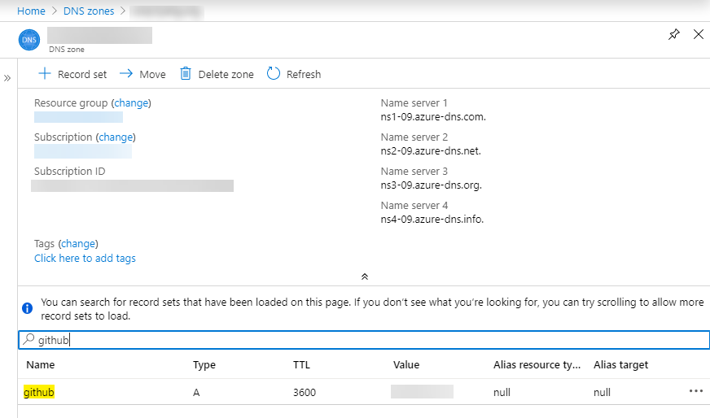
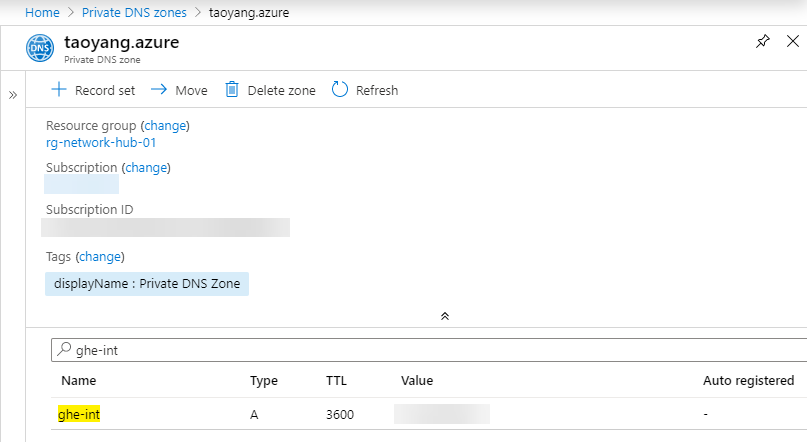
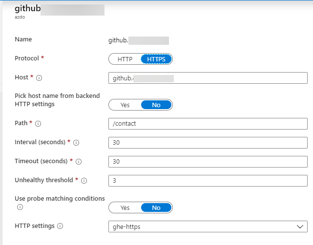
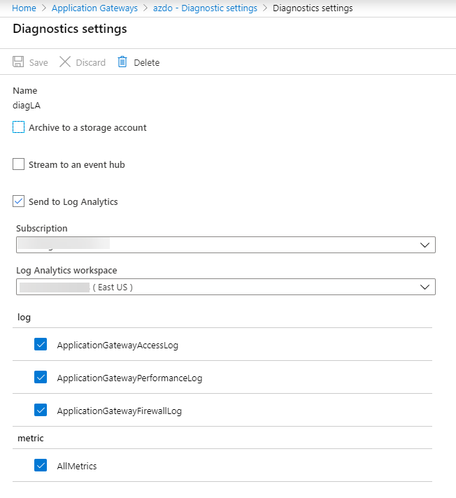
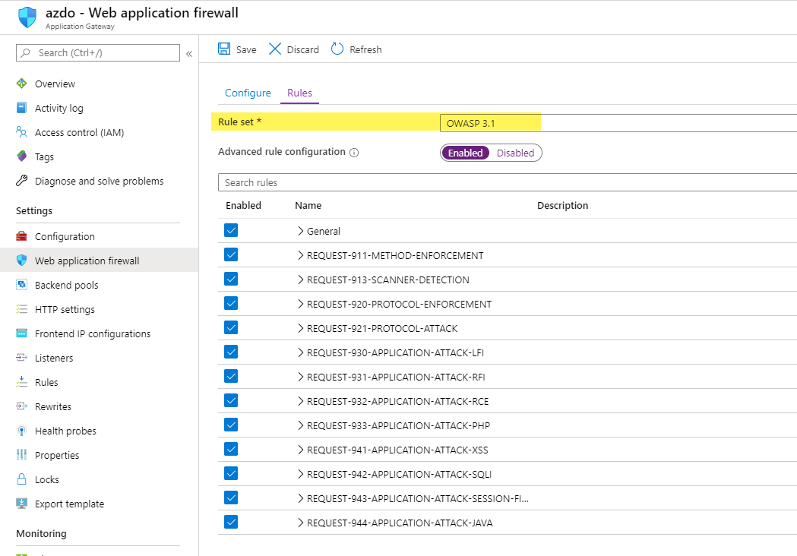
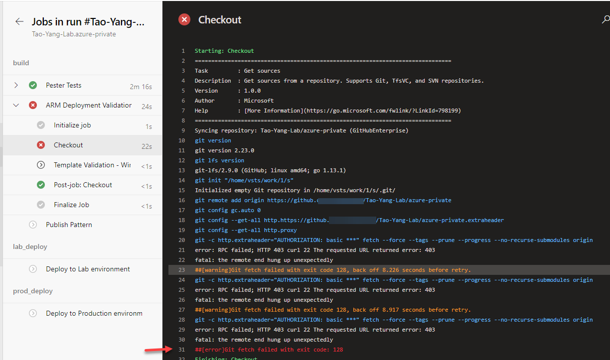

# Day 75 - Securing GitHub Enterprise Connection in Azure DevOps

*Today's post comes from guest contributor Tao Yang [@MrTaoYang](https://twitter.com/mrtaoyang). Tao is a Microsoft MVP who from 9-to-5 focuses on DevOps and governance in Azure for enterprise customers. You can find Tao blogging at [Managing Cloud and Datacenter by Tao Yang](https://blog.tyang.org/).*

In [day 65](./day.65.integrating.ghe.with.azure.pipelines.md), we discussed how to connect GitHub Enterprise server (GHE) to Azure Pipelines. Although the connection is established via HTTPS and Azure DevOps must authenticate to GitHub Enterprise server, it in fact is an inbound connection to your on-prem network. You may find it would be hard to get this pattern approved by your network security team.

## Overview

When connecting Azure DevOps to GitHub Enterprise server, it is possible to place the GHE server behind a Web Application Firewall (WAF), so any inbound connections to your GHE server will go through the WAF.

Since Azure Application Gateway can be configured as a WAF, in this post, I will demonstrate how to use Azure Application Gateway to secure the connection between Azure DevOps and your GHE server.

In this demo, I have used the following Azure services:

* Azure Application Gateway
* Azure DNZ Zone
* Azure Private DNZ Zone

## Configuration

### DNS Name Resolution

>**NOTE:** In this post, let's assume the FQDN for my GHE server is **https://github.xyz.com** so I don't have to unveil the real public DNS name to my GitHub Enterprise server.

#### Public DNS Record

One of the key requirements is the FQDN for the GitHub Enterprise server can be resolved from both internal network and the Internet. Since I own the public domain name used by my on-prem network (i.e. xyz.com), I simply made the DNS name of my GHE server available in the public DNS zone. I am using Azure DNZ Zone service to host this zone (xyz.com). This is by choice, you can use your existing public DNS servers, as long as your GHE FQDN is publicly resolvable. The IP address for github.xyz.com is pointing to the Azure Application Gateway frontend public IP.

#### Private DNS Record

I have also created an Azure Private DNS zone (i.e. taoyang.azure), and created an HOST record ***ghe-int.taoyang.azure*** pointing to the real public IP address of my GHE server. This DNS record is only resolvable from the Azure Virtual Networks that are linked to this Private DNS zone. I made sure it's linked to the VNet used by the App Gateway.

>**NOTE:** Although this is not mandatory, I thought it is a good idea to use a private DNS record for the backend target, since I already have an existing private DNS zone available. Moving forward, any updates to the GHE server IP can be performed on the private DNS zone without having to update the App Gateway. Updating an App Gateway configuration can be very time consuming.

### Azure Application Gateway Configuration

The Azure App Gateway configuration is detailed as below:

* **Tier** - WAF V2
* **WAF Firewall mode** - Prevention
* **WAF Rules** - OWASP 3.1
* **Frontend IP Configuration** - use a static public IP
* **Frontend listener**:
    * **Port** - 443
    * **Certificate** - upload the cert used by GHE server
* **Backend**:

    * **Target** - ghe-int.taoyang.azure (private dns record)

* **HTTP Settings**:

    * **Protocol** - HTTPS
    * **Port** - 443
    * **Certificate** - Use Well known CA Certificate

* **Health Probe** - I'm using the GHE site contact page (https://github.xyz.com/contact) as probe target (as shown below)

Optionally, I have also enabled diagnostic settings in the App Gateway and configured all the logs and metrics to be forwarded to an Azure Log Analytics workspace, so I can create ~~dashboards~~ workbooks and alerts in Azure Monitor if I want to.

>**NOTE:** My GHE server is using a SSL certificated issued by a public CA (Digicert), I am using the same cert in the frontend listener of the App Gateway.

## Things To Consider

Although the App Gateway and DNS zone configurations are very straight forward, based on my testing, there are few things you need to pay attention to:

**1. Consistent FQDN for the GHE server**

You must make sure the **SAME** FQDN is used internally by GHE server and externally by the WAF. When Azure DevOps starts a build, it passes the public FQDN (i.e. https://github.xyz.com) to the build agent so the agent can clone the Git repo. If you are using Self-hosted agents located in the same network as your GHE server, the address (https://github.xyz.com) **MUST** be resolvable by the self-hosted agent. If your GHE server address is something like https://github.xyz.internal from your internal network, the pipeline execution will fail if it runs on self-hosted agents.

**2. Fine-tune the WAF rules**

In my test environment, I have selected a pre-configured WAF firewall rule set (as shown below).

This pre-configured rule set actually blocks Microsoft-Hosted agents from git cloning the repo hosted on the GHE server (as shown below)

Since one of requirements from my customer is having the ability to prevent Microsoft-hosted agents from cloning the repo, this satisfies this requirement. Therefore I didn't spend too much time digging into which of these rules is actually responsible for this behaviour. I can proof this error is caused by WAF - if I switch the WAF mode from **Prevention** to **Detection**, the error went away and MS-hosted agents were able to clone the git repo.

>**NOTE:** If you have configured the App Gateway to forward diagnostic logs to Log Analytics, you maybe able to investigate further since the firewall logs are stored in Log Analytics. - This is beyond the scope of this post.

## Conclusion

In this post, I have demonstrated how to secure the Azure DevOps to GitHub Enterprise server connection using a Web Application Firewall (in this case, Azure Application Gateway). The WAF can be configured more granularly according to your requirements. For example, you can write a custom rule to only allow [IP addresses used by Azure DevOps](https://docs.microsoft.com/en-us/azure/devops/migrate/migration-import?view=azure-devops&viewFallbackFrom=azuredevops#azure-devops-services-ips&WT.mc_id=DOP-MVP-5000997) from the region of your Azure DevOps instance, or only allow [IPs from certain countries](https://docs.microsoft.com/en-us/azure/web-application-firewall/ag/create-custom-waf-rules?WT.mc_id=DOP-MVP-5000997). 