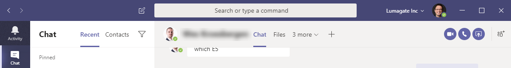
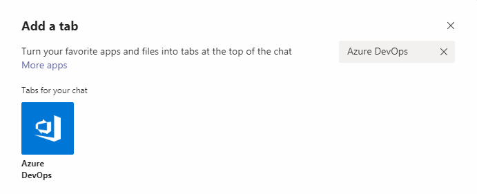
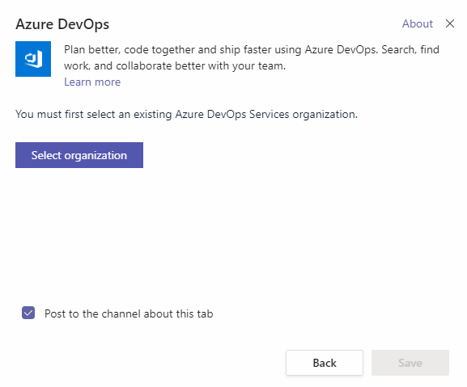
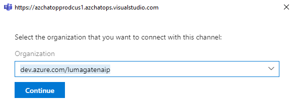
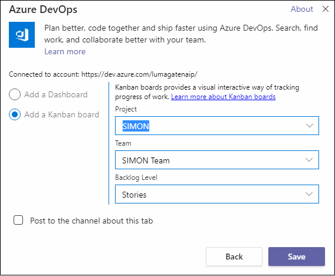
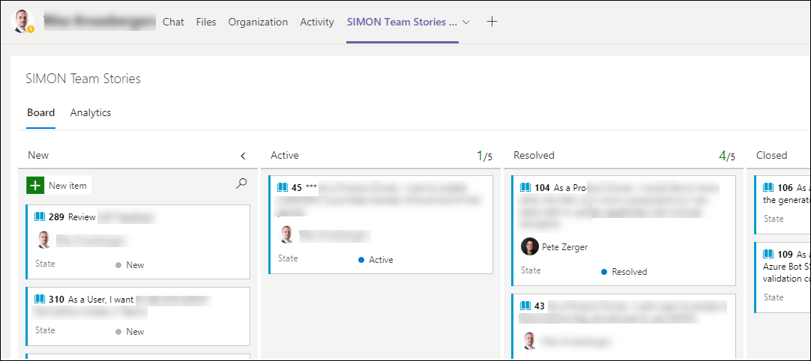

# Day 78 - Azure DevOps Integration with Microsoft Teams - Part 1

Working in a company that is 100% cloud-focused, it's easy to wind up with too many portals to deal with, sucking time away from actual work. This is one reason I love Microsoft Teams, because it offers so many opportunities to integrate your tools and services into the Teams client where I am already spending time.

Teams allows us to add tabs to a channel, private chat, or group chat to integrate our cloud services. This way, we can keep the services we work with most close at hand in the client where we're already collaborating. 

Teams gives us multiple integration options with Azure DevOps, but today I am going to show you one of those I use frequently - *development backlogs* from Azure Boards. In fact, I have multiple tabs with backlogs for different products and projects. In case you're not familiar, Azure DevOps includes a component called [Azure Boards](https://azure.microsoft.com/en-us/services/devops/boards/), where you can create Kanban style boards, with cards containing our features, and Agile stories.

If you're an Agile development shop using Trello or other Kanban tool today, I strongly recommend you take a look at Azure Boards. Since it's purpose-built for software development activities and integrates with other Azure DevOps features (and Teams!), it's a net add for productivity.

Let's take a look at the configuration, step-by-step.

## Adding your backlog to a Tab in Teams

1. In the Teams client, I will pick 1-1 chat, group chat, or Team where I want to add tab containing my backlog.
2. Then, click the plus(+) sign, shown in Figure 1.

**Figure 1**. Adding a tab to a Teams channel (+)

3. Then, I will browse to the **Azure DevOps** icon in the list, or simple search for 'Azure DevOps', as shown in Figure 2.

**Figure 2**. Search for 'Azure DevOps'

4. Next, click the **Select organization** button, and authenticate with your Azure Active Directory (AAD) account. Then, select the development organization that contains the backload (in Azure Boards) you want to show on this tab.

**Figure 3**. Select organization button

5. In the dropdown shown in Figure 4, select your org and click **Continue**.

**Figure 4**. Select your organization dropdown

Now, we'll configure how we want our board to appear.

6. Select 'Add a Kanban board' radio button, shown in Figure 5.
7. Then, configure the dropdowns in Figure 5 as follows:
   - **Project** - <your project name> - SIMON, in my case
   - **Team** - <name of Team to associate> - In my case, the 'SIMON Team' is the one where SIMON developers will chat.
   - **Backlog level** - Stories (the primary items we're working with every day) is what I choose. You could also pick *Features* here if you wanted to surface your backup in Teams from that perspective.

**Figure 5**. Dashboard settings

At this point, you should see your board (backlog) in the tab you added in the Teams client, as shown in Figure 6! (excuse the blur effect, as I have obscured sensitive info in this image)

**Figure 5**. Dashboard settings

## Conclusion and Next Steps

If you haven't tried Azure boards or explored Teams integration, you should definitely give this a try. In future installments, we'll look at some other integration options between Azure DevOps and Teams to improve productivity, collaboration, and user experience of your development team!

Have a topic you'd like us to cover that you haven't seen yet? Open an issue on the 100 Days repo and we'll do our best!