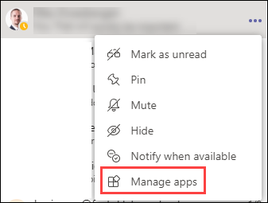
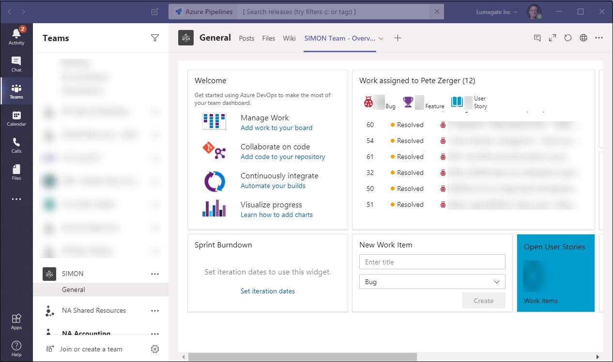
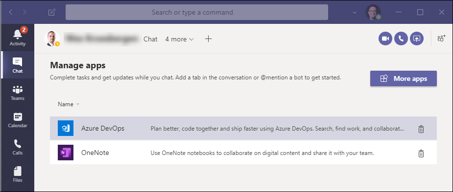
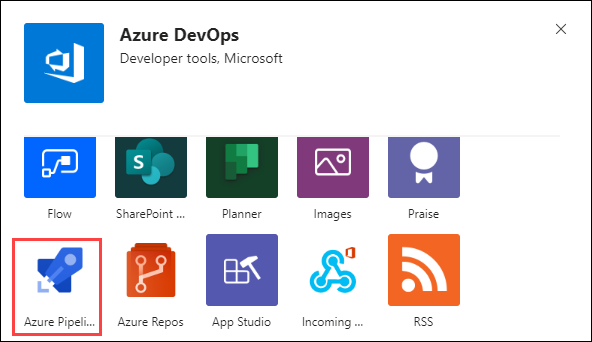
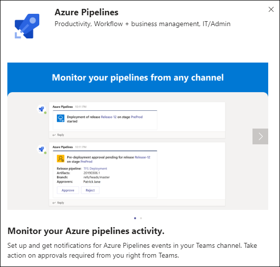
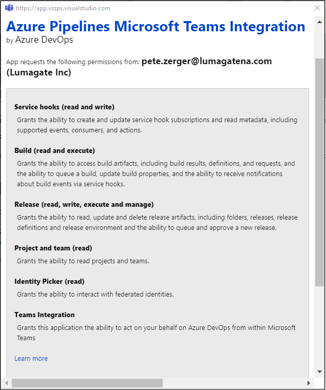
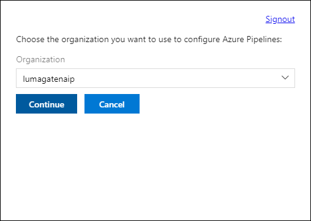
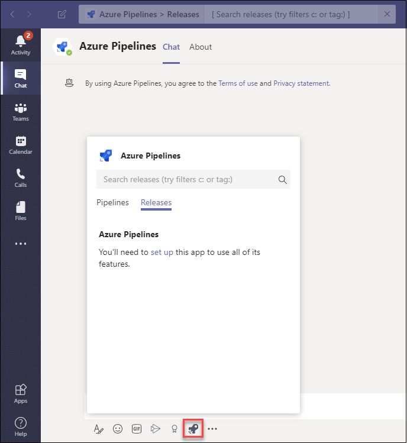
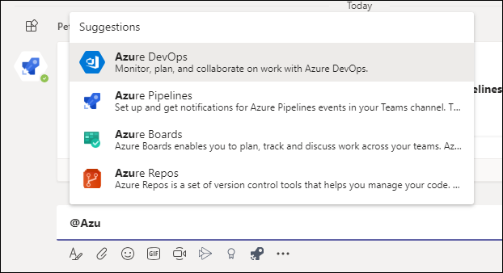
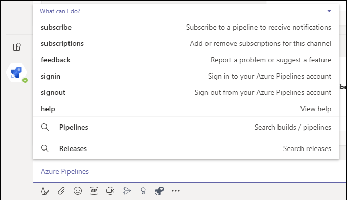

# Day 79 - Azure DevOps Integration with Microsoft Teams - Part 2

In Day 78, we discussed Azure DevOps integration with Microsoft Teams, adding a tab to display backlogs in Azure Boards. But yesterday, we only scratched the surface, as integration between Teams and any of the components within Azure DevOps is possible. Today, in the second installment of a 3-part mini-series, we are going to continue exploration of Azure DevOps integration with Teams.

Previous installments:
[Day 78 - Azure DevOps Integration with Microsoft Teams - Part 1](https://github.com/starkfell/100DaysOfIaC/blob/master/articles/day.78.AZDO-Teams-Integrate.md)

By clicking the ellipsis (...) by the team, shown in Figure 1...

**Figure 1**. Manage Apps link in Teams

and then selecting apps, I added another Tab with a view of this dashboard of my work in a particular project within Azure Devops.

**Figure 2**. Azure DevOps Project Dashboard (Teams tab)

I'll select Azure DevOps from the list of apps added to Teams, which includes App DevOps, I added yesterday in Day 78.

**Figure 3**. Select organization in Azure DevOps

Using the ellipsis again, I'll add a new Azure DevOps component - Azure Pipelines! 

**Figure 4**. App selection dialog

You'll get a splash screen with a description of some of Azure Pipelines features available in Teams. I'll show you how to get the detailed info from the Teams chat interface near the end of this installment.

**Figure 5**. Azure Pipelines integration screen

Next, you'll get the consent dialog, granting consent for Azure Pipelines / Teams integration. The list of permissions in the consent dialog gives you more insight, but this isn't what I am talking about.

**Figure 6**. Consent dialog for Azure Pipelines integration with Teams

Then, we'll pick the Organization and Project we want to target in Azure Pipelines.

**Figure 7**. Select organization for Azure Pipelines integration

Clicking the Azure Pipelines icon below the chat interface.

**Figure 8**. Search releases in Azure Pipelines from Teams

From the search box at the top of the Teams client, you'll see I can also query release info from Azure Pipelines.

**Figure 9**. Release search from Teams

If I type @Azure, Teams shows me the full list of bot integrations I can use to enable Azure DevOps notifications, workflow, and management capabilities, directly from Teams. Notice you see Azure DevOps, Boards, Pipelines, and Repos!

**Figure 10**. Querying the full range of Azure DevOps integrations

And when I add Azure Pipelines to the channel, Teams returns the following message...

👋  Hi! Let's start monitoring your pipelines
Subscribe to one or more pipelines or all pipelines in a project with: @Azure Pipelines subscribe [pipeline url/ project url]
To see what else you can do, type @Azure Pipelines help
To know more see [documentation](https://aka.ms/AzurePipelinesTeamsIntegration).

...and the guidance on how to use chat to subscribe to pipeline notifications, and add or remove subscriptions for this channel. It's great to bring targeted notifications to the interface where the team collaborates, rather than adding to the flood of email overwhelming my inbox.

**Figure 11**. Azure Pipelines integration capabilities (Bot)

## Conclusion

As you can see, Teams can really enhance the DevOps experience for your Infrastructure-as-Code life, reducing your context switching between apps and portals and other tools. Tomorrow, we'll wrap up this mini-series with a look at integration with Azure Repos I think you'll find handy.