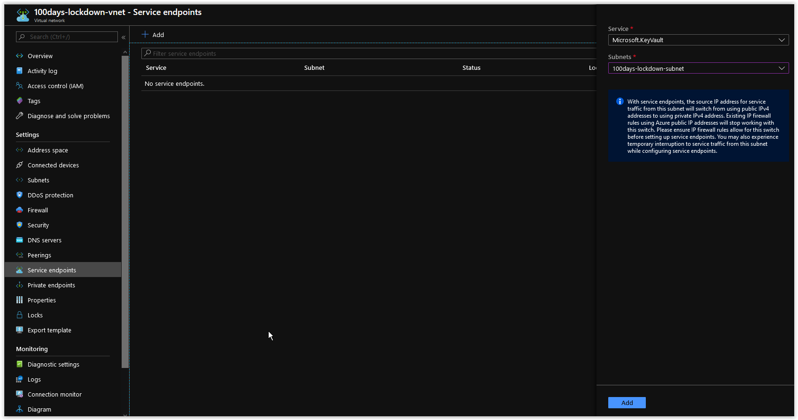

# Day 90 - Restricting Network Access to Azure Key Vault

Today we will cover how to restrict access to Azure Key Vault using Network Rules.

</br>

> **NOTE:** This article was tested and written for a Linux Host running Ubuntu 18.04 with Azure CLI installed.

</br>

In today's article we will cover the following scenarios when troubleshooting your Kubernetes Applications using **kubectl**.

[Deploy a new Resource Group](#deploy-a-new-resource-group)</br>
[Deploy a VNet](#deploy-a-vnet)</br>
[Add the Service Endpoint for Microsoft.KeyVault to the VNet](#add-the-service-endpoint-for-microsoftkeyvault-to-the-vnet)</br>
[Deploy Azure Key Vault](#deploy-azure-key-vault)</br>
[Add a Secret to Key Vault](#add-a-secret-to-key-vault))</br>
[Restrict access to the Azure Key Vault](#restrict-access-to-the-azure-key-vault)</br>
[Verify Restricted Access to Key Vault](#verify-restricted-access-to-key-vault)</br>
[Things to Consider](#things-to-consider)</br>
[Conclusion](#conclusion)</br>

## Deploy a new Resource Group

Using Azure CLI, run the following command to create a new Resource Group.

```bash
az group create \
--name 100days-lockdown \
--location westeurope
```

You should get back the following output:

```json
{
  "id": "/subscriptions/00000000-0000-0000-0000-000000000000/resourceGroups/100days-lockdown",
  "location": "westeurope",
  "managedBy": null,
  "name": "100days-lockdown",
  "properties": {
    "provisioningState": "Succeeded"
  },
  "tags": null,
  "type": "Microsoft.Resources/resourceGroups"
}
```

</br>

## Deploy a VNet

Next, run the following command to create a new VNet in the Resource Group.

```bash
az network vnet create \
--name "100days-lockdown-vnet" \
--resource-group "100days-lockdown" \
--address-prefix "172.16.0.0/16" \
--subnet-name "100days-lockdown-subnet" \
--subnet-prefix "172.16.1.0/24" \
--query "newVNet.provisioningState" \
--output tsv
```

You should get back a similar response.

```console
"Succeeded"
```

</br>

## Add the Service Endpoint for Microsoft.KeyVault to the VNet

Next, Open up the [Azure Portal](https://portal.azure.com) and browse to **100days-lockdown-vnet** in the **100days-lockdown** Resource Group. Click into the VNet and then click on **Service endpoints** under **Settings**. Next, in the **Service** drop-down menu, choose *Microsoft.KeyVault* and in the **Subnets** drop-down menu choose *100days-lockdown-subnet*.



</br>

When you are done, click on the **Add** button. The Service Endpoint will take only a few seconds to apply.

</br>

## Deploy Azure Key Vault

Next, run the following command to create a new Azure Key Vault in the Resource Group.

```bash
az keyvault create \
--name "iac100dayslockdown" \
--resource-group "100days-lockdown" \
--output table
```

You should get back a similar response.

```console
Location    Name                 ResourceGroup
----------  -------------------  -----------------
westeurope  iac100dayslockdown   100days-lockdown
```

</br>

## Add a Secret to Key Vault

Next, the following command to generate a random value

```bash
TRASH_PANDA=$(cat /proc/sys/kernel/random/uuid)
```

</br>

Next, add the value as a Secret in the Azure Key Vault.

```bash
/usr/bin/az keyvault secret set \
--name "trash-panda" \
--vault-name "iac100dayslockdown" \
--value "$TRASH_PANDA" \
--output table
```

You should back a response similar to the one below.

```console
Value
------------------------------------
f5e99ebe-c8c0-4edd-875a-884b89c85c26
```

Next, query the Key Vault to verify that we can still access the Secret

```bash
az keyvault secret list \
--vault-name "iac100dayslockdown" \
--query "[].id" \
--output tsv
```

You should back the response below.

```console
https://iac100dayslockdown.vault.azure.net/secrets/trash-panda
```

</br>

## Restrict access to the Azure Key Vault

Run the following command to deny access to the Azure Key Vault by default.

```bash
az keyvault update \
--name "iac100dayslockdown" \
--default-action deny \
--query properties.networkAcls
```

You should back a response similar to the one below.

```console
{
  "bypass": "AzureServices",
  "defaultAction": "Deny",
  "ipRules": [],
  "virtualNetworkRules": [
    {
      "id": "/subscriptions/00000000-0000-0000-0000-000000000000/resourcegroups/100days-lockdown/providers/microsoft.network/virtualnetworks/100days-lockdown-vnet/subnets/100days-lockdown-subnet",
      "resourceGroup": "100days-lockdown"
    }
  ]
}
```

</br>

Run the following command to retrieve the ID of the **100days-lockdown-subnet** subnet.

```bash
SUBNET_ID=$(az network vnet subnet list \
--resource-group "100days-lockdown" \
--vnet-name "100days-lockdown-vnet" \
| jq '.[].id | select(.|test("lockdown"))' | tr -d '"')
```

</br>

Next, run the following command to create a Network Rule in Azure Key Vault restricting access only from the **100days-lockdown-subnet** subnet.

```bash
az keyvault network-rule add \
--name "iac100dayslockdown" \
--subnet "$SUBNET_ID" \
--output table
```

```console
{
  "bypass": "AzureServices",
  "defaultAction": "Deny",
  "ipRules": [],
  "virtualNetworkRules": [
    {
      "id": "/subscriptions/84f065f5-e37a-4127-9c82-0b1ecd57a652/resourcegroups/100days-lockdown/providers/microsoft.network/virtualnetworks/100days-lockdown-vnet/subnets/100days-lockdown-subnet",
      "resourceGroup": "100days-lockdown"
    }
  ]
}
```

## Verify Restricted Access to Key Vault

Finally, run the following command to verify that you can no longer access the Key Vault from outside of the **100days-lockdown-vnet** VNet.

```bash
az keyvault secret list \
--vault-name "iac100dayslockdown" \
--query "[].id" \
--output tsv
```

You should get back a response similar to what is shown below.

```console
Client address is not authorized and caller is not a trusted service.
Client address: 000.000.000.000
Caller: appid=00000000-0000-0000-0000-000000000000;oid=00000000-0000-0000-0000-000000000000;iss=https://sts.windows.net/00000000-0000-0000-0000-000000000000/
Vault: iac100dayslockdown;location=westeurope
```

If you browse the Azure Key Vault in the [Azure Portal](https://portal.azure.com), you'll notice that you get the message *You are unauthorized to view these contents.* when attempting to view **Secrets** or **Keys**.

</br>

## Things to Consider

If you are going to restrict access to your Azure Key Vault, as we demonstrated in this article, make sure to also restrict Access Control (IAM) as well. A User with enough rights to the Azure Key Vault resource could easily remove the restrictions that were put in place.

</br>

## Conclusion

In today's article we covered how to restrict access to Azure Key Vault using Network Rules. If there's a specific scenario that you wish to be covered in future articles, please create a **[New Issue](https://github.com/starkfell/100DaysOfIaC/issues)** in the [starkfell/100DaysOfIaC](https://github.com/starkfell/100DaysOfIaC/) GitHub repository.
