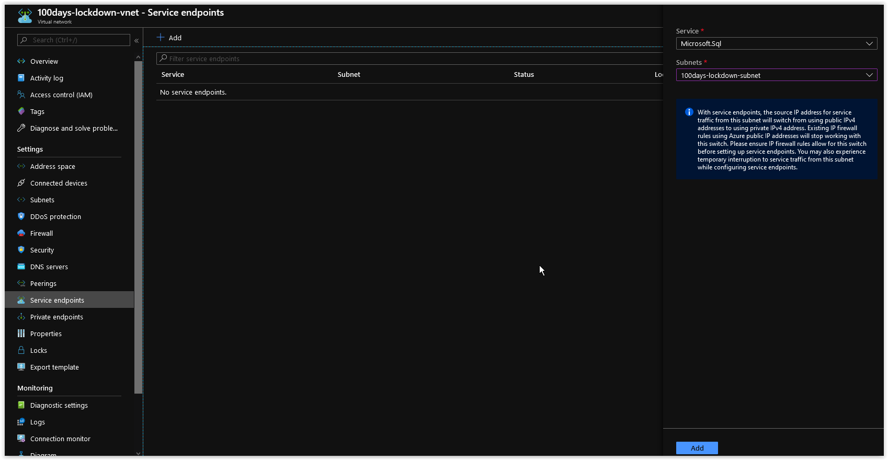

# Day 92 - Restricting Network Access to Azure Database for PostgreSQL

Today we will cover how to restrict access to an Azure Database for PostgreSQL using VNet Rules.

</br>

> **NOTE:** This article was tested and written for a Linux Host running Ubuntu 18.04 with Azure CLI installed.

</br>

This article covers the same network environment circumstances (restricting access) as described in [Day 90](./day.90.restricting.network.access.to.key.vault.md) but with the focus on Azure Database for PostgreSQL.The walkthrough below will demonstrate how to restrict network access to an Azure Database for PostgreSQL.

> **NOTE:** If you are following these instructions directly after [Day 90](./day.90.restricting.network.access.to.key.vault.md), many of the steps below can be skipped since some of the infrastructure will already be in place.

</br>

In today's article we will be performing the following steps.

[Deploy a new Resource Group](#deploy-a-new-resource-group)</br>
[Deploy a VNet](#deploy-a-vnet)</br>
[Add the Service Endpoint for Microsoft.ContainerRegistry to the VNet](#add-the-service-endpoint-for-microsoftcontainerregistry-to-the-vnet)</br>
[Deploy an Azure Database for PostgreSQL](#deploy-an-azure-container-registry)</br>
[Restrict access to the Azure Container Registry](#restrict-access-to-the-azure-container-registry)</br>
[Verify Restricted Access to the Azure Container Registry](#verify-restricted-access-to-the-azure-container-registry)</br>
[Things to Consider](#things-to-consider)</br>
[Conclusion](#conclusion)</br>

## Deploy a new Resource Group

Using Azure CLI, run the following command to create a new Resource Group.

```bash
az group create \
--name 100days-lockdown \
--location westeurope
```

You should get back the following output:

```json
{
  "id": "/subscriptions/00000000-0000-0000-0000-000000000000/resourceGroups/100days-lockdown",
  "location": "westeurope",
  "managedBy": null,
  "name": "100days-lockdown",
  "properties": {
    "provisioningState": "Succeeded"
  },
  "tags": null,
  "type": "Microsoft.Resources/resourceGroups"
}
```

</br>

## Deploy a VNet

Next, run the following command to create a new VNet in the Resource Group.

```bash
az network vnet create \
--name "100days-lockdown-vnet" \
--resource-group "100days-lockdown" \
--address-prefix "172.16.0.0/16" \
--subnet-name "100days-lockdown-subnet" \
--subnet-prefix "172.16.1.0/24" \
--query "newVNet.provisioningState" \
--output tsv
```

You should get back a similar response.

```console
"Succeeded"
```

</br>

## Add the Service Endpoint for Microsoft.SQL to the VNet

Next, Open up the [Azure Portal](https://portal.azure.com) and browse to **100days-lockdown-vnet** in the **100days-lockdown** Resource Group. Browse to the **Service endpoints** under **Settings** and click on the **+ Add** at the top. Next, in the **Service** drop-down menu, choose *Microsoft.SQL* and in the **Subnets** drop-down menu choose *100days-lockdown-subnet*.



</br>

When you are done, click on the **Add** button at the bottom. The Service Endpoint will take only a few seconds to apply.

</br>

## Deploy an Azure PostgreSQL Server

Run the following command to generate a random Password for the PostgreSQL Server

```bash
POSTGRES_SERVER_ADMIN_PASSWORD=$(cat /proc/sys/kernel/random/uuid 2>&1)
```

Next, run the following command to create a new Azure PostgreSQL Server in the Resource Group.

```bash
az postgres server create \
--name "100dayspostgres" \
--admin-user "pgadmin" \
--admin-password "$POSTGRES_SERVER_ADMIN_PASSWORD" \
--location "westeurope" \
--resource-group "100days-lockdown" \
--sku-name GP_Gen5_2 \
--version 11 \
--query userVisibleState \
--output tsv
```

You should get back the following response.

```console
Ready
```

> **NOTE:** You have to use the General Purpose or higher SKU for Azure Database for PostgreSQL in order to use VNet Rules.

</br>

## Restrict access to the Azure PostgreSQL Server

Run the following command to retrieve the Subnet ID of the **100days-lockdown-subnet** subnet.

```bash
SUBNET_ID=$(az network vnet subnet list \
--resource-group "100days-lockdown" \
--vnet-name "100days-lockdown-vnet" \
| jq '.[].id | select(.|test("lockdown"))' | tr -d '"')
```

</br>

Next, run the following command to create a Network Rule in the Azure Container Registry restricting access only from the **100days-lockdown-subnet** subnet.

```bash
/usr/bin/az postgres server vnet-rule create \
--name "100days-lockdown-subnet" \
--server-name "100dayspostgres" \
--resource-group "100days-lockdown" \
--subnet $SUBNET_ID \
--query state \
--output tsv
```

You should get back the following response

```console
Ready
```

</br>

## Verify Restricted Access to the Azure Container Registry

Finally, run the following command to verify that you can no longer access the Azure Container Registry from outside of the **100days-lockdown-subnet** Subnet.

```bash
az acr repository list \
--name "iac100daysacr"
```

You should get back a response similar to what is shown below.

```console
Looks like you don't have access to registry 'iac100daysacr.azurecr.io'. To see configured firewall rules, run 'az acr show --query networkRuleSet --name iac100daysacr'. Please refer to https://aka.ms/acr/errors#connectivity_forbidden_error for more information.
```

</br>

>**NOTE:** If you immediately check to see if you can list the Container Images in the Repository right after creating or updating a Network Rule, you might get the following error message:

```console
Unable to get AAD authorization tokens with message: An error occurred: CONNECTIVITY_ACCESS_TOKEN_ERROR
Access to registry 'iac100daysacr.azurecr.io' was denied. Response code: 403. Please try running 'az login' again to refresh permissions.
Could not get the requested data. Correlation ID: 2d2cb3ec-7779-41ce-8203-c546ced9e4d4.
```

Keep in mind that you need to allow a few seconds for the Network Rules to propagate if you are going to be creating or modifying them in any of your automation tasks.

</br>

If you browse the Azure Container Registry in the [Azure Portal](https://portal.azure.com), you'll notice that you get the message *Looks like you don't have access to this content. Are firewalls and virtual networks enabled?* when attempting to view **Repositories**.

</br>

## Things to Consider

Even though we have restricted access to the actual Repositories in the Azure Container Registry, if you click on **Access Keys** under Settings, you should see the Admin User **iac100daysacr** and the existing Passwords for that account. The reason is because we set the *--admin-enabled* option to *true* earlier when creating the Azure Container Registry.

Just as when we were discussing locking down access to an Azure Key Vault, make sure to also restrict Access Control (IAM) as well for your Azure Container Registries. A User with enough rights could easily remove the network restrictions that were put in place for the Azure Container Registry.

The JSON Output from creating Network Rules here for an Azure Container Registry is slightly different than for Azure Key Vault. Be aware of this when using the *--query* switch or **jq** to parse the results of your Azure CLI operations for both.

</br>

## Conclusion

In today's article we covered how to restrict access to an Azure Container Registry using Network Rules. If there's a specific scenario that you wish to be covered in future articles, please create a **[New Issue](https://github.com/starkfell/100DaysOfIaC/issues)** in the [starkfell/100DaysOfIaC](https://github.com/starkfell/100DaysOfIaC/) GitHub repository.
