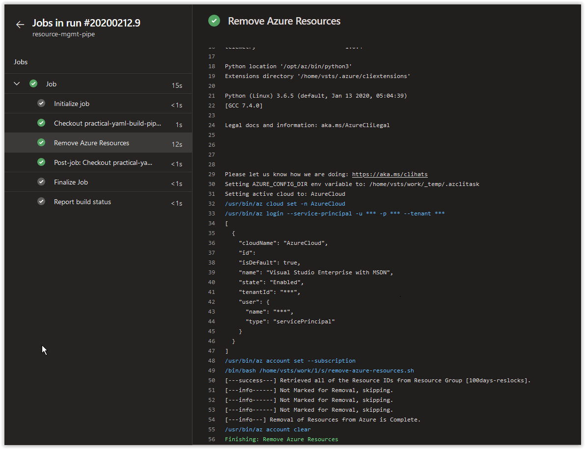
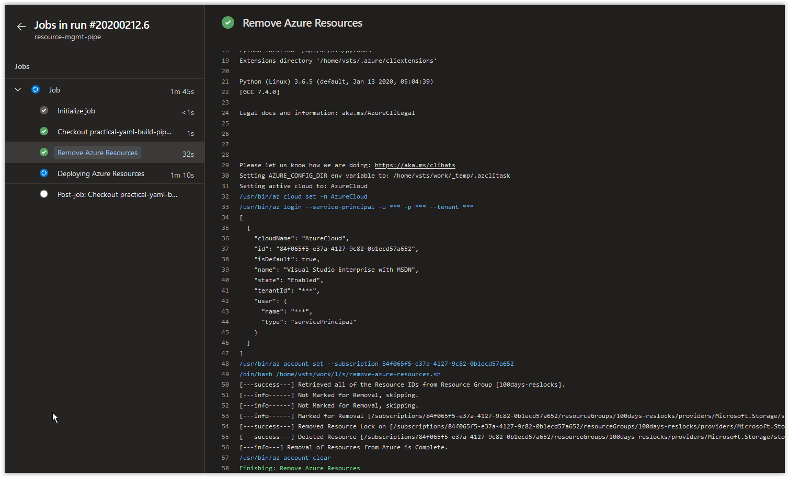

# Day 98 - Using Resource Locks in a YAML Pipeline

Today we are going to show you how you can integrate Resource Locks into a YAML Build Pipeline. As we have covered extensively how to use a YAML Build Pipeline starting on [Day 35](/articles/day.35.building.a.practical.yaml.pipeline.part.1.md), only the basics of what you will need in your build pipeline will be covered here.

</br>

In this article:

[Deploy Resources into Azure](#deploy-resources-into-azure)</br>
[Lock the Azure Resources](#lock-the-azure-resources)</br>
[Tag the Azure Resources](#tag-the-azure-resources)</br>
[Update the Tag on the Storage Account](#update-the-tag-on-the-storage-account)</br>
[Delete a Locked Resource Based on a Tag Value](#delete-a-locked-resource-based-on-a-tag-value)</br>
[Things to Consider](#things-to-consider)</br>
[Conclusion](#conclusion) </br>

## Create a Script for Deploying your Resources in Azure

In VS Code, create a new file called the **deploy-azure-resources.sh**. Copy and paste the contents below into it and save and commit it to your Azure DevOps repository.

```bash
#!/bin/bash

# Author:      Ryan Irujo
# Name:        deploy-azure-resources.sh
# Description: Deploys Resources into an existing Azure Subscription.

# Deploy a New Resource Group
DEPLOY_RG=$(az group create \
--name 100days-reslocks \
--location westeurope)

if [ $? -eq 0 ]; then
    echo "[---success---] Deployed Resource Group [100days-reslocks]"
else
    echo "[---fail------] Failed to deploy Resource Group [100days-reslocks]."
    exit 2
fi

# Deploying a VNet into the Resource Group.
DEPLOY_VNET=$(az network vnet create \
--name "100days-reslocks-vnet" \
--resource-group "100days-reslocks" \
--address-prefix "172.16.0.0/16" \
--subnet-name "100days-reslocks-subnet" \
--subnet-prefix "172.16.1.0/24" \
--query "newVNet.provisioningState" \
--output tsv)

if [ "$DEPLOY_VNET" == "Succeeded" ]; then
    echo "[---success---] Deployed VNet [100days-reslocks-vnet]"
else
    echo "[---fail------] Failed to deploy VNet [100days-reslocks-vnet]."
    exit 2
fi

# Deploying a Key Vault into the Resource Group.
DEPLOY_KEY_VAULT=$(az keyvault create \
--name "iac100daysreslockskv" \
--resource-group "100days-reslocks" \
--output none)

if [ $? -eq 0 ]; then
    echo "[---success---] Deployed Key Vault [iac100daysreslockskv]"
else
    echo "[---fail------] Failed to deploy Key Vault [iac100daysreslockskv]."
    exit 2
fi

# Deploying a Storage Account into the Resource Group.
DEPLOY_STORAGE=$(/usr/bin/az storage account create \
--name "iac100daysreslocksstr" \
--resource-group "100days-reslocks" \
--sku Standard_LRS \
--query statusOfPrimary \
--output tsv)

if [ "$DEPLOY_STORAGE" == "available" ]; then
    echo "[---success---] Deployed Storage Account [iac100daysreslocksstr]"
else
    echo "[---fail------] Failed to deploy Storage Account [iac100daysreslocksstr]."
    exit 2
fi

# Retrieving all of the Resource IDs.
RESOURCE_IDS=$(az resource list \
--resource-group "100days-reslocks" \
--query [].id \
--output tsv)

if [ $? -eq 0 ]; then
    echo "[---success---] Retrieved all of the Resource IDs."
else
    echo "[---fail------] Failed to retrieve all of the Resource IDs."
    exit 2
fi

# Adding 'CanNotDelete' Resource Locks to all of the Resources.
for ID in $RESOURCE_IDS;
do
    az lock create \
    --name "LockedResources" \
    --notes "100DaysOfIac" \
    --lock-type CanNotDelete \
    --resource $ID \
    --query "id" \
    --output tsv
done

if [ $? -eq 0 ]; then
    echo "[---success---] Added 'CanNotDelete' Locks to all of the Resources."
else
    echo "[---fail------] Failed to add 'CanNotDelete' Locks to all of the Resources."
    exit 2
fi

# Tagging all of the Resources.
for ID in $RESOURCE_IDS;
do
    az resource tag \
    --tags "Permanent=True" \
    --ids $ID \
    --query 'id' \
    --output tsv
done

if [ $? -eq 0 ]; then
    echo "[---success---] Tagged all of the Resources with Tag [Permanent=True]"
else
    echo "[---fail------] Failed to tag all of the Resources with Tag [Permanent=True]"
    exit 2
fi
```

## Create a Script for Deleting Resources based on a Tag Value

In VS Code, create a new file called the **remove-azure-resources.sh**. Copy and paste the contents below into it and save and commit it to your Azure DevOps repository.

```bash
#!/bin/bash

# Author:      Ryan Irujo
# Name:        remove-azure-resources.sh
# Description: Removes Resources from Azure based on a Tag Value.

# Retrieving all of the Resource IDs in the Resource Group.
RESOURCE_IDS=$(az resource list \
--resource-group "100days-reslocks" \
--query [].id \
--output tsv)

if [ $? -eq 0 ]; then
    echo "[---success---] Retrieved all of the Resource IDs from Resource Group [100days-reslocks]."
else
    echo "[---fail------] Failed to retrieve all of the Resource IDs from Resource Group [100days-reslocks]."
    exit 2
fi

for ID in $RESOURCE_IDS;
do
    # Retrieving the Resource 'Permanent' Tag.
    CHECK_TAG=$(az resource show \
    --ids $ID \
    --query "tags.Permanent" \
    --output tsv)

    if [[ "$CHECK_TAG" == "True" ]]; then
        echo "[---info------] Not Marked for Removal, skipping."
    else
        echo "[---info------] Marked for Removal [$ID]."

        # Removing the Lock on the Resource.
        REMOVE_LOCK=$(az lock delete \
        --name "LockedResources" \
        --resource $ID)

        if [ $? -eq 0 ]; then
            echo "[---success---] Removed Resource Lock on [$ID]."
        else
            echo "[---fail------] Failed to remove Resource Lock on [$ID]."
            echo "[---fail------] $REMOVE_LOCK"
        fi

        # Deleting the Resource.
        DELETE_RESOURCE=$(az resource delete --ids $ID)

        if [ $? -eq 0 ]; then
            echo "[---success---] Deleted Resource [$ID]."
        else
            echo "[---fail------] Failed to delete Resource[$ID]."
            echo "[---fail------] $DELETE_RESOURCE"
        fi
    fi
done

echo "[---info---] Removal of Resources from Azure is Complete."
```

## Create the YAML File for the Build Pipeline

Next, in VS Code, create a file called **resource-mgmt-pipe.yaml** file. Copy and paste the contents below into the file and then save and commit your changes to the repository.

```yaml
# Builds are automatically triggered from the master branch in the 'practical-yaml-build-pipe' Repo.
trigger:
- master

pool:
  # Using a Microsoft Hosted Agent - https://docs.microsoft.com/en-us/azure/devops/pipelines/agents/hosted?view=azure-devops
  vmImage: ubuntu-18.04

steps:

# Azure CLI Task - Deploying Azure Resources.
- task: AzureCLI@2
  displayName: 'Deploying Azure Resources'
  inputs:
    # Using Service Principal, 'sp-az-build-pipeline', to authenticate to the Azure Subscription.
    azureSubscription: 'sp-az-build-pipeline'
    scriptType: 'bash'
    scriptLocation: 'scriptPath'
    scriptPath: './deploy-azure-resources.sh'

# Azure CLI Task - Remove Azure Resources.
- task: AzureCLI@2
  displayName: 'Remove Azure Resources'
  inputs:
    # Using Service Principal, 'sp-az-build-pipeline', to authenticate to the Azure Subscription.
    azureSubscription: 'sp-az-build-pipeline'
    scriptType: 'bash'
    scriptLocation: 'scriptPath'
    scriptPath: './remove-azure-resources.sh.sh'
```

## Create a new Build Pipeline and then run it

If you need additional information on how to create a new Build Pipeline, please refer to [Day 35](/articles/day.35.building.a.practical.yaml.pipeline.part.1.md) and the section called **Create a new Build Pipeline**.

> **NOTE:** Make sure your Service Principal that you are using to run the Build Pipeline either has **Owner** rights to the Resource Group or to the Azure Subscription you are working with; otherwise, you may run into issues managing the Resource Locks.

</br>

Create a new Build Pipeline called **resource-mgmt-pipe**. At the end of the creation process, make sure you using the **resource-mgmt-pipe.yaml** file. Run the Build Pipeline once you are done configuring it.

The **Deploy Azure Resources** Job should return the following results.



The **Remove Azure Resources** Job should return the following results.



</br>

## Update the Tag on the Storage Account

Next, we are going to change the Storage Account's **Permanent** Tag from *True* to *False*.

Run the following command to retrieve the **id** of the Storage Account.

```bash
STORAGE_ID=$(az resource list \
--resource-group "100days-reslocks" \
| jq '.[].id | select(.|test("iac100daysreslocksstr"))' | tr -d '"')
```

</br>

Next, run the following command to change the Storage Account's **Permanent** Tag from *True* to *False*.

```bash
az resource tag \
--tags "Permanent=False" \
--ids $STORAGE_ID \
--query 'id' \
--output tsv
```

You should get back a similar response to what is shown below.

```console
/subscriptions/00000000-0000-0000-0000-000000000000/resourceGroups/100days-reslocks/providers/Microsoft.Storage/storageAccounts/iac100daysreslocksstr
```

</br>

## Rerun the Build Pipeline Job

Next, rerun the **resource-mgmt-pipe** Build Pipeline.

The **Deploy Azure Resources** Job should return the exact same results after the original run. However, the results from the **Remove Azure Resources** Job should return the following results.


</br>

You can check the [Azure Portal](https://portal.azure.com) to verify that the Storage Account has been deleted from the **100days-reslocks** Resource Group.

</br>

## Things to Consider

The methodology shown above should work for just about all Resources in Azure that are taggable. If you plan on implementing this type of solution, we recommend that you test this against your Azure Resources thoroughly before doing so.

You'll notice that we didn't include the **id** of the Resource if it was being skipped for deletion. Depending on the type of logging in your environment, such as in Production, you'll probably want to include as much information as possible for tracking and troubleshooting purposes.

</br>

## Conclusion

In today's article we covered how you can integrate Resource Locks into a YAML Build Pipeline. If there's a specific scenario that you wish to be covered in future articles, please create a **[New Issue](https://github.com/starkfell/100DaysOfIaC/issues)** in the [starkfell/100DaysOfIaC](https://github.com/starkfell/100DaysOfIaC/) GitHub repository.
