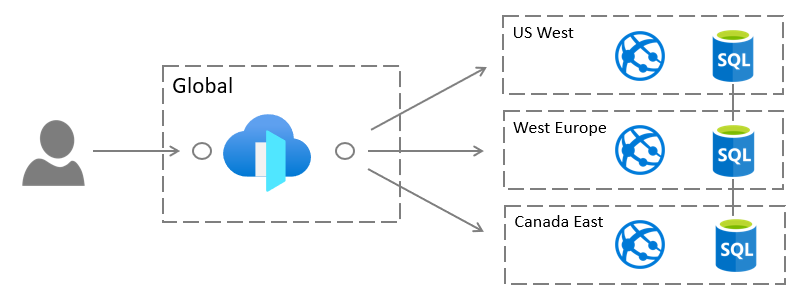

# Day 99 - Azure Front Door (Part 1)

When Microsoft announced general availability (GA) of Azure Front Door (AFD), a scalable and secure entry point for web applications, they shared some interesting information. The underlying technology in Azure Front Door had been utilized within Microsoft for the past five , where it has enabled scaling and protection for many popular Microsoft services, such as Bing, Office 365, LinkedIn, and Microsoft Teams, to name a few.

Azure Front Door represents a significant advancement in delivering a service with a global presence with great user experience, the top of the mountain in some respects. It seems the perfect way to finish out the "100 Days of Infrastructure-as-Code in Azure" series.

There's a lot to Azure Front Door, so we'll open the door today, and continue tomorrow in Day 100.

In this article:

[Introducing Anycast](#introducing-anycast) </br>
[Core Capabilities](#core-capabilities) </br>
[Benefits of Front Door](#benefits-of-front-door) </br>
[How should I deploy Front Door?](#how-should-i-create-front-door-instances?) </br>
[Breaking it down (Azure CLI)](#Breaking-it-down-azure-cli) </br>

## Introducing Anycast
Azure Front Door utilizes of the [**anycast**](https://en.wikipedia.org/wiki/Anycast) protocol,  a network addressing and routing methodology in which a single destination address has multiple routing paths to two or more endpoint destinations. Routers will select the desired path on the basis of number of hops, distance, lowest cost, latency measurements or based on the least congested route. Anycast networks are widely used for content delivery network (CDN) products to bring their content closer to the end user.

In the context of Azure Front Door



**Figure 1**. Azure Front Door (concept)

## Core Capabilities

The core capabilities of Azure Front Door include:

- **Application and API acceleration** through the use of anycast which will optimize the connectivity to Azure application services and reduce the latency for end users.
- **Global HTTP load balancing** allows developers to build out geo-distributed services and lets Azure determine endpoint availability and intelligent routing to local, and available, endpoints.
- **SSL offload** relieves endpoints of performing expensive decryption computation and moves the function higher-up in the stack.
- **Edge web application filtering** provides protection against DDoS attacks or malicious users at the edge without impacting backend services.

## Benefits of Front Door

For organizations that have web applications with global reach, application performance can be impacted by the proximity of the customer. To provide a better and more consistent experience, orgs may leverage Content Delivery Networks (CDNs), which have several distribution points and deliver content to customer faster through proximity of content and optimized connections.

One of the primary benefits of using Azure Front Door is taking advantage of Microsoft’s global network. Front Door uses Azure's global network, a dedicated private network run by Microsoft, from the edge PoP (Point of presence), to your application *wherever it is hosted, even if it is not on Azure*. This traffic goes over Microsoft’s global network so there is much higher network reliability. Front Door routes traffic to the nearest point where the application is and then exits from that application. You get a dedicated network for your end users and so it just boosts your network performance and reliability.

## How should I deploy Front Door?

As with most services, you can deploy Azure Front Door with PowerShell, Azure CLI, or ARM templates. With the more complex Front Door scenarios, where multiple components and dependencies are involved, we would recommend sticking with ARM templates for the most complex scenarios, or Azure CLI in Azure Pipelines, if you are more comfortable. 

## Breaking it down
For a first pass, let's break down the requirements by looking at the parameters of the Azure CLI:

``` Bash
az network front-door create \
--backend-address \
--name
--resource-group
--accepted-protocols]
--backend-host-header]
--disabled {false, true}]
--enforce-certificate-name-check {Disabled, Enabled}]
--forwarding-protocol]
--friendly-name]
--frontend-host-name]
--interval]
--no-wait]
--path]
--patterns]
--probeMethod {GET, HEAD}]
--protocol {Http, Https}]
--send-recv-timeout]
--tags]
```