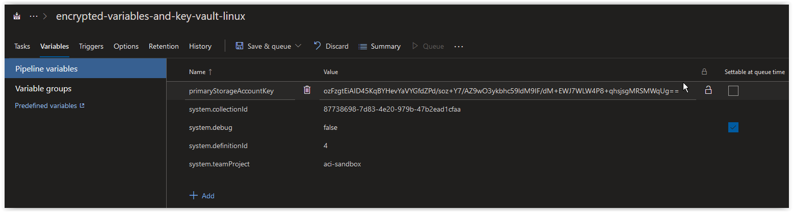
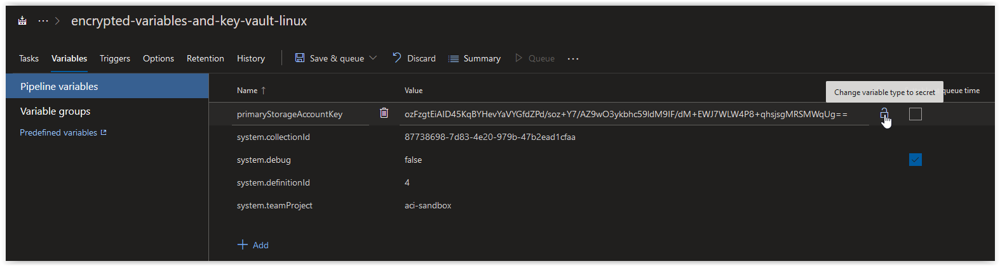
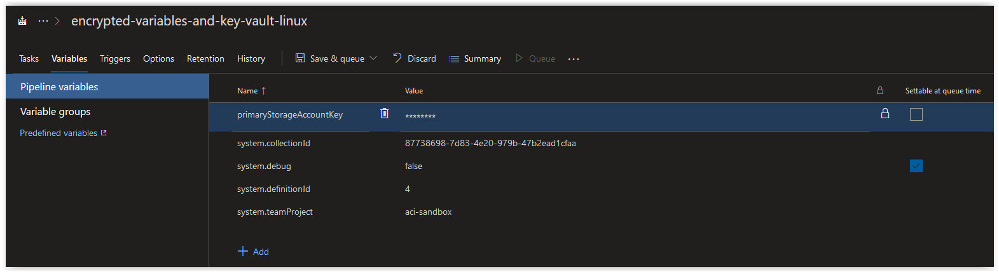
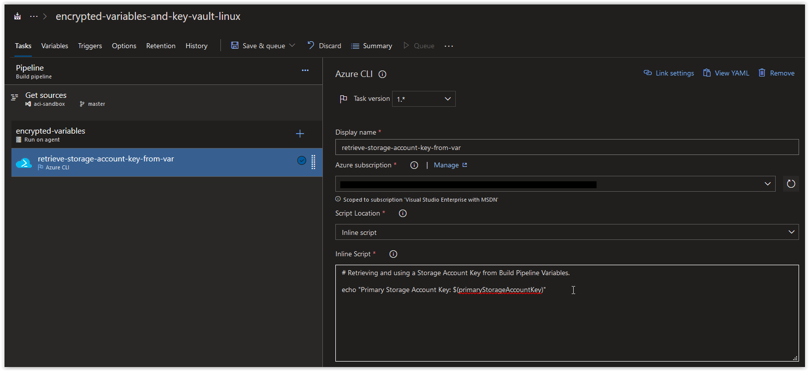
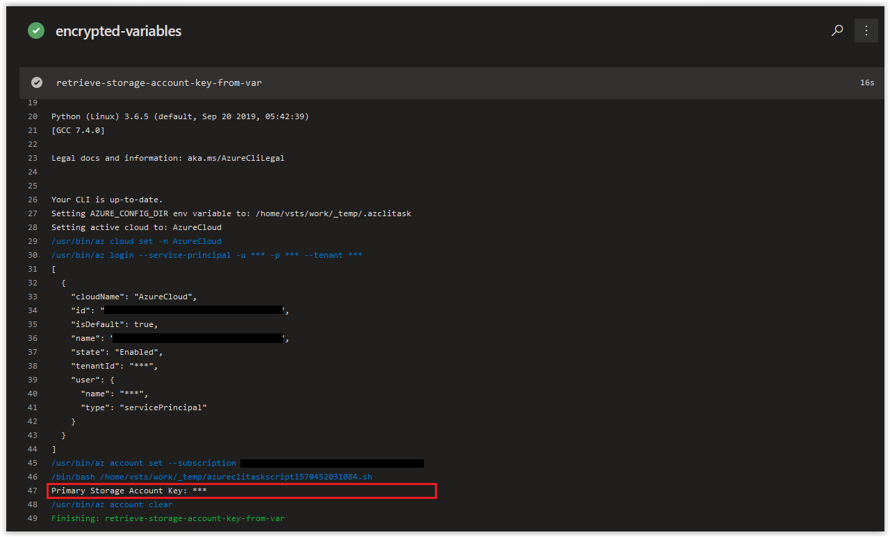

# Day XXX - Build Pipelines, using Static Encrypted Variables (Linux Edition)

In today's article we are going to cover how to use Encrypted Variables in Azure CLI Tasks in an Azure DevOps Build Pipeline.

> **NOTE:** This article was tested and written for an Azure Build Pipeline using a Microsoft-hosted Agent running Ubuntu 18.04.

## Create a Resource Group and Storage Account

<br />

Run the following command to create a new Resource Group.

```bash
az group create \
--name encrypted-variables-and-key-vault \
--location westeurope
```

You should get back the following output:

```console
{
  "id": "/subscriptions/00000000-0000-0000-0000-000000000000/resourceGroups/encrypted-variables-and-key-vault",
  "location": "westeurope",
  "managedBy": null,
  "name": "encrypted-variables-and-key-vault",
  "properties": {
    "provisioningState": "Succeeded"
  },
  "tags": null,
  "type": "Microsoft.Resources/resourceGroups"
}
```

<br />

Next, run the following command randomly generate 4 alphanumeric characters.

```bash
RANDOM_ALPHA=$(cat /dev/urandom | tr -dc 'a-z0-9' | fold -w 4 | head -n 1)
```

> **NOTE:** We are appending this to the name of our Storage Account to ensure we create a unique Storage Account name.

<br />

Run the following command to create a new Storage Account.

```bash
NEW_STORAGE_ACCOUNT=$(az storage account create \
--name "encryptvardemo${RANDOM_ALPHA}" \
--resource-group encrypted-variables-and-key-vault)
```

You should get back the following output:

```console
The default kind for created storage account will change to 'StorageV2' from 'Storage' in future
```

<br />

You can run the following command to verify that the Storage Account was provisioned successfully.

```bash
echo $NEW_STORAGE_ACCOUNT | jq .provisioningState
```

You should get back the following output:

```console
"Succeeded"
```

<br />

Next, run the following command to retrieve the Primary Key for your new Storage Account.

```bash
az storage account keys list \
--account-name "encryptvardemo${RANDOM_ALPHA}" \
--query [0].value \
--output tsv
```

You should get back the Primary Key of your new Storage Account which should look similar to the one below:

```console
ozFzgtEiAID45KqBYHevYaVYGfdZPd/soz+Y7/AZ9wO3ykbhc59ldM9IF/dM+EWJ7WLW4P8+qhsjsgMRSMWqUg==
```

<br />

## Using the Storage Account Key in a Build Pipeline

Next, copy the Storage Account Key into a a new variable called **primaryStorageAccountKey** in a Build Pipeline.



<br />

Next, change the Storage Account Key value by pressing the Lock Icon on the far right side of the **primaryStorageAccountKey** variable.



<br />

The Storage Account Key should now be secured and displayed only as a set of asterisks.



<br />

Next, create an Azure CLI Task in the Build Pipeline and paste in the following code below as an Inline script.

```bash
# Retrieving and using a Storage Account Key from Build Pipeline Variables.

echo "Primary Storage Account Key: $(primaryStorageAccountKey)"
```

<br />

After your task looks like what is shown below, click on **Save & queue** to run the Build.



<br />

When the Build finishes, you should see the Storage Account Key displayed in all asterisks.



Although the job displays the Storage Account Key in asterisks, the value can still be used in your script where required.
