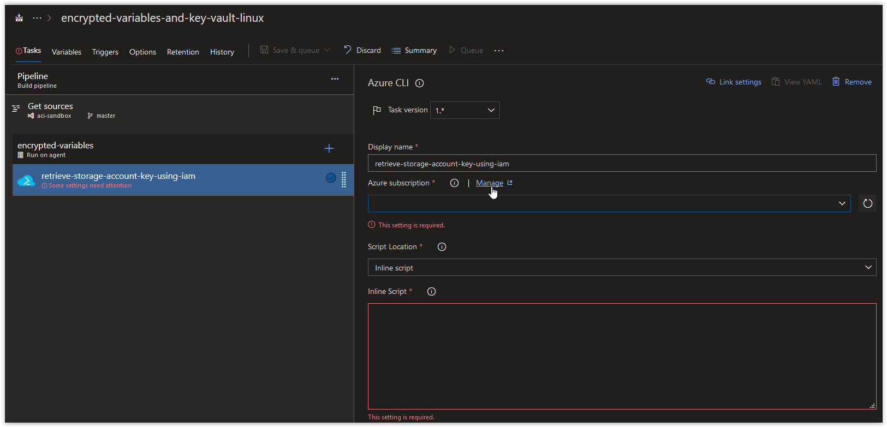
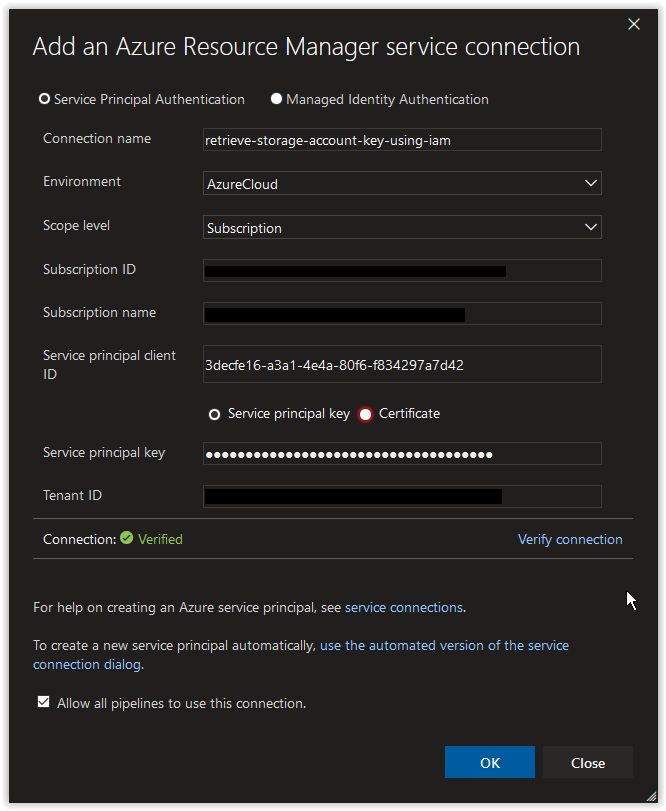
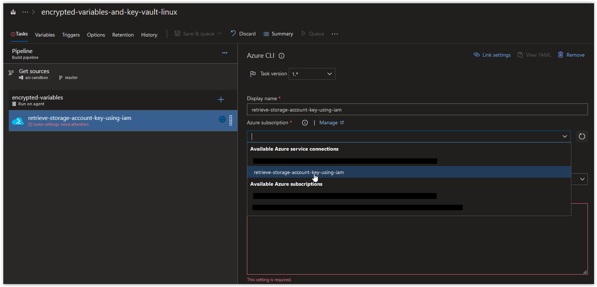
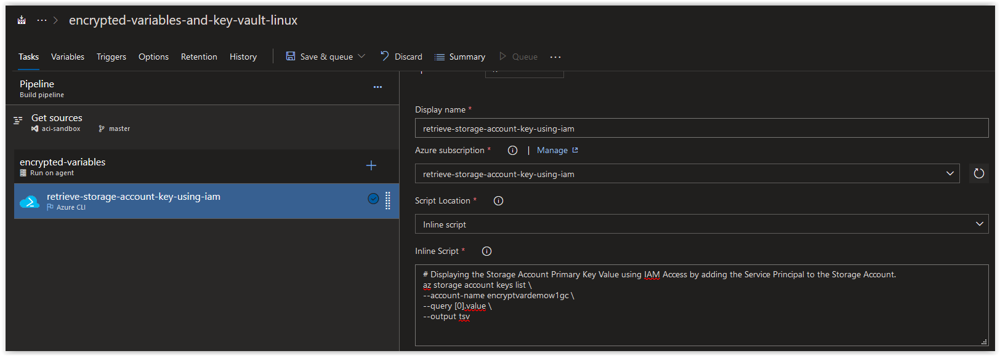

# Day XXX - Build Pipelines, using a Service Principal to access Resources in a Task (Linux Edition)

In today's article we are going to cover how to access Azure resources using a Service Principal in an Azure CLI Task in a Build Pipeline. The methods demonstrated in this article can also be used for several other IaaS and PaaS Offerings available in Azure.

> **NOTE:** This article was tested and written for an Azure Build Pipeline using a Microsoft-hosted Agent running Ubuntu 18.04 and a separate Linux Host running Ubuntu 18.04 with Azure CLI installed.

*Please note that the content below is based off of [Day XXX]() and it is highly recommended that you review or complete that material before continuing.*

## Create a Service Principal

On your Linux Host (with Azure CLI installed), open up a bash prompt and run the following command to create a new Service Principal.

```bash
AZURE_SP=$(/usr/bin/az ad sp create-for-rbac \
--role "contributor" \
--name "sp-for-iam-access" \
--years 3)
```

You should get back a result similar to what is shown below.

```console
Changing "sp-for-iam-access" to a valid URI of "http://sp-for-iam-access", which is the required format used for service principal names
Creating a role assignment under the scope of "/subscriptions/00000000-0000-0000-0000-000000000000"
  Retrying role assignment creation: 1/36
  Retrying role assignment creation: 2/36
```

<br />

Next retrieve your Azure Subscription ID.

```bash
AZURE_SUB_ID=$(az account show --query id --output tsv)
```

If the above command doesn't work, manually add your Azure Subscription ID to the variable.

```bash
AZURE_SUB_ID="00000000-0000-0000-0000-000000000000"
```

<br />

Assign the contributor role to the new Service Principal for the Storage Account.

```bash
az role assignment create \
--role "Contributor" \
--assignee "http://sp-for-iam-access" \
--scope /subscriptions/$AZURE_SUB_ID/resourceGroups/encrypted-variables-and-key-vault/providers/Microsoft.Storage/storageAccounts/encryptvardemow1gc
```

You should get something back similar to what is shown below.

```console
{
  "canDelegate": null,
  "id": "/subscriptions/00000000-0000-0000-0000-000000000000/resourceGroups/encrypted-variables-and-key-vault/providers/Microsoft.Storage/storageAccounts/encryptvardemow1gc/providers/Microsoft.Authorization/roleAssignments/0ce209b8-a107-45a5-81d2-cd5d886a047a",
  "name": "0ce209b8-a107-45a5-81d2-cd5d886a047a",
  "principalId": "cbb34d1b-e937-4c47-96ac-c886114adda2",
  "principalType": "ServicePrincipal",
  "resourceGroup": "encrypted-variables-and-key-vault",
  "roleDefinitionId": "/subscriptions/00000000-0000-0000-0000-000000000000/providers/Microsoft.Authorization/roleDefinitions/b24988ac-6180-42a0-ab88-20f7382dd24c",
  "scope": "/subscriptions/00000000-0000-0000-0000-000000000000/resourceGroups/encrypted-variables-and-key-vault/providers/Microsoft.Storage/storageAccounts/encryptvardemow1gc",
  "type": "Microsoft.Authorization/roleAssignments"
}
```

<br />

Retrieve the **appId** from the Azure Service Principal.

```bash
echo $AZURE_SP | jq .appId | tr -d '"'
```

You should get back the **appId** which should look similar to what is shown below, make a note of it.

```console
3decfe16-a3a1-4e4a-80f6-f834297a7d42
```

<br />

Retrieve the **password** from the Azure Service Principal.

```bash
echo $AZURE_SP | jq .password | tr -d '"'
```

You should get back the **password** which should look similar to what is shown below, make a note of it.

```console
02ab477d-b64d-4ef8-9a16-5bcbe8652036
```

<br />

Next, open up your Azure Build Pipeline and create a new Azure CLI task called **retrieve-storage-account-key-using-iam** and then click on **Manage** in the *Azure Subscription* section.



<br />

In the Service Connections blade, click on **New Service Connection** and then on **Azure Resource Manager**.


<br />

Next, in the **Add an Azure Resource Manager service connection** window, click on the link **use the full version of the service connection dialog**.


<br />

Next, in the **Add an Azure Resource Manager service connection** window, set the *Connection name* field to **retrieve-storage-account-key-using-iam**. Paste in the **appId** value from earlier in the *Service principal client ID* field and the **password** value in the *Service principal key* field. Afterwards, click on the **Verify connection** button. Once the connection is verified, click on the **OK** button.



<br />

Back in your Azure CLI task window, click on the **Refresh Azure subscription** button.


<br />

In the **Azure subscription** field, click on the drop-down arrow and select **retrieve-storage-account-key-using-iam** under *Available Azure service connections*.



<br />

Next, copy and paste in the code below into the inline Script section and then click on **Save & queue**.

```bash
# Displaying the Storage Account Primary Key Value using IAM Access by adding the Service Principal to the Storage Account.
PRIMARY_KEY=$(az storage account keys list \
--account-name encryptvardemow1gc \
--query [0].value \
--output tsv)

echo "Primary Storage Account Key: $PRIMARY_KEY"
```

> **NOTE** Replace the value under the *--account-name* parameter with the name of your storage account!



<br />

When the job has completed, you should see the Storage Account Primary Key in the Job Logs.


<br />

## Conclusion

In today's article we covered how to access Azure resources using a Service Principal that was granted IAM access and how that would behave in an Azure CLI Task in a Build Pipeline. If there's a specific scenario that you wish to be covered in future articles, please create a **[New Issue](https://github.com/starkfell/100DaysOfIaC/issues)** in the [starkfell/100DaysOfIaC](https://github.com/starkfell/100DaysOfIaC/) GitHub repository.
