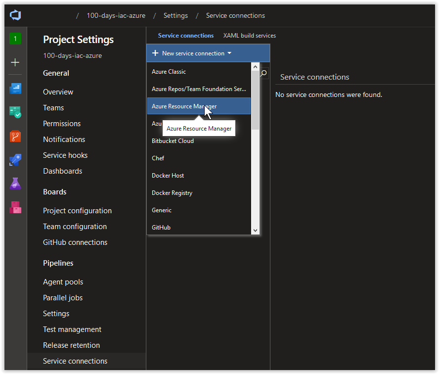
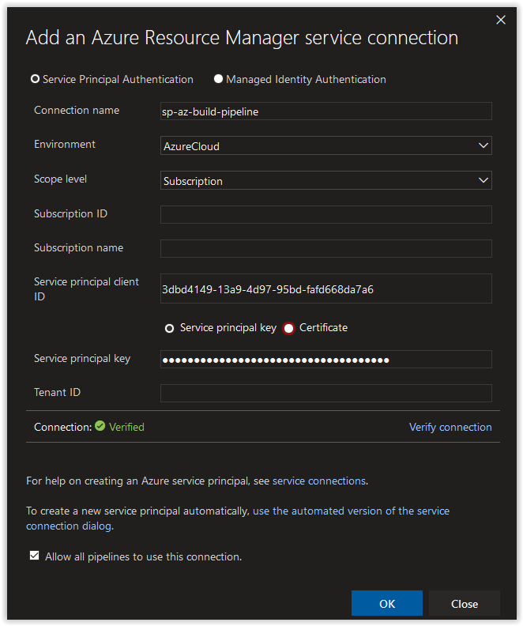
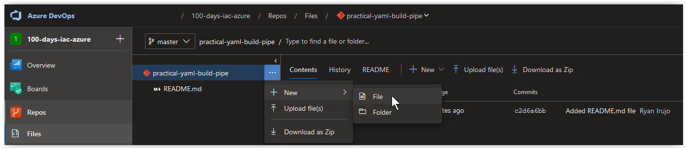
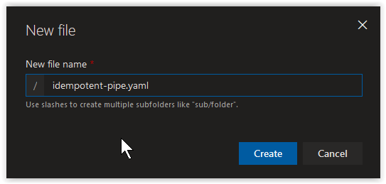

# Building a Practical YAML Pipeline - Part 1

Today, we are going to take you through the process of setting up Practical YAML Build Pipeline in Azure DevOps that is idempotent.

**In this article:**

[Creating a Service Principal for the Build Pipeline](#create-a-service-principal-for-the-build-pipeline)</br>
[Create a new Service Connection for the Service Prinicpal](#create-a-new-service-connection-for-the-service-principal)</br>
[Create a Repo in Azure DevOps for the Build Pipeline](#create-a-repo-in-azure-devops-for-the-build-pipeline)</br>
[Create a YAML File for the Build Pipeline](#create-a-yaml-file-for-the-build-pipeline)</br>
[Create a new Build Pipeline](#create-a-new-build-pipeline)</br>
[Conclusion]()</br>

## Create a Service Principal for the Build Pipeline

On your Linux Host (with Azure CLI installed), open up a bash prompt and run the following command to create a new Service Principal.

```bash
AZURE_SUB_ID=$(az account show --query id --output tsv)
```

If the above command doesn't work, manually add your Azure Subscription ID to the variable.

```powershell
AZURE_SUB_ID=("00000000-0000-0000-0000-000000000000")
```

On your Linux Host (with Azure CLI installed), open up a bash prompt and run the following command to create a new Service Principal.

```bash
AZURE_BUILD_PIPE_SP=$(az ad sp create-for-rbac \
--role "contributor" \
--name "sp-az-build-pipeline-creds" \
--scope "/subscriptions/$AZURE_SUB_ID" \
--years 1)
```

You should get back a result similar to what is shown below. You'll notice that the **contributor** right assignment is scoped to the Resource Group.

```console
Changing "sp-az-build-pipeline-creds" to a valid URI of "http://sp-az-build-pipeline-creds", which is the required format used for service principal names
Creating a role assignment under the scope of "/subscriptions/00000000-0000-0000-0000-000000000000"
  Retrying role assignment creation: 1/36
  Retrying role assignment creation: 2/36
```

</br>

Retrieve the **appId** from the Azure Service Principal.

```bash
echo $AZURE_BUILD_PIPE_SP | jq .appId | tr -d '"'
```

You should get back the **appId** which should look similar to what is shown below, make a note of it.

```console
3dbd4149-13a9-4d97-95bd-fafd668da7a6
```

</br>

Retrieve the **password** from the Azure Service Principal.

```bash
echo $AZURE_BUILD_PIPE_SP | jq .password | tr -d '"'
```

You should get back the **password** which should look similar to what is shown below, make a note of it.

```console
30d7efe8-372d-420d-b84b-b25d2a2b32c6
```

</br>

## Create a new Service Connection for the Service Principal

In your Azure DevOps Project, click on the **Project Settings** blade and then click on **Service Connections**. Next, click on **+ New service connection** and then on **Azure Resource Manager**.



</br>

Next, in the **Add an Azure Resource Manager service connection** window, click on the link **use the full version of the service connection dialog**.


</br>

Next, in the **Add an Azure Resource Manager service connection** window, set the *Connection name* field to **sp-az-build-pipeline**. Paste in the **appId** value from earlier in the *Service principal client ID* field and the **password** value in the *Service principal key* field. Afterwards, click on the **Verify connection** button. Once the connection is verified, click on the **OK** button.



</br>

## Create a Repo in Azure DevOps for the Build Pipeline

In your Azure DevOps Project, click on the **Repos** blade and then click on **+ New Repository**.


</br>

Next, create a Git repository called **practical-yaml-build-pipe**, put a checkmark in the *Add a README to describe your repository* box and then click on **Create**.


</br>

## Create a YAML File for the Build Pipeline

Next, in the **practical-yaml-build-pipe** Repo, create a new file.



</br>

Name the file **idempotent-pipe.yaml**.



</br>

Next, paste in the contents below and click on **Commit...** to save the file.

```yaml
# Builds are automatically triggered from the master branch in the 'practical-yaml-build-pipe' Repo.
trigger:
- master

pool:
  # Using a Microsoft Hosted Agent - https://docs.microsoft.com/en-us/azure/devops/pipelines/agents/hosted?view=azure-devops
  vmImage: ubuntu-18.04

steps:

# Azure CLI Task - creating the 'practical-yaml' Resource Group.
- task: AzureCLI@1
  displayName: 'Create practical-yaml Resource Group'
  inputs:
    # Using Service Principal, 'sp-az-build-pipeline', to authenticate to the Azure Subscription.
    azureSubscription: 'sp-az-build-pipeline'
    scriptLocation: inlineScript
    inlineScript: |
     az group create \
     --name practical-yaml \
     --location westeurope
```

</br>


</br>

### Explanation of the YAML File

Blah blah blah.

## Create a new Build Pipeline

Next, 

## Conclusion

Now...


In this installment of our Series, we are going

Let's build a Container running Grav from Azure DevOps.

- preface this by creating a Repository in Azure DevOps.
- go over how to create the repository in a Project
- anything else that Is added to this series is added to that repository.
  - This repository/walkthrough has to be quick to add/modify/change.

- Let's go ahead and have this YAML file based Build Pipeline setup to control everything, so that when the YAML file is updated, a build kicks off
  - can show idempotence
  - can show the build and deploy containers scenario

## New Blog Post Series on Azure Containers and Practical YAML Build Pipelines

- create a new Service Principal called **sp-az-build-pipeline-creds**
- go to Project Settings --> Service Connections
  - Create a new Service connection called **sp-az-build-pipeline-creds** and add in the Service Principal Creds.
- create new Repo in your Azure DevOps Project called **az-containers**
- add in the following file **az-containers.yaml**

```yaml
trigger:
- master

pool:
  # Using a Microsoft Hosted Agent - https://docs.microsoft.com/en-us/azure/devops/pipelines/agents/hosted?view=azure-devops
  vmImage: ubuntu-18.04

steps:

# Azure CLI Task - creating the 'containers-in-azure' Resource Group.
- task: AzureCLI@1
  displayName: 'check-resource-group'
  inputs:
    # Using Service Principal, 'sp-az-build-pipeline-creds', to authenticate to the Subscription.
    azureSubscription: 'sp-az-build-pipeline-creds'
    scriptLocation: inlineScript
    inlineScript: |
     az group create \
     --name containers-in-azure \
     --location westeurope
```

- Write About each step in this YAML File about what is going on and continue from there and how we will continue to build on it in subsequent blog posts.
- follow up blog post will be about:
- adding in the Azure Container Registry
- adding in Dockerfile for Container
- customizing the Dockerfile for the Container
- Container Deployment (Grav CMS)
- Modifying the Grav CMS Container
- Modifying the YAML Build File to first delete and redeploy the Container
