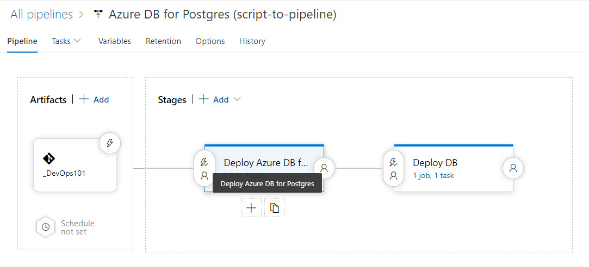

# Day 37 - Transform Existing Scripts to YAML Pipelines (Part 2)

In any journey of growth and transformation, while you and your situation may change a great deal, it doesn't happen all at once. Transformation happens through a series of incremental changes, and Infrastructure-as-Code (IaC) is no different. Since IaC should be automated, declarative, and idempotent, you will likely be leaning heavily on ARM templates. However, you may need time to grow your ARM authoring capabilities, and requirements for non-production scenarios certainly allow some room to leverage lighter weight authoring methods, like Azure CLI, in your IaC pipelines. It's an incremental step in the direction of deploying from a pipeline rather than running scripts by hand or deploying via the Azure portal.

In Day 36, we deconstructed an existing script we had that would 1) deploy and fully configure an Azure DB for PostgreSQL server instance 2) Deploy the AdventureWorks database and 3) run a sql script to populate the AdventureWorks DB with data. We'll take the existing script from yesterday, [Day 36](https://github.com/starkfell/100DaysOfIaC/blob/master/articles/day.36.paas.db.postgres.md), and we'll transition from standalone single script, to a multi-stage visual (aka "classic") pipeline, and finally to a YAML pipeline, which we'll cover in the next installment.

YAML pipelines are great for a number of reasons, but my favorites are 1) that they are easily imported into other environments 2) saved as code in a repo (and thus can be versioned) and 3) give us a cut-and-paste way to jump start new pipelines. This two-step transition gives us a way to ease into YAML pipelines without writing one from scratch our first time out.

As a first step, I've essentially taken my existing script from [Day 36](https://github.com/starkfell/100DaysOfIaC/blob/master/articles/day.36.paas.db.postgres.md) and broken it into two scripts in just a few minutes time, which are:

- **createpginst.sh**. Deploys the Azure DB for PostgreSQL instance and performs all the configuration, including backup retention and firewall.
- **dbcreatepop.sh**. Deploys the AdventureWorks database and runs a SQL script (from psql command line) to populate it with data.

> **IMPORTANT**: Notice how each script makes sure the necessary components, like Azure CLI, or PostgreSQL client utilities, are present on the agent before trying to use them. If something is not present (like psql), the script installs it. It pays to know what is (and isn't) installed on your build agents by default!

I've configured the parameters of these scripts as [release variables](https://docs.microsoft.com/en-us/azure/devops/pipelines/release/variables?view=azure-devops&tabs=batch).

Then, I created a two stage pipeline. One stage for each script. This gives us some handy default behaviors, such as the second stage only running if the first stage is successful. And we can add approvers on any or all stages if we wish.  



**Figure 1**. Multi-stage Release Pipeline

The first stage, shown in Figure 2, deploys the Azure DB for PostgreSQL instance, and performs all the additional configurations. Read the script parameters for **createpginst.sh** which explains all the configurable elements. An example of the syntax is shown in Figure 2.

``` Bash
./createpginst.sh -i 0b62f50c-c15a-40e2-b1ab-7ac2596a1385 -t cf5b57b5-3bce-46f1-82b0-396341247726 \
-l eastus -r advwks-rg -u iac-sp -p '053c7e32-a074-4fea-a8fb-169883esdfwer' -d postgres \
-x 'PGP@ssw0rd!' -c advenwrks19 -v 9.6 -k GP_Gen5_2 -b 7 -y Disabled
```

**Figure 2**. Stage 1: Deploy and Configure Azure DB for PostgreSQL

The second stage, shown in Figure 3, creates the database with the name we pass in through the DB_NAME parameter (AdventureWorks, in this case). Then, it runs a .sql script to populate this database with data.

``` Bash
./dbcreatepop.sh -i 0b62f50c-c15a-40e2-b1ab-7ac2596a1385 -t cf5b57b5-3bce-46f1-82b0-396341247726 \
-l eastus -r advwks-rg -u iac-sp -p '053c7e32-a074-4fea-a8fb-169883esdfwer' -d postgres\
-x 'PGP@ssw0rd!' -c advenwrks19 -n adventureworks -s install.sql
```

**Figure 3**. Stage 2: Deploy and Configure Azure DB for PostgreSQL

## Conclusion  

Okay, so now we have a classic (visual) pipeline. In the next installment, we're going to convert this to a YAML pipeline so we can start tapping into all the advantages the new world of YAML pipelines has to offer. We're only on Day 37, so if there is something you'd like to see us cover, remember leave a comment on the repo!